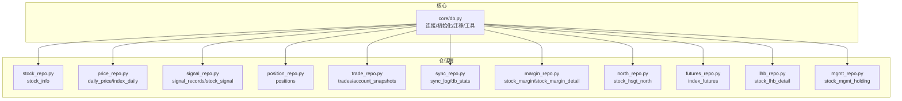
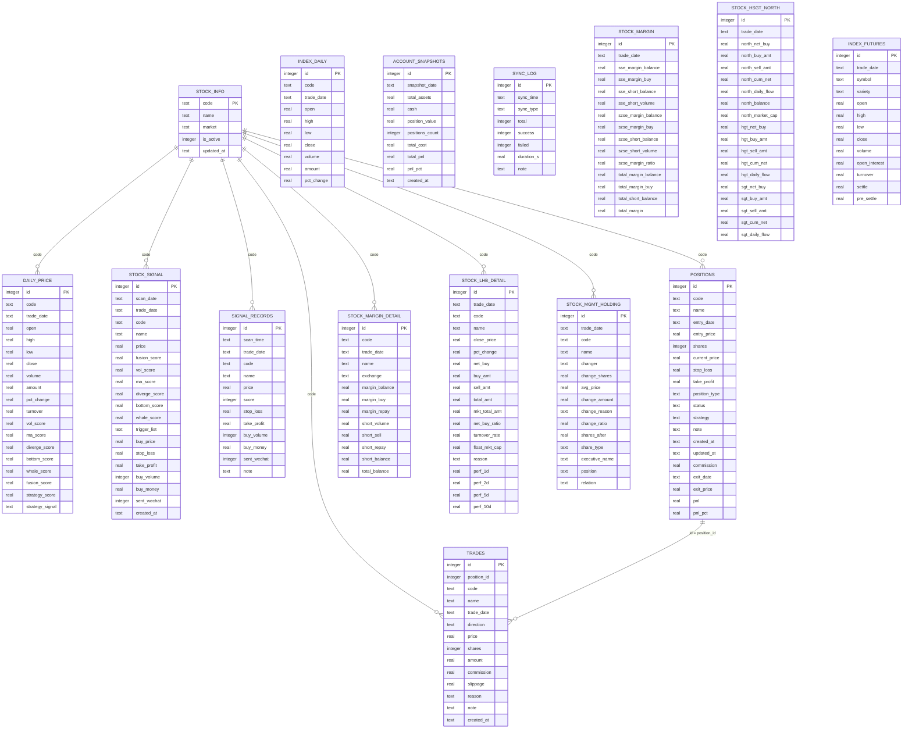
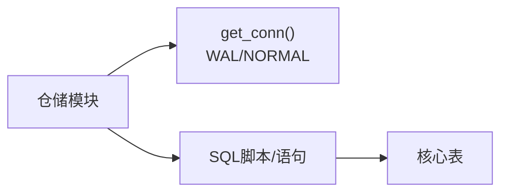

# 数据库设计

<cite>
**本文引用的文件**
- [core/db.py](file://core/db.py)
- [core/repository/stock_repo.py](file://core/repository/stock_repo.py)
- [core/repository/price_repo.py](file://core/repository/price_repo.py)
- [core/repository/signal_repo.py](file://core/repository/signal_repo.py)
- [core/repository/position_repo.py](file://core/repository/position_repo.py)
- [core/repository/trade_repo.py](file://core/repository/trade_repo.py)
- [core/repository/sync_repo.py](file://core/repository/sync_repo.py)
- [core/repository/margin_repo.py](file://core/repository/margin_repo.py)
- [core/repository/north_repo.py](file://core/repository/north_repo.py)
- [core/repository/futures_repo.py](file://core/repository/futures_repo.py)
- [core/repository/lhb_repo.py](file://core/repository/lhb_repo.py)
- [core/repository/mgmt_repo.py](file://core/repository/mgmt_repo.py)
</cite>

## 目录
1. [简介](#简介)
2. [项目结构](#项目结构)
3. [核心组件](#核心组件)
4. [架构总览](#架构总览)
5. [详细组件分析](#详细组件分析)
6. [依赖分析](#依赖分析)
7. [性能考虑](#性能考虑)
8. [故障排查指南](#故障排查指南)
9. [结论](#结论)
10. [附录](#附录)

## 简介
本文件面向AIQuant数据库设计，聚焦于本地SQLite数据库的整体架构与表结构设计，系统性阐述以下核心主题：
- 表结构设计理念与字段语义
- 主键、外键、索引设计原则与性能优化策略
- 表间关联关系与数据完整性约束
- 数据库初始化流程、版本迁移机制与字段扩展方法
- 创建、查询与更新操作的最佳实践示例（以路径形式给出）

本设计以“行情+信号+交易+风控+多因子指标”为主线，覆盖股票基本信息、日线行情、策略信号、持仓记录、交易记录等关键表，并提供跨表查询与统计能力。

## 项目结构
AIQuant采用“核心模块 + 仓储层”的分层组织方式：
- 核心模块负责数据库连接、初始化、迁移与通用工具
- 仓储层按业务域拆分，每个表对应一个独立的仓库模块，封装CRUD与常用查询

图表来源
- [core/db.py:57-466](file://core/db.py#L57-L466)
- [core/repository/stock_repo.py:13-80](file://core/repository/stock_repo.py#L13-L80)
- [core/repository/price_repo.py:13-237](file://core/repository/price_repo.py#L13-L237)
- [core/repository/signal_repo.py:14-119](file://core/repository/signal_repo.py#L14-L119)
- [core/repository/position_repo.py:12-138](file://core/repository/position_repo.py#L12-L138)
- [core/repository/trade_repo.py:12-77](file://core/repository/trade_repo.py#L12-L77)
- [core/repository/sync_repo.py:18-55](file://core/repository/sync_repo.py#L18-L55)
- [core/repository/margin_repo.py:29-186](file://core/repository/margin_repo.py#L29-L186)
- [core/repository/north_repo.py:27-117](file://core/repository/north_repo.py#L27-L117)
- [core/repository/futures_repo.py:27-109](file://core/repository/futures_repo.py#L27-L109)
- [core/repository/lhb_repo.py:27-99](file://core/repository/lhb_repo.py#L27-L99)
- [core/repository/mgmt_repo.py:27-103](file://core/repository/mgmt_repo.py#L27-L103)

章节来源
- [core/db.py:57-466](file://core/db.py#L57-L466)

## 核心组件
本节概述数据库初始化、连接管理、迁移与通用工具，以及各核心表的职责边界与典型操作。

- 初始化与连接
  - 初始化：一次性执行建表与索引创建脚本，确保数据库可用
  - 连接：统一使用上下文管理器，启用WAL模式与NORMAL同步，设置Row工厂
  - 迁移：提供安全添加列的辅助函数，支持后续字段扩展
- 核心表职责
  - stock_info：股票基础信息与市值字段
  - daily_price：日线行情与策略评分
  - index_daily：指数日线行情
  - stock_signal：策略扫描推荐（新表）
  - signal_records：策略扫描记录（兼容旧表）
  - positions：持仓记录
  - trades：交易记录与账户快照
  - 同步日志与统计：sync_log、db_stats
  - 其他专题数据：融资融券、北向资金、股指期货、龙虎榜、高管持股

章节来源
- [core/db.py:26-40](file://core/db.py#L26-L40)
- [core/db.py:57-466](file://core/db.py#L57-L466)

## 架构总览
下图展示核心表之间的逻辑关系与典型查询路径：

图表来源
- [core/db.py:61-427](file://core/db.py#L61-L427)

## 详细组件分析

### 股票基本信息表 stock_info
- 设计要点
  - 主键：code（唯一标识股票）
  - 字段：名称、市场、是否激活、更新时间；新增市值相关字段（总股本、流通股本）
- 关键操作
  - 批量写入/更新：upsert_stock_list
  - 批量更新市值：batch_update_market_cap
  - 查询：获取全部股票、按代码查名称
- 最佳实践
  - 使用ON CONFLICT(code) DO UPDATE避免重复插入
  - 批量导入前先清理重复，再批量写入

章节来源
- [core/db.py:63-69](file://core/db.py#L63-L69)
- [core/db.py:470-507](file://core/db.py#L470-L507)
- [core/repository/stock_repo.py:13-80](file://core/repository/stock_repo.py#L13-L80)

### 日线行情表 daily_price
- 设计要点
  - 主键：自增id；联合唯一索引(code, trade_date)
  - 字段：OHLCV、涨跌幅、换手率、策略评分（多维度）
- 关键操作
  - 批量写入/更新：upsert_daily_price
  - 批量更新策略评分：update_strategy_scores_batch
  - 查询：按日期范围获取行情，索引支持高效过滤
- 最佳实践
  - 写入时使用ON CONFLICT(code, trade_date) DO UPDATE
  - 分离行情与评分更新，减少锁竞争
  - 使用索引(code, trade_date)与(trade_date)加速查询

章节来源
- [core/db.py:71-91](file://core/db.py#L71-L91)
- [core/db.py:543-578](file://core/db.py#L543-L578)
- [core/db.py:581-629](file://core/db.py#L581-L629)
- [core/repository/price_repo.py:13-129](file://core/repository/price_repo.py#L13-L129)

### 指数行情表 index_daily
- 设计要点
  - 主键：自增id；联合唯一索引(code, trade_date)
  - 字段：OHLCV、涨跌幅
- 关键操作
  - 批量写入/更新：upsert_index_daily
  - 查询：按日期范围获取指数行情
- 最佳实践
  - 写入时使用ON CONFLICT(code, trade_date) DO UPDATE
  - 与daily_price一致的索引策略

章节来源
- [core/db.py:95-110](file://core/db.py#L95-L110)
- [core/db.py:672-706](file://core/db.py#L672-L706)
- [core/repository/price_repo.py:134-197](file://core/repository/price_repo.py#L134-L197)

### 策略信号表（兼容两代）
- 旧表 signal_records
  - 设计要点：主键id；trade_date索引
  - 字段：扫描时间、交易日、股票信息、分数、止盈止损、买卖金额等
  - 用途：历史兼容
- 新表 stock_signal
  - 设计要点：主键id；唯一索引(scan_date, code)，trade_date索引
  - 字段：扫描日、交易日、股票信息、价格、融合与单项评分、触发条件、止盈止损、买卖数量/金额、微信推送标记、创建时间
  - 用途：当前策略扫描推荐
- 关键操作
  - 保存扫描结果：save_scan_signals（INSERT OR REPLACE）
  - 保存筛选结果：save_signals（INSERT）
  - 查询：按日期或限制条数获取
- 最佳实践
  - 新流程优先使用stock_signal，兼容旧表保留迁移期
  - 唯一索引保证同一扫描日同股票仅一条记录

章节来源
- [core/db.py:112-136](file://core/db.py#L112-L136)
- [core/db.py:138-154](file://core/db.py#L138-L154)
- [core/db.py:781-800](file://core/db.py#L781-L800)
- [core/db.py:801-840](file://core/db.py#L801-L840)
- [core/repository/signal_repo.py:14-119](file://core/repository/signal_repo.py#L14-L119)

### 持仓记录表 positions
- 设计要点
  - 主键：自增id；常用索引(code, status)
  - 字段：股票、入场日期/价、份额、当前价、止盈止损、类型、状态、策略、费用、出入场信息、时间戳
- 关键操作
  - 新建/平仓/部分平仓：add_position、close_position、partial_close_position
  - 更新当前价：update_position_price
  - 统计：get_position_summary
- 最佳实践
  - 状态字段区分持有与已平仓，便于报表与风控
  - 部分平仓通过原记录减仓+新增已平仓记录实现

章节来源
- [core/db.py:168-186](file://core/db.py#L168-L186)
- [core/db.py:942-949](file://core/db.py#L942-L949)
- [core/repository/position_repo.py:12-138](file://core/repository/position_repo.py#L12-L138)

### 交易记录表 trades 与账户快照表 account_snapshots
- 设计要点
  - trades：主键id；外键position_id指向positions.id；常用索引(code, trade_date)
  - account_snapshots：主键id；唯一索引(snapshot_date)
- 关键操作
  - 新增交易：add_trade
  - 获取交易：get_trades
  - 保存账户快照：save_account_snapshot（ON CONFLICT按日期更新）
  - 查询：最近N天快照、最新快照
- 最佳实践
  - 交易与持仓解耦，通过position_id关联
  - 快照按日去重，避免重复写入

章节来源
- [core/db.py:190-208](file://core/db.py#L190-L208)
- [core/db.py:210-223](file://core/db.py#L210-L223)
- [core/repository/trade_repo.py:12-77](file://core/repository/trade_repo.py#L12-L77)

### 数据同步日志与统计
- 设计要点
  - sync_log：记录每次同步的耗时、成功/失败数、备注
  - db_stats：统计股票数、有行情股票数、行情总数、信号总数、最早/最晚日期、数据库大小
- 最佳实践
  - 所有数据源拉取后统一调用log_sync记录
  - 定期打印db_stats用于运维监控

章节来源
- [core/db.py:156-166](file://core/db.py#L156-L166)
- [core/db.py:921-939](file://core/db.py#L921-L939)
- [core/repository/sync_repo.py:18-55](file://core/repository/sync_repo.py#L18-L55)

### 其他专题数据表（迁移与扩展）
- 融资融券
  - stock_margin：全市场汇总，唯一索引(trade_date)
  - stock_margin_detail：个股明细，唯一索引(code, trade_date)
- 北向资金
  - stock_hsgt_north：唯一索引(trade_date）
- 指数期货
  - index_futures：唯一索引(trade_date, symbol)
- 龙虎榜
  - stock_lhb_detail：唯一索引(trade_date, code)
- 高管持股
  - stock_mgmt_holding：唯一索引(trade_date, code, holder_name)

章节来源
- [core/db.py:225-288](file://core/db.py#L225-L288)
- [core/db.py:290-334](file://core/db.py#L290-L334)
- [core/db.py:336-356](file://core/db.py#L336-L356)
- [core/db.py:358-426](file://core/db.py#L358-L426)

## 依赖分析
- 内部依赖
  - 仓储层均通过_get_conn()从core/db.py获取连接，确保一致性
  - 核心db.py集中定义建表、索引、迁移与连接参数
- 外部依赖
  - pandas用于批量导入导出
  - sqlite3标准库提供连接与事务控制

图表来源
- [core/db.py:26-40](file://core/db.py#L26-L40)
- [core/repository/stock_repo.py:8-10](file://core/repository/stock_repo.py#L8-L10)
- [core/repository/price_repo.py:8-10](file://core/repository/price_repo.py#L8-L10)
- [core/repository/signal_repo.py:9-11](file://core/repository/signal_repo.py#L9-L11)
- [core/repository/position_repo.py:7-9](file://core/repository/position_repo.py#L7-L9)
- [core/repository/trade_repo.py:7-9](file://core/repository/trade_repo.py#L7-L9)
- [core/repository/sync_repo.py:8-10](file://core/repository/sync_repo.py#L8-L10)
- [core/repository/margin_repo.py:7-9](file://core/repository/margin_repo.py#L7-L9)
- [core/repository/north_repo.py:7-9](file://core/repository/north_repo.py#L7-L9)
- [core/repository/futures_repo.py:7-9](file://core/repository/futures_repo.py#L7-L9)
- [core/repository/lhb_repo.py:7-9](file://core/repository/lhb_repo.py#L7-L9)
- [core/repository/mgmt_repo.py:7-9](file://core/repository/mgmt_repo.py#L7-L9)

## 性能考虑
- 连接与并发
  - WAL模式提升写入并发；NORMAL同步在性能与可靠性间平衡
  - Row工厂便于字典式访问
- 索引策略
  - daily_price：(code, trade_date)、trade_date；提高按股票与日期范围查询效率
  - index_daily：(code, trade_date)、trade_date
  - stock_signal：(scan_date, code)唯一索引；(trade_date)
  - positions：(code)、(status)
  - trades：(code)、(trade_date)
  - account_snapshots：(snapshot_date)
  - 其他专题表按唯一键建立唯一索引，避免重复
- 写入优化
  - 批量executemany配合ON CONFLICT/INSERT OR REPLACE
  - 分离行情与评分更新，降低锁竞争
- 查询优化
  - 明确选择列，避免SELECT *
  - 使用索引列作为WHERE条件，必要时使用LIMIT
- 迁移与扩展
  - _safe_add_column：安全添加列，避免重复报错
  - 迁移阶段补充唯一索引，保证数据一致性

章节来源
- [core/db.py:26-40](file://core/db.py#L26-L40)
- [core/db.py:458-464](file://core/db.py#L458-L464)
- [core/db.py:429-440](file://core/db.py#L429-L440)

## 故障排查指南
- 常见问题
  - 重复数据：检查唯一索引与ON CONFLICT策略
  - 锁等待：批量写入时避免长事务，分批提交
  - 查询慢：确认WHERE条件命中索引，避免在索引列上使用函数
- 排查步骤
  - 使用db_stats快速定位数据规模与时间范围
  - 检查sync_log同步记录，定位异常批次
  - 对热点表（如daily_price）核对索引是否存在
- 建议
  - 定期维护索引（SQLite通常无需重建，但可DROP/CREATE重建）
  - 监控数据库大小，必要时清理历史冗余数据

章节来源
- [core/db.py:921-939](file://core/db.py#L921-L939)
- [core/repository/sync_repo.py:18-33](file://core/repository/sync_repo.py#L18-L33)

## 结论
本设计以SQLite为核心，围绕“行情+信号+交易+风控+专题数据”构建了完整数据体系。通过明确的主外键与索引策略、完善的初始化与迁移机制、以及清晰的仓储层划分，实现了高性能、可扩展与易维护的本地化数据库方案。建议在生产环境中结合监控与定期维护，持续优化查询与写入路径。

## 附录

### 数据库初始化流程（步骤说明）
- 步骤1：创建连接并启用WAL/NORMAL
- 步骤2：执行建表与索引脚本
- 步骤3：迁移：安全添加列（策略评分、市值字段、commission等）
- 步骤4：迁移：修正唯一索引（stock_signal、daily_price）
- 步骤5：输出初始化完成提示

章节来源
- [core/db.py:57-466](file://core/db.py#L57-L466)

### 版本迁移机制与字段扩展
- 迁移机制
  - _safe_add_column：若列不存在则添加，避免重复报错
  - 唯一索引补建：在重复建表后补充缺失索引
- 字段扩展
  - 常见扩展：策略评分系列、市值字段、费用字段、状态字段
  - 扩展流程：先迁移脚本，再业务侧读写兼容

章节来源
- [core/db.py:429-440](file://core/db.py#L429-L440)
- [core/db.py:442-444](file://core/db.py#L442-L444)
- [core/db.py:446-456](file://core/db.py#L446-L456)
- [core/db.py:458-464](file://core/db.py#L458-L464)

### 表间关联关系与数据完整性
- 关系
  - stock_info与daily_price、stock_signal、signal_records、positions、trades、专题表：通过code关联
  - positions与trades：position_id外键
- 完整性
  - 唯一键：(code, trade_date)、(trade_date)、(scan_date, code)、(snapshot_date)等
  - 状态字段：positions.status区分持有/已平仓
  - 外键：trades.position_id指向positions.id

章节来源
- [core/db.py:61-427](file://core/db.py#L61-L427)

### 最佳实践示例（以路径代替代码）
- 创建与初始化
  - [初始化数据库:57-466](file://core/db.py#L57-L466)
- 写入与更新
  - [批量写入股票列表:470-485](file://core/db.py#L470-L485)
  - [批量写入日线行情:543-578](file://core/db.py#L543-L578)
  - [批量更新策略评分:581-629](file://core/db.py#L581-L629)
  - [保存扫描推荐到stock_signal:801-840](file://core/db.py#L801-L840)
  - [新增交易记录:1179-1181](file://core/db.py#L1179-L1181)
  - [保存账户快照:1180-1181](file://core/db.py#L1180-L1181)
- 查询
  - [按日期范围查询日线行情:631-665](file://core/db.py#L631-L665)
  - [查询最新交易日:740-755](file://core/db.py#L740-L755)
  - [查询持仓汇总:1174-1177](file://core/db.py#L1174-L1177)
  - [查询账户快照:1180-1181](file://core/db.py#L1180-L1181)