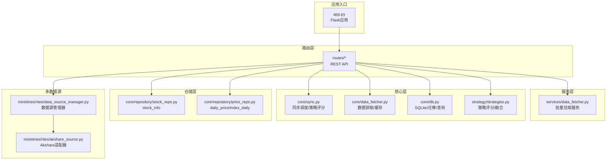
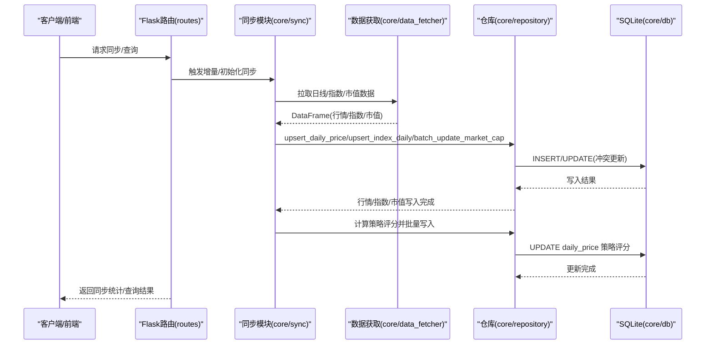
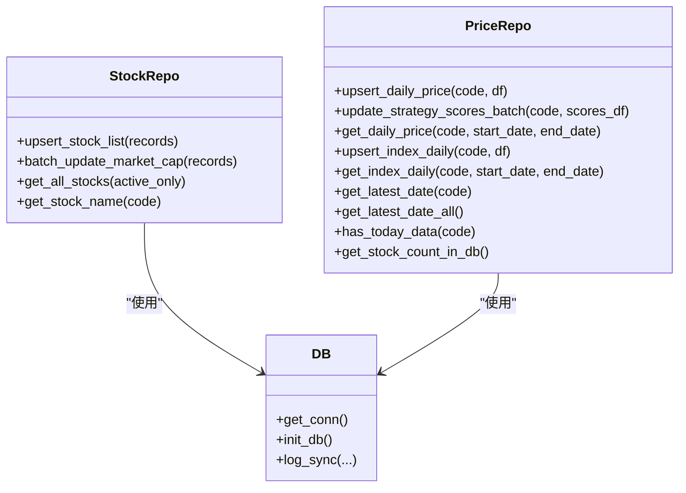
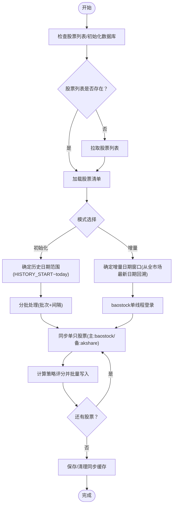
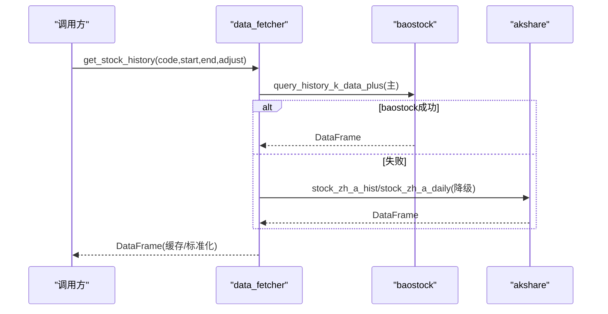
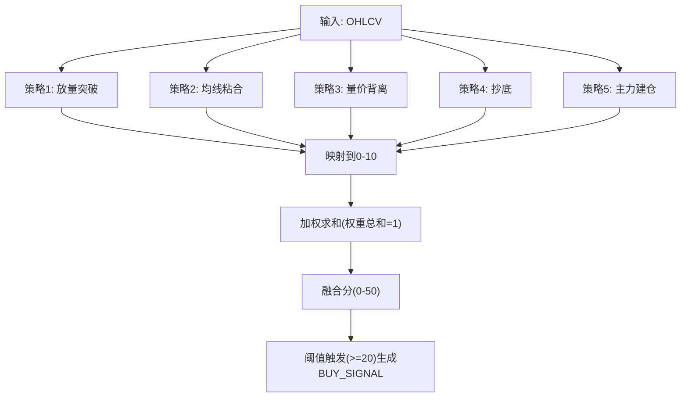
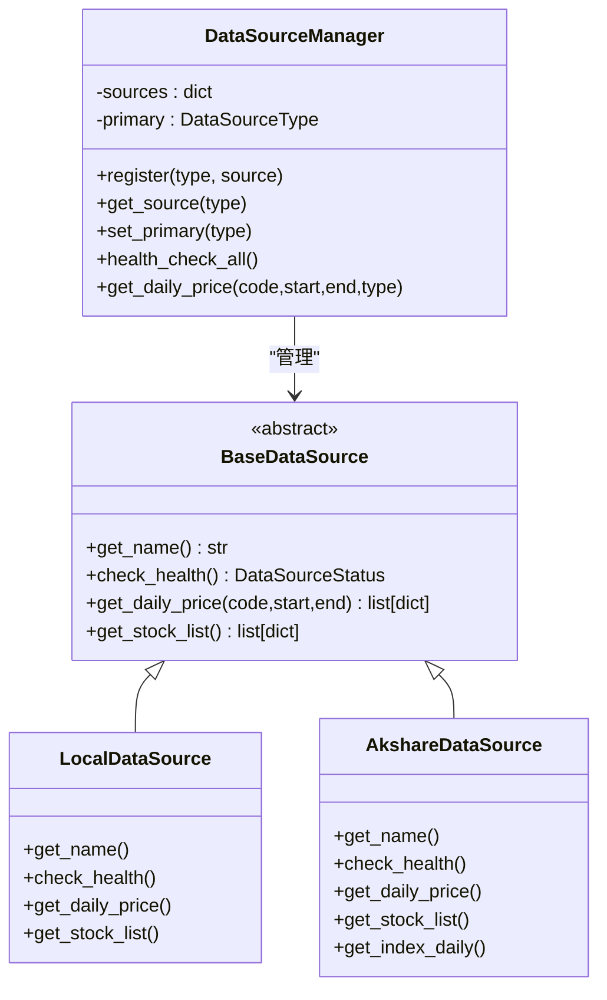
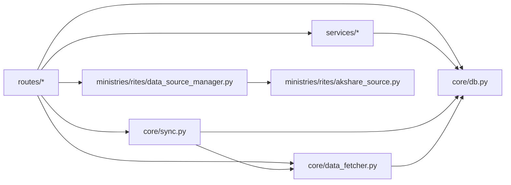

# 数据管理系统

<cite>
**本文引用的文件**
- [core/db.py](file://core/db.py)
- [core/sync.py](file://core/sync.py)
- [core/data_fetcher.py](file://core/data_fetcher.py)
- [ministries/rites/data_source_manager.py](file://ministries/rites/data_source_manager.py)
- [ministries/rites/akshare_source.py](file://ministries/rites/akshare_source.py)
- [core/repository/stock_repo.py](file://core/repository/stock_repo.py)
- [core/repository/price_repo.py](file://core/repository/price_repo.py)
- [strategy/strategies.py](file://strategy/strategies.py)
- [core/audit.py](file://core/audit.py)
- [routes/data_source.py](file://routes/data_source.py)
- [services/data_fetcher.py](file://services/data_fetcher.py)
- [app.py](file://app.py)
</cite>

## 目录
1. [简介](#简介)
2. [项目结构](#项目结构)
3. [核心组件](#核心组件)
4. [架构总览](#架构总览)
5. [详细组件分析](#详细组件分析)
6. [依赖分析](#依赖分析)
7. [性能考虑](#性能考虑)
8. [故障排查指南](#故障排查指南)
9. [结论](#结论)
10. [附录](#附录)

## 简介
本文件面向AIQuant数据管理系统，系统以本地SQLite为核心存储，围绕“数据获取—ETL处理—仓库模式—数据同步—质量保障”构建完整数据管线。重点涵盖：
- 数据库设计与表结构（股票基础、日线行情、策略评分、指数行情、风控与审计等）
- 仓库模式实现（Repository层封装数据访问）
- 数据同步机制（历史初始化、增量同步、策略评分回填）
- 数据质量保障（健康检查、断点续传、缓存与降级）
- 扩展与集成（多数据源管理、自定义数据源适配）
- 运维与优化（并发控制、性能优化、备份与恢复）

## 项目结构
系统采用“模块化+分层”的组织方式：
- 核心层：数据库连接与迁移、数据获取与清洗、策略评分与融合
- 仓储层：对核心表进行统一的数据访问封装
- 业务服务层：对外提供数据拉取与批量处理能力
- 路由与API：基于Flask的REST接口与WebSocket行情推送
- 多数据源管理：抽象数据源接口，支持本地与第三方数据源切换



图表来源
- [app.py:1-164](file://app.py#L1-L164)
- [routes/data_source.py:1-112](file://routes/data_source.py#L1-L112)
- [services/data_fetcher.py:1-106](file://services/data_fetcher.py#L1-L106)
- [core/sync.py:1-760](file://core/sync.py#L1-L760)
- [core/data_fetcher.py:1-578](file://core/data_fetcher.py#L1-L578)
- [core/db.py:1-1213](file://core/db.py#L1-L1213)
- [strategy/strategies.py:1-431](file://strategy/strategies.py#L1-L431)
- [core/repository/stock_repo.py:1-80](file://core/repository/stock_repo.py#L1-L80)
- [core/repository/price_repo.py:1-237](file://core/repository/price_repo.py#L1-L237)
- [ministries/rites/data_source_manager.py:1-190](file://ministries/rites/data_source_manager.py#L1-L190)
- [ministries/rites/akshare_source.py:1-135](file://ministries/rites/akshare_source.py#L1-L135)

章节来源
- [app.py:1-164](file://app.py#L1-L164)
- [routes/data_source.py:1-112](file://routes/data_source.py#L1-L112)

## 核心组件
- 数据库与连接管理：提供SQLite连接上下文、WAL模式、PRAGMA配置、建表与迁移、常用查询封装
- 数据获取与缓存：baostock为主、akshare为备，统一缓存与降级逻辑
- 仓库模式：对stock_info/daily_price/index_daily等表进行统一的数据访问
- 策略评分与融合：多策略独立评分与加权融合，输出融合分与买卖信号
- 数据同步：历史初始化、增量同步、指数同步、策略评分回填、断点续传
- 多数据源管理：抽象数据源接口，支持本地与第三方数据源健康检查与切换
- 审计日志：统一记录操作、用户、IP、结果与耗时

章节来源
- [core/db.py:1-1213](file://core/db.py#L1-L1213)
- [core/data_fetcher.py:1-578](file://core/data_fetcher.py#L1-L578)
- [core/repository/stock_repo.py:1-80](file://core/repository/stock_repo.py#L1-L80)
- [core/repository/price_repo.py:1-237](file://core/repository/price_repo.py#L1-L237)
- [strategy/strategies.py:1-431](file://strategy/strategies.py#L1-L431)
- [core/sync.py:1-760](file://core/sync.py#L1-L760)
- [ministries/rites/data_source_manager.py:1-190](file://ministries/rites/data_source_manager.py#L1-L190)
- [core/audit.py:1-147](file://core/audit.py#L1-L147)

## 架构总览
系统以“本地SQLite + 多数据源 + 仓库模式 + 策略引擎 + API网关”的架构运行，核心数据流如下：



图表来源
- [core/sync.py:1-760](file://core/sync.py#L1-L760)
- [core/data_fetcher.py:1-578](file://core/data_fetcher.py#L1-L578)
- [core/repository/price_repo.py:1-237](file://core/repository/price_repo.py#L1-L237)
- [core/repository/stock_repo.py:1-80](file://core/repository/stock_repo.py#L1-L80)
- [core/db.py:1-1213](file://core/db.py#L1-L1213)

## 详细组件分析

### 数据库设计与表结构
- stock_info：股票基本信息（代码、名称、市场、是否激活、更新时间、市值字段）
- daily_price：日线行情（OHLCV+涨跌幅+换手率+策略评分列），复合唯一索引(code,date)
- index_daily：指数日线行情（OHLCV+涨跌幅），复合唯一索引(code,date)
- stock_signal：策略扫描记录（兼容旧表）
- sync_log：数据同步日志
- positions/trades/account_snapshots：持仓、交易、账户快照
- stock_margin/stock_margin_detail：融资融券汇总与明细
- stock_hsgt_north：沪深港通北向资金
- index_futures：指数期货
- stock_lhb_detail：龙虎榜明细
- stock_mgmt_holding：高管增减持
- risk_events/risk_status/risk_overrides：风控事件、风控状态、风控豁免
- audit_log：审计日志

```mermaid
erDiagram
STOCK_INFO {
text code PK
text name
text market
integer is_active
text updated_at
real total_shares
real circ_shares
}
DAILY_PRICE {
integer id PK
text code
text trade_date
real open
real high
real low
real close
real volume
real amount
real pct_change
real turnover
real vol_score
real ma_score
real diverge_score
real bottom_score
real whale_score
real fusion_score
real strategy_score
text strategy_signal
}
INDEX_DAILY {
integer id PK
text code
text trade_date
real open
real high
real low
real close
real volume
real amount
real pct_change
}
STOCK_SIGNAL {
integer id PK
text scan_date
text trade_date
text code
text name
real price
real fusion_score
real vol_score
real ma_score
real diverge_score
real bottom_score
real whale_score
text trigger_list
real buy_price
real stop_loss
real take_profit
integer buy_volume
real buy_money
integer sent_wechat
text created_at
}
SYNC_LOG {
integer id PK
text sync_time
text sync_type
integer total
integer success
integer failed
real duration_s
text note
}
POSITIONS {
integer id PK
text code
text name
text entry_date
real entry_price
integer shares
real current_price
real stop_loss
real take_profit
text position_type
text status
text strategy
text note
text created_at
text updated_at
real commission
}
TRADES {
integer id PK
integer position_id
text code
text name
text trade_date
text direction
real price
integer shares
real amount
real commission
real slippage
text reason
text note
text created_at
}
ACCOUNT_SNAPSHOTS {
integer id PK
text snapshot_date
real total_assets
real cash
real position_value
integer positions_count
real total_cost
real total_pnl
real pnl_pct
text created_at
}
STOCK_MARGIN {
integer id PK
text trade_date
real sse_margin_balance
real sse_margin_buy
real sse_short_balance
real sse_short_volume
real szse_margin_balance
real szse_margin_buy
real szse_short_balance
real szse_short_volume
real szse_margin_ratio
real total_margin_balance
real total_margin_buy
real total_short_balance
real total_margin
}
STOCK_MARGIN_DETAIL {
integer id PK
text code
text trade_date
text name
text exchange
real margin_balance
real margin_buy
real margin_repay
real short_volume
real short_sell
real short_repay
real short_balance
real total_balance
}
STOCK_HSGT_NORTH {
integer id PK
text trade_date
real north_net_buy
real north_buy_amt
real north_sell_amt
real north_cum_net
real north_daily_flow
real north_balance
real north_market_cap
real hgt_net_buy
real hgt_buy_amt
real hgt_sell_amt
real hgt_cum_net
real hgt_daily_flow
real sgt_net_buy
real sgt_buy_amt
real sgt_sell_amt
real sgt_cum_net
real sgt_daily_flow
}
INDEX_FUTURES {
integer id PK
text trade_date
text symbol
text variety
real open
real high
real low
real close
real volume
real open_interest
real turnover
real settle
real pre_settle
}
STOCK_LHB_DETAIL {
integer id PK
text trade_date
text code
text name
real close_price
real pct_change
real net_buy
real buy_amt
real sell_amt
real total_amt
real mkt_total_amt
real net_buy_ratio
real turnover_rate
real float_mkt_cap
text reason
real perf_1d
real perf_2d
real perf_5d
real perf_10d
}
STOCK_MGMT_HOLDING {
integer id PK
text trade_date
text code
text name
text changer
real change_shares
real avg_price
real change_amount
text change_reason
real change_ratio
real shares_after
text share_type
text executive_name
text position
}
RISK_EVENTS {
integer id PK
text pipeline_id
text rule_name
text category
text level
text message
real metric_value
real threshold
text suggestion
text created_at
}
RISK_STATUS {
text account_id PK
text overall_level
text active_rules
real current_drawdown
integer current_positions
real total_exposure
real available_capital
text last_check
text block_reason
text updated_at
}
RISK_OVERRIDES {
integer id PK
text rule_name
text reason
text operator
text approver
text status
text created_at
text expires_at
text approved_at
}
AUDIT_LOG {
integer id PK
text user_id
text action
text resource
text detail
text ip_address
text created_at
}
DAILY_PRICE }o--|| STOCK_INFO : "code"
DAILY_PRICE }o--|| INDEX_DAILY : "code"
DAILY_PRICE }o--o|| STOCK_SIGNAL : "scan_date/code"
DAILY_PRICE }o--o|| POSITIONS : "code"
POSITIONS ||--o{ TRADES : "position_id"
DAILY_PRICE ||--o{ TRADES : "code"
DAILY_PRICE ||--o{ ACCOUNT_SNAPSHOTS : "snapshot_date"
DAILY_PRICE ||--o{ STOCK_MARGIN_DETAIL : "code"
DAILY_PRICE ||--o{ STOCK_HSGT_NORTH : "trade_date"
DAILY_PRICE ||--o{ STOCK_LHB_DETAIL : "code"
DAILY_PRICE ||--o{ STOCK_MGMT_HOLDING : "code"
DAILY_PRICE ||--o|| RISK_EVENTS : "pipeline_id"
DAILY_PRICE ||--o|| RISK_STATUS : "account_id"
DAILY_PRICE ||--o|| RISK_OVERRIDES : "rule_name"
DAILY_PRICE ||--o|| AUDIT_LOG : "resource"
```

图表来源
- [core/db.py:57-427](file://core/db.py#L57-L427)

章节来源
- [core/db.py:1-1213](file://core/db.py#L1-L1213)

### 仓库模式实现
- stock_repo：封装stock_info的批量写入、市值更新、查询等
- price_repo：封装daily_price/index_daily的写入、查询、最新日期、覆盖率统计等



图表来源
- [core/repository/stock_repo.py:1-80](file://core/repository/stock_repo.py#L1-L80)
- [core/repository/price_repo.py:1-237](file://core/repository/price_repo.py#L1-L237)
- [core/db.py:26-467](file://core/db.py#L26-L467)

章节来源
- [core/repository/stock_repo.py:1-80](file://core/repository/stock_repo.py#L1-L80)
- [core/repository/price_repo.py:1-237](file://core/repository/price_repo.py#L1-L237)

### 数据同步机制
- 历史初始化：拉取全市场股票历史数据，断点续传，baostock为主、akshare为备
- 增量同步：按全市场最新日期向前推，寻找覆盖率≥阈值的日期窗口，单线程登录baostock，逐日同步
- 指数同步：每日同步主要指数（上证/深证/沪深300/中证500/中证1000）
- 策略评分：对已同步的全量历史计算5策略评分并批量写入daily_price
- 缓存与断点：同步缓存文件记录已同步股票，异常中断后可续传



图表来源
- [core/sync.py:319-390](file://core/sync.py#L319-L390)
- [core/sync.py:462-668](file://core/sync.py#L462-L668)
- [core/sync.py:675-702](file://core/sync.py#L675-L702)

章节来源
- [core/sync.py:1-760](file://core/sync.py#L1-L760)

### 数据获取与ETL
- 主数据源：baostock（免费、稳定、无频率限制），备用：akshare（多接口降级）
- ETL流程：统一列名、类型转换、缺失值处理、复权调整、缓存与降级
- 市值数据：通过baostock换手率反推流通股本，批量无频率限制



图表来源
- [core/data_fetcher.py:173-223](file://core/data_fetcher.py#L173-L223)
- [core/data_fetcher.py:371-424](file://core/data_fetcher.py#L371-L424)

章节来源
- [core/data_fetcher.py:1-578](file://core/data_fetcher.py#L1-L578)

### 策略评分与融合
- 独立策略：放量突破、均线粘合、量价背离、抄底、主力建仓
- 融合策略：将各策略评分映射到0-10，按权重加权求和，得到0-50的融合分
- 输出：BUY_SIGNAL/SELL_SIGNAL、BUY_SCORE、STRATEGY字段



图表来源
- [strategy/strategies.py:36-92](file://strategy/strategies.py#L36-L92)
- [strategy/strategies.py:368-430](file://strategy/strategies.py#L368-L430)

章节来源
- [strategy/strategies.py:1-431](file://strategy/strategies.py#L1-L431)

### 多数据源管理与扩展
- 抽象接口：BaseDataSource，统一健康检查、日线/列表获取
- 管理器：DataSourceManager，支持本地与第三方数据源注册、主备切换、自动降级
- API：提供数据源列表、健康检查、切换主数据源、按源获取行情



图表来源
- [ministries/rites/data_source_manager.py:48-190](file://ministries/rites/data_source_manager.py#L48-L190)
- [ministries/rites/akshare_source.py:15-135](file://ministries/rites/akshare_source.py#L15-L135)

章节来源
- [ministries/rites/data_source_manager.py:1-190](file://ministries/rites/data_source_manager.py#L1-L190)
- [ministries/rites/akshare_source.py:1-135](file://ministries/rites/akshare_source.py#L1-L135)
- [routes/data_source.py:1-112](file://routes/data_source.py#L1-L112)

### 审计日志与运维
- 审计日志：统一记录操作、用户、IP、结果与耗时，支持装饰器自动记录
- API：提供审计日志查询接口，支持按动作/用户分页查询

章节来源
- [core/audit.py:1-147](file://core/audit.py#L1-L147)

## 依赖分析
- 组件耦合
  - 路由层依赖服务层与核心模块，服务层依赖数据获取与仓库层，仓库层依赖数据库层
  - 多数据源管理器作为抽象层，被路由层调用，避免直接耦合具体数据源
- 外部依赖
  - baostock：主数据源，无频率限制
  - akshare：备用数据源，多接口降级
  - SQLite：本地存储，WAL模式提升并发
- 潜在循环依赖
  - 当前模块间为单向依赖，未发现循环导入



图表来源
- [routes/data_source.py:1-112](file://routes/data_source.py#L1-L112)
- [services/data_fetcher.py:1-106](file://services/data_fetcher.py#L1-L106)
- [core/sync.py:1-760](file://core/sync.py#L1-L760)
- [core/data_fetcher.py:1-578](file://core/data_fetcher.py#L1-L578)
- [core/db.py:1-1213](file://core/db.py#L1-L1213)
- [ministries/rites/data_source_manager.py:1-190](file://ministries/rites/data_source_manager.py#L1-L190)
- [ministries/rites/akshare_source.py:1-135](file://ministries/rites/akshare_source.py#L1-L135)

章节来源
- [app.py:1-164](file://app.py#L1-L164)

## 性能考虑
- 并发与锁
  - SQLite使用WAL模式与PRAGMA配置，提升读写并发
  - baostock单线程登录，避免线程安全问题；多线程场景建议独立会话或串行
- 索引与查询
  - 为高频查询建立复合索引（如daily_price(code,date)、index_daily(code,date)等）
  - 查询时尽量限定日期范围，减少全表扫描
- 批量写入
  - 使用executemany与ON CONFLICT更新，减少往返次数
  - 策略评分批量更新关闭外键约束，逐条UPDATE后提交
- 缓存与降级
  - 数据获取层提供CSV缓存，避免重复请求
  - 多接口降级，提升可用性
- 策略计算
  - 策略评分一次性写入数据库，回测时直接读取，避免重复计算

[本节为通用指导，无需列出章节来源]

## 故障排查指南
- 数据库初始化失败
  - 检查DB_PATH与权限；确认init_db()执行成功
  - 关注PRAGMA配置与索引重建
- 同步中断/断点续传
  - 查看同步缓存文件是否存在；确认缓存中的已同步股票集合
  - 若缓存损坏，删除缓存文件后重试
- baostock登录失败
  - 单线程登录失败会导致后续查询异常；检查登录返回码与网络
- akshare接口限速/失败
  - 自动降级到备用接口；若仍失败，检查网络与代理
- 策略评分未更新
  - 确认已执行sync_strategy_score或daily_sync中已包含评分回填
- 多数据源切换无效
  - 检查DataSourceManager主数据源设置与健康检查结果
- 审计日志未记录
  - 确认装饰器使用正确；检查数据库连接与表结构

章节来源
- [core/sync.py:462-668](file://core/sync.py#L462-L668)
- [core/data_fetcher.py:173-223](file://core/data_fetcher.py#L173-L223)
- [core/audit.py:16-92](file://core/audit.py#L16-L92)

## 结论
AIQuant数据管理系统以SQLite为核心，结合baostock与akshare双数据源，采用仓库模式与策略融合，构建了高效、可扩展、可维护的数据管线。通过断点续传、缓存与降级、索引优化与WAL并发，系统在保证数据质量的同时兼顾性能与稳定性。多数据源管理器为未来扩展更多数据源提供了清晰的接口与最佳实践。

[本节为总结性内容，无需列出章节来源]

## 附录

### 数据备份与恢复
- 备份
  - 直接复制SQLite文件（quant.db）进行物理备份
  - 导出关键表结构与数据（SQL导出）用于跨环境迁移
- 恢复
  - 停止服务后替换或还原quant.db
  - 如需重建索引，执行init_db()或手动重建索引

[本节为通用指导，无需列出章节来源]

### 扩展指南：自定义数据源集成
- 实现BaseDataSource接口，提供健康检查、日线/列表获取
- 在DataSourceManager中注册并设置为主数据源或备用
- 通过routes/data_source.py提供的API进行切换与测试

章节来源
- [ministries/rites/data_source_manager.py:48-190](file://ministries/rites/data_source_manager.py#L48-L190)
- [routes/data_source.py:1-112](file://routes/data_source.py#L1-L112)

### 最佳实践
- 同步策略
  - 历史初始化使用baostock，增量同步在交易日16:00后执行
  - 设置合理的覆盖率阈值，避免数据不完整导致的回测偏差
- 数据质量
  - 使用健康检查与断点续传，确保数据完整性
  - 对缺失列进行补全或剔除，统一列名与类型
- 性能优化
  - 合理使用索引与查询范围，批量写入与事务合并
  - 策略评分一次性写入，避免重复计算

[本节为通用指导，无需列出章节来源]