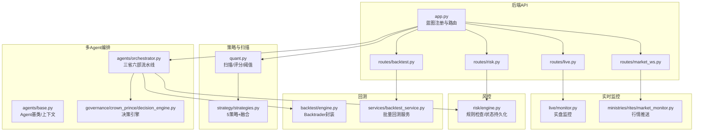
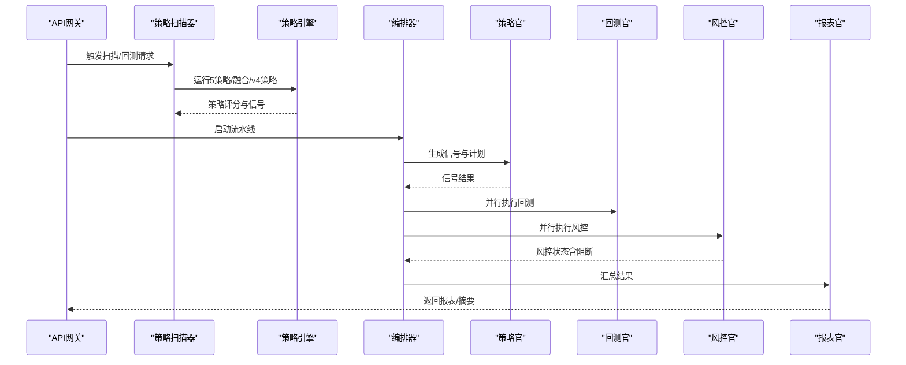
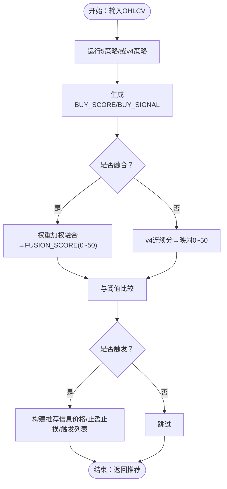
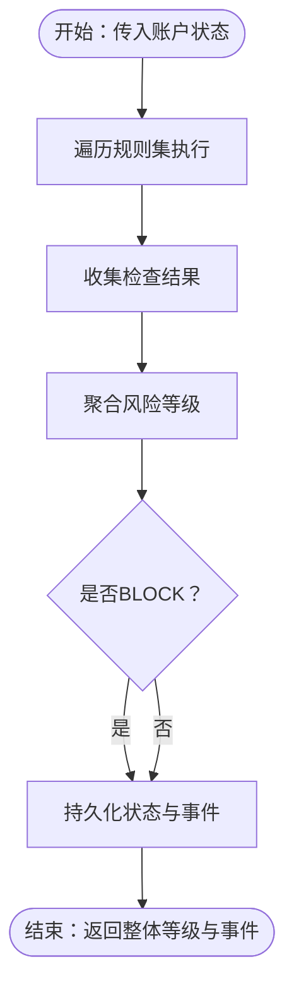
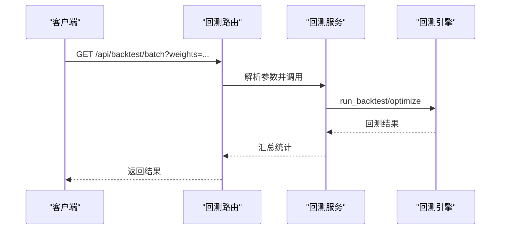
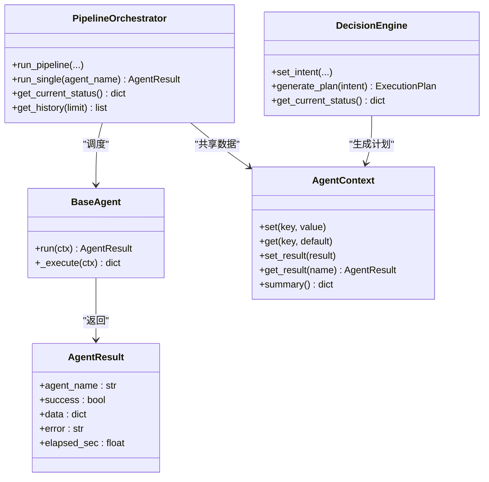
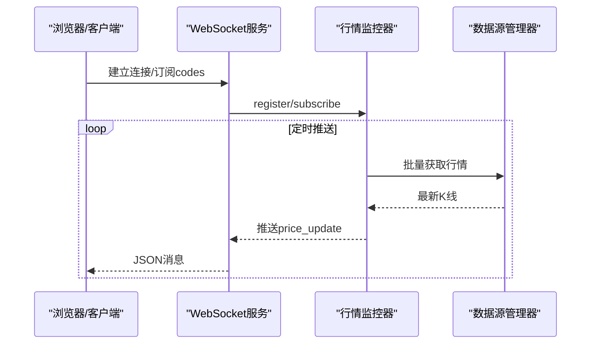
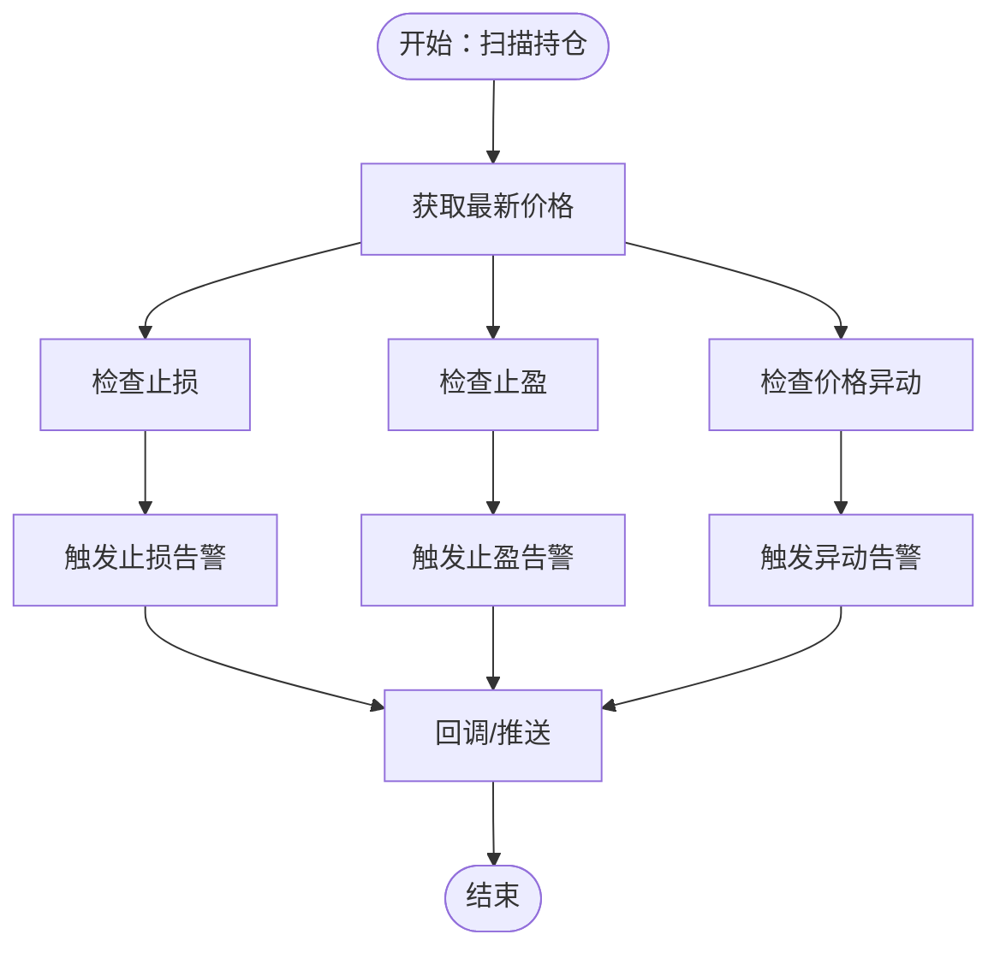
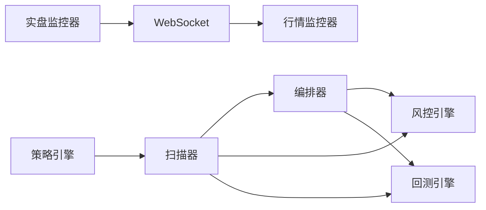

# 核心功能特性

<cite>
**本文引用的文件**   
- [README.md](file://README.md)
- [app.py](file://app.py)
- [quant.py](file://quant.py)
- [strategy/strategies.py](file://strategy/strategies.py)
- [agents/orchestrator.py](file://agents/orchestrator.py)
- [agents/base.py](file://agents/base.py)
- [backtest/engine.py](file://backtest/engine.py)
- [routes/backtest.py](file://routes/backtest.py)
- [services/backtest_service.py](file://services/backtest_service.py)
- [risk/engine.py](file://risk/engine.py)
- [live/monitor.py](file://live/monitor.py)
- [ministries/rites/market_monitor.py](file://ministries/rites/market_monitor.py)
- [governance/crown_prince/decision_engine.py](file://governance/crown_prince/decision_engine.py)
- [config/settings.py](file://config/settings.py)
</cite>

## 目录
1. [简介](#简介)
2. [项目结构](#项目结构)
3. [核心组件](#核心组件)
4. [架构总览](#架构总览)
5. [详细组件分析](#详细组件分析)
6. [依赖分析](#依赖分析)
7. [性能考虑](#性能考虑)
8. [故障排查指南](#故障排查指南)
9. [结论](#结论)
10. [附录](#附录)

## 简介
本文件面向AIQuant量化交易系统的核心功能特性，围绕“多策略量化分析（5种A股策略）”“风险控制系统”“回测验证平台”“多Agent编排系统”“实时监控”等关键模块，系统阐述其作用、实现原理、使用场景、模块协作关系与数据流，并提供使用示例与最佳实践，帮助用户与开发者建立完整、可操作的认知。

## 项目结构
系统采用“后端API + 策略引擎 + Agent流水线 + 风控 + 实时监控 + 回测”的分层组织方式：
- 后端API：通过蓝图组织路由，提供策略扫描、回测、风控、实时行情、交易执行等接口
- 策略引擎：内置5种A股策略与融合评分，支持v4超跌反弹策略
- 多Agent编排：三省六部制流水线，串行/并行组合，支持状态持久化与中断控制
- 风控系统：规则驱动的风险检查与状态记录，支持阻断式风控
- 实时监控：实盘监控与行情推送，支持告警与Webhook
- 回测平台：批量回测服务，支持参数扫描与结果汇总

图表来源
- [app.py:1-164](file://app.py#L1-L164)
- [quant.py:26-35](file://quant.py#L26-L35)
- [strategy/strategies.py:1-431](file://strategy/strategies.py#L1-L431)
- [agents/orchestrator.py:1-263](file://agents/orchestrator.py#L1-L263)
- [agents/base.py:1-120](file://agents/base.py#L1-L120)
- [governance/crown_prince/decision_engine.py:1-157](file://governance/crown_prince/decision_engine.py#L1-L157)
- [risk/engine.py:1-168](file://risk/engine.py#L1-L168)
- [live/monitor.py:1-286](file://live/monitor.py#L1-L286)
- [ministries/rites/market_monitor.py:1-244](file://ministries/rites/market_monitor.py#L1-L244)
- [backtest/engine.py:1-174](file://backtest/engine.py#L1-L174)
- [services/backtest_service.py:1-135](file://services/backtest_service.py#L1-L135)

章节来源
- [app.py:1-164](file://app.py#L1-L164)
- [config/settings.py:1-25](file://config/settings.py#L1-L25)

## 核心组件
- 多策略量化分析（5种A股策略）
  - 放量突破、均线粘合、量价背离、抄底、主力建仓
  - 策略评分连续化（0~3），融合为0~50分，支持阈值过滤与触发列表
  - v4超跌反弹策略：连续打分0~4，映射至0~50分，结合大盘择时
- 风险控制系统
  - 规则集合与风险等级聚合，阻断式风控（BLOCK级拦截）
  - 风控事件与状态持久化，支持查询与回溯
- 回测验证平台
  - 批量回测服务，支持参数扫描、止盈止损、跟踪止盈、交易对平
  - 输出年化收益、最大回撤、胜率、盈亏比、交易明细等
- 多Agent编排系统
  - 三省六部制流水线：数据官→策略官→回测官/风控官（并行）→报表官
  - 支持非交易日回退、状态持久化、中断记录与并行加速
- 实时监控
  - 实盘监控：止损/止盈/价格异动告警，支持Webhook推送
  - 行情监控：WebSocket推送，订阅/退订管理，批量行情拉取

章节来源
- [strategy/strategies.py:36-431](file://strategy/strategies.py#L36-L431)
- [quant.py:71-283](file://quant.py#L71-L283)
- [risk/engine.py:19-72](file://risk/engine.py#L19-L72)
- [agents/orchestrator.py:81-175](file://agents/orchestrator.py#L81-L175)
- [services/backtest_service.py:10-74](file://services/backtest_service.py#L10-L74)
- [live/monitor.py:102-155](file://live/monitor.py#L102-L155)
- [ministries/rites/market_monitor.py:108-152](file://ministries/rites/market_monitor.py#L108-L152)

## 架构总览
系统以“策略扫描→回测/风控并行→报表输出”的流水线为核心，结合实时行情与实盘监控，形成闭环的量化交易工作流。

图表来源
- [quant.py:289-337](file://quant.py#L289-L337)
- [agents/orchestrator.py:112-153](file://agents/orchestrator.py#L112-L153)
- [services/backtest_service.py:10-38](file://services/backtest_service.py#L10-L38)
- [risk/engine.py:51-71](file://risk/engine.py#L51-L71)

## 详细组件分析

### 多策略量化分析（5策略+融合+v4）
- 功能要点
  - 5策略评分连续化，融合为0~50分，支持阈值过滤
  - v4超跌反弹策略：连续打分0~4，映射0~50分，结合大盘择时（MA5>MA20）
  - 触发列表：各策略≥2.0视为触发，便于面板展示
- 实现原理
  - 各策略独立计算得分列（BUY_SCORE/BUY_SIGNAL），融合策略对各策略原始分做权重加权并映射
  - v4策略独立打分，结合20日跌幅、站上MA5、温和放量、RSI区间、不创近期新低、大盘择时
- 使用场景
  - 日常扫描：按阈值筛选Top N，生成交易计划
  - 历史回填：将融合分≥阈值的历史日期写入面板表，支持对比分析
- 关键路径
  - 策略函数：[strategy_volume_breakout:36-91](file://strategy/strategies.py#L36-L91)、[strategy_ma_convergence:98-134](file://strategy/strategies.py#L98-L134)、[strategy_price_volume_divergence:141-178](file://strategy/strategies.py#L141-L178)、[strategy_bottom_fishing:185-217](file://strategy/strategies.py#L185-L217)、[strategy_whale_accumulation:224-255](file://strategy/strategies.py#L224-L255)
  - 融合函数：[fuse_signals:368-429](file://strategy/strategies.py#L368-L429)
  - v4策略：[strategy_oversold_rebound:281-360](file://strategy/strategies.py#L281-L360)
  - 扫描与阈值：[analyze_stock_from_db:71-143](file://quant.py#L71-L143)、[analyze_stock_v4:177-283](file://quant.py#L177-L283)、[scan_all_stocks:289-337](file://quant.py#L289-L337)

图表来源
- [strategy/strategies.py:36-431](file://strategy/strategies.py#L36-L431)
- [quant.py:71-283](file://quant.py#L71-L283)

章节来源
- [strategy/strategies.py:36-431](file://strategy/strategies.py#L36-L431)
- [quant.py:71-283](file://quant.py#L71-L283)

### 风控控制系统
- 功能要点
  - 规则集合执行，聚合整体风险等级（PASS/WARNING/RESTRICT/BLOCK）
  - 阻断式风控：若整体等级为BLOCK，拦截后续流程
  - 风控事件与状态持久化，支持查询与回溯
- 实现原理
  - 风控引擎遍历规则，收集检查结果，按优先级取最严格等级
  - 将结果与状态写入数据库，提供查询接口
- 使用场景
  - 流水线风控拦截：在回测/报表阶段前置风控
  - 实盘风控：结合账户状态动态评估
- 关键路径
  - 风控检查：[check/check_and_record:19-71](file://risk/engine.py#L19-L71)
  - 状态持久化：[save_results/save_status:73-127](file://risk/engine.py#L73-L127)
  - 查询接口：[get_latest_status/get_recent_events:129-167](file://risk/engine.py#L129-L167)

图表来源
- [risk/engine.py:19-71](file://risk/engine.py#L19-L71)
- [risk/engine.py:73-127](file://risk/engine.py#L73-L127)

章节来源
- [risk/engine.py:19-71](file://risk/engine.py#L19-L71)
- [risk/engine.py:73-127](file://risk/engine.py#L73-L127)

### 回测验证平台
- 功能要点
  - 批量回测服务：支持参数扫描、止盈止损、跟踪止盈、交易对平
  - 输出指标：年化收益、最大回撤、胜率、盈亏比、交易明细、净值曲线
- 实现原理
  - 路由层接收参数，服务层调用底层脚本执行回测，汇总统计
  - 回测引擎封装Backtrader，提供策略适配与分析器
- 使用场景
  - 参数优化：扫描权重、阈值、止盈止损等
  - 历史复盘：验证策略在历史区间的稳定性
- 关键路径
  - 路由参数解析：[routes/backtest.py:12-44](file://routes/backtest.py#L12-L44)
  - 服务层执行：[services/backtest_service.py:10-74](file://services/backtest_service.py#L10-L74)
  - 引擎封装：[backtest/engine.py:72-174](file://backtest/engine.py#L72-L174)

图表来源
- [routes/backtest.py:12-44](file://routes/backtest.py#L12-L44)
- [services/backtest_service.py:10-74](file://services/backtest_service.py#L10-L74)
- [backtest/engine.py:72-174](file://backtest/engine.py#L72-L174)

章节来源
- [routes/backtest.py:12-44](file://routes/backtest.py#L12-L44)
- [services/backtest_service.py:10-74](file://services/backtest_service.py#L10-L74)
- [backtest/engine.py:72-174](file://backtest/engine.py#L72-L174)

### 多Agent编排系统
- 功能要点
  - 三省六部制：数据官→策略官→回测官/风控官（并行）→报表官
  - 支持非交易日回退、状态持久化、中断记录、并行加速
- 实现原理
  - 编排器统一调度，延迟导入Agent类，串行/并行组合
  - 上下文共享数据与结果，支持回调与历史记录
- 使用场景
  - 自动化策略验证：从数据到报表的一体化流水线
  - 手动触发与调试：单Agent执行与状态查询
- 关键路径
  - 编排执行：[run_pipeline/_run_parallel:81-175](file://agents/orchestrator.py#L81-L175)
  - Agent基类：[BaseAgent/AgentContext:88-120](file://agents/base.py#L88-L120)
  - 决策引擎：[DecisionEngine:61-157](file://governance/crown_prince/decision_engine.py#L61-L157)

图表来源
- [agents/orchestrator.py:36-263](file://agents/orchestrator.py#L36-L263)
- [agents/base.py:20-120](file://agents/base.py#L20-L120)
- [governance/crown_prince/decision_engine.py:61-157](file://governance/crown_prince/decision_engine.py#L61-L157)

章节来源
- [agents/orchestrator.py:81-175](file://agents/orchestrator.py#L81-L175)
- [agents/base.py:88-120](file://agents/base.py#L88-L120)
- [governance/crown_prince/decision_engine.py:61-157](file://governance/crown_prince/decision_engine.py#L61-L157)

### 实时监控
- 实时行情监控
  - WebSocket客户端管理、订阅/退订、批量行情拉取与推送
  - 系统事件广播（连接/断开）
- 实盘监控
  - 持仓扫描、止损/止盈/价格异动告警
  - Webhook推送与告警处理回调

图表来源
- [ministries/rites/market_monitor.py:108-152](file://ministries/rites/market_monitor.py#L108-L152)

图表来源
- [live/monitor.py:102-155](file://live/monitor.py#L102-L155)

章节来源
- [ministries/rites/market_monitor.py:108-152](file://ministries/rites/market_monitor.py#L108-L152)
- [live/monitor.py:102-155](file://live/monitor.py#L102-L155)

## 依赖分析
- 组件耦合
  - 策略层与扫描层解耦：策略函数独立，扫描层负责阈值与触发列表
  - 编排层与Agent层解耦：延迟导入Agent类，通过上下文传递数据
  - 风控层与业务层解耦：规则可插拔，状态持久化
- 外部依赖
  - Backtrader用于回测引擎封装
  - WebSocket用于行情推送
  - 数据源管理器提供行情数据
- 潜在风险
  - 非交易日数据回退逻辑需确保历史数据可用
  - 并行执行时的资源竞争与锁保护

图表来源
- [quant.py:289-337](file://quant.py#L289-L337)
- [agents/orchestrator.py:112-153](file://agents/orchestrator.py#L112-L153)
- [risk/engine.py:51-71](file://risk/engine.py#L51-L71)
- [backtest/engine.py:72-174](file://backtest/engine.py#L72-L174)
- [ministries/rites/market_monitor.py:108-152](file://ministries/rites/market_monitor.py#L108-L152)
- [live/monitor.py:102-155](file://live/monitor.py#L102-L155)

章节来源
- [quant.py:289-337](file://quant.py#L289-L337)
- [agents/orchestrator.py:112-153](file://agents/orchestrator.py#L112-L153)
- [risk/engine.py:51-71](file://risk/engine.py#L51-L71)
- [backtest/engine.py:72-174](file://backtest/engine.py#L72-L174)
- [ministries/rites/market_monitor.py:108-152](file://ministries/rites/market_monitor.py#L108-L152)
- [live/monitor.py:102-155](file://live/monitor.py#L102-L155)

## 性能考虑
- 扫描与回测
  - 扫描层对全市场股票逐只运行策略，建议分批与限速，避免数据库与网络压力
  - 回测服务支持参数网格扫描，建议并行化与缓存中间结果
- 实时监控
  - 行情推送批量拉取，避免单次过多请求；实盘监控间隔可调
- 风控与编排
  - 风控规则尽量轻量，避免复杂IO；编排器使用线程池并行，注意锁竞争
- 存储与索引
  - 建议为常用查询字段建立索引，减少扫描成本

## 故障排查指南
- API健康检查
  - 访问 /api/health 确认服务运行状态
- 路由调试
  - 访问 /api/debug/routes 查看已注册路由
- 扫描与回测
  - 若扫描无命中，检查阈值设置与v4择时条件
  - 回测报错时查看服务层异常栈，确认参数合法性
- 风控拦截
  - 查询风控状态与事件，定位具体规则与阈值
- 实时监控
  - 检查WebSocket连接状态与订阅列表；确认告警回调URL可达

章节来源
- [app.py:124-145](file://app.py#L124-L145)
- [services/backtest_service.py:40-42](file://services/backtest_service.py#L40-L42)
- [risk/engine.py:129-167](file://risk/engine.py#L129-L167)

## 结论
AIQuant系统通过“策略扫描+Agent编排+风控+回测+实时监控”的一体化设计，实现了从信号生成到实盘执行的闭环。其创新点在于：
- 多策略融合与v4超跌反弹策略的双轨扫描能力
- 三省六部制流水线的模块化与可扩展性
- 阻断式风控与状态持久化的安全边界
- 批量回测与参数扫描的工程化验证能力
- 实时行情与实盘监控的可观测性保障

## 附录
- 使用示例（概念性）
  - 启动后端服务并自动启动行情/实盘监控
  - 手动触发策略扫描：POST /api/system/scan
  - 批量回测：GET /api/backtest/batch?weights=0.30,0.15,0.20,0.20,0.15&start_date=2025-04-03&end_date=2026-04-03
  - 查询风控状态：GET /api/risk/status
  - 实时行情：WebSocket ws://localhost:5000/ws/market 订阅股票代码
- 最佳实践
  - 优先使用融合策略，结合v4超跌反弹进行择时
  - 回测阶段充分扫描参数网格，关注最大回撤与胜率
  - 风控拦截发生时，优先检查BLOCK级规则并调整阈值
  - 实时监控告警及时响应，必要时暂停交易