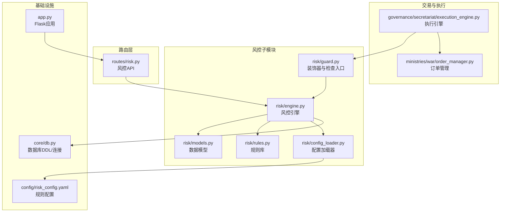
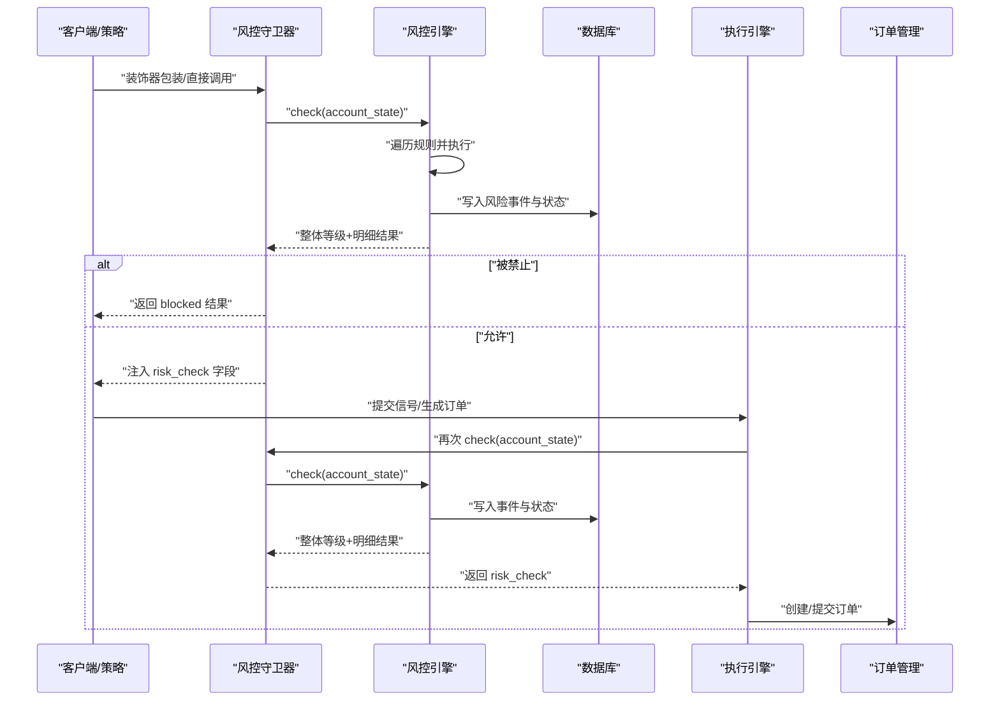
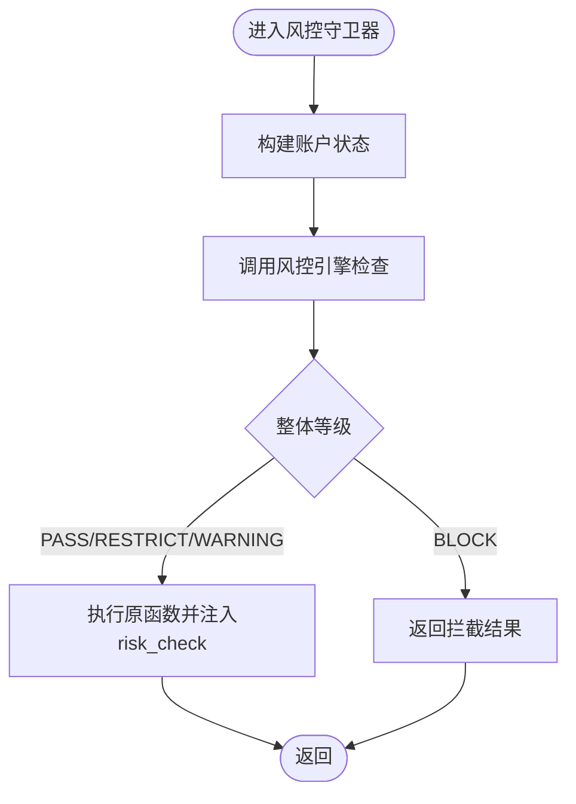
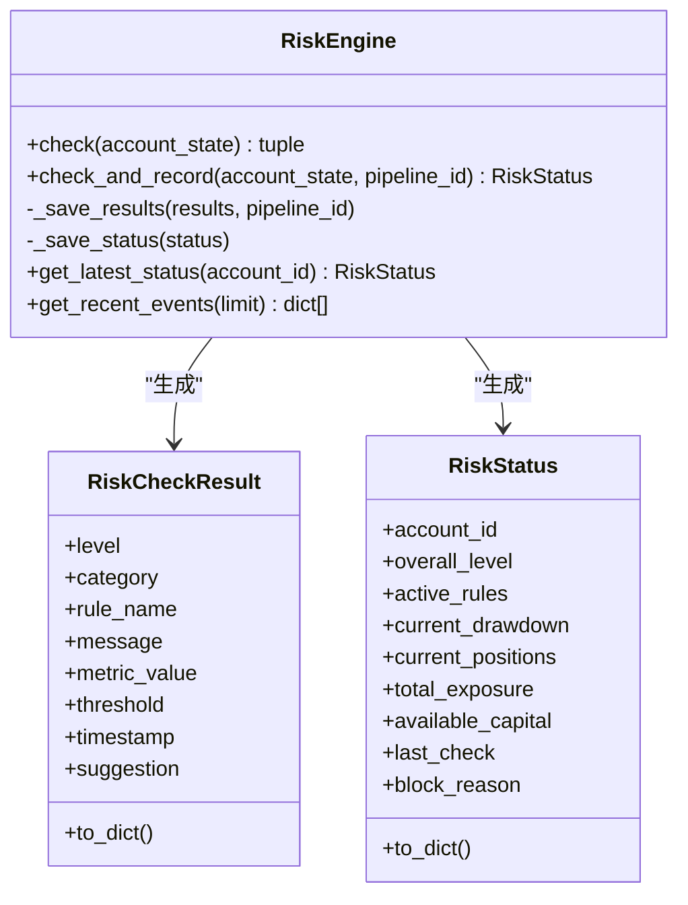
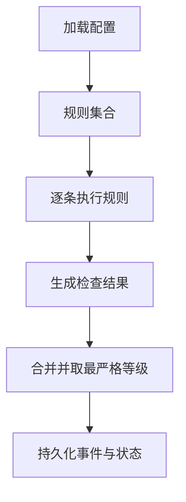
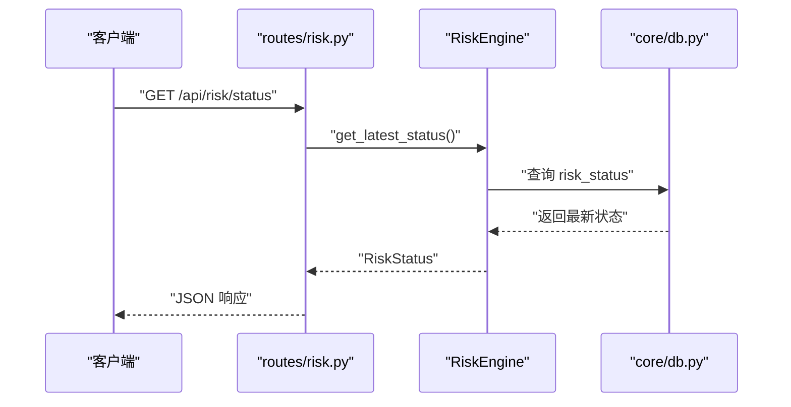
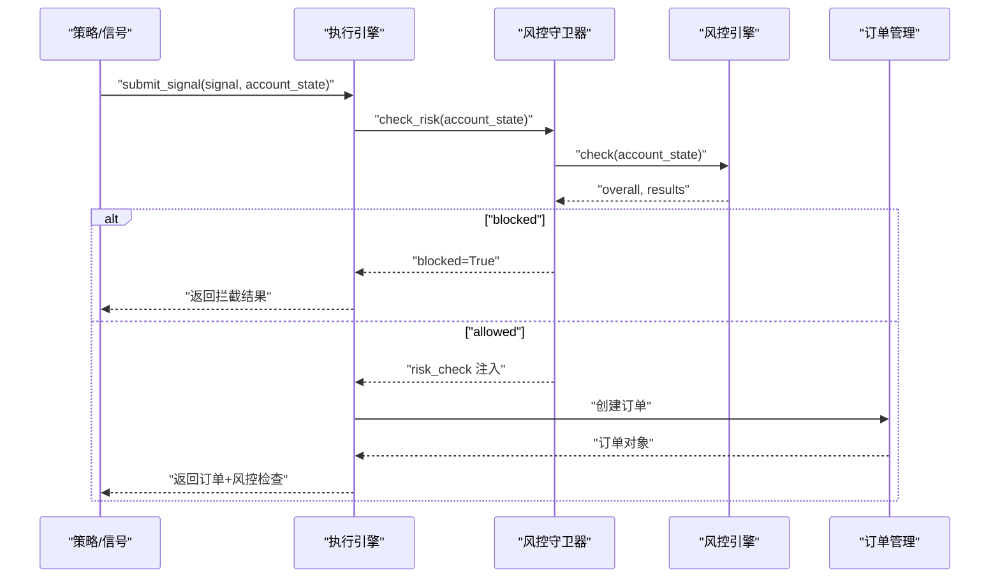
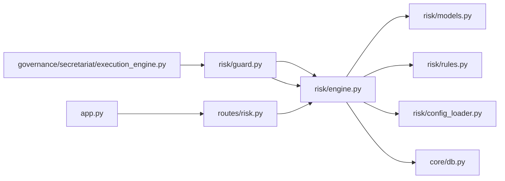

# 风控守卫器

<cite>
**本文引用的文件**
- [risk/guard.py](file://risk/guard.py)
- [risk/engine.py](file://risk/engine.py)
- [risk/models.py](file://risk/models.py)
- [risk/rules.py](file://risk/rules.py)
- [risk/config_loader.py](file://risk/config_loader.py)
- [routes/risk.py](file://routes/risk.py)
- [core/db.py](file://core/db.py)
- [ministries/war/order_manager.py](file://ministries/war/order_manager.py)
- [governance/secretariat/execution_engine.py](file://governance/secretariat/execution_engine.py)
- [config/risk_config.yaml](file://config/risk_config.yaml)
- [app.py](file://app.py)
</cite>

## 目录
1. [简介](#简介)
2. [项目结构](#项目结构)
3. [核心组件](#核心组件)
4. [架构总览](#架构总览)
5. [详细组件分析](#详细组件分析)
6. [依赖关系分析](#依赖关系分析)
7. [性能考量](#性能考量)
8. [故障排查指南](#故障排查指南)
9. [结论](#结论)
10. [附录](#附录)

## 简介
本文件面向AIQuant风控守卫器模块，系统性阐述其设计理念、实现机制与集成方式。风控守卫器负责在交易执行前后进行前置检查、状态同步与结果反馈，保障交易安全与合规。本文覆盖：
- 风控拦截逻辑与等级判定
- 交易保护机制（订单验证、资金检查、仓位控制等）
- 异常处理与数据库持久化
- 与风控引擎的协作关系
- 配置选项与自定义方法
- 实战集成示例与常见触发场景处理

## 项目结构
风控相关代码集中在 risk 子模块，并通过路由暴露API，同时与数据库表 risk_events、risk_status、blacklist、risk_overrides 等协同工作。

图表来源
- [risk/guard.py:1-92](file://risk/guard.py#L1-L92)
- [risk/engine.py:1-168](file://risk/engine.py#L1-L168)
- [risk/models.py:1-78](file://risk/models.py#L1-L78)
- [risk/rules.py:1-388](file://risk/rules.py#L1-L388)
- [risk/config_loader.py:1-131](file://risk/config_loader.py#L1-L131)
- [routes/risk.py:1-298](file://routes/risk.py#L1-L298)
- [governance/secretariat/execution_engine.py:60-141](file://governance/secretariat/execution_engine.py#L60-L141)
- [ministries/war/order_manager.py:1-211](file://ministries/war/order_manager.py#L1-L211)
- [app.py:1-164](file://app.py#L1-L164)
- [core/db.py:358-414](file://core/db.py#L358-L414)
- [config/risk_config.yaml:1-170](file://config/risk_config.yaml#L1-L170)

章节来源
- [risk/guard.py:1-92](file://risk/guard.py#L1-L92)
- [routes/risk.py:1-298](file://routes/risk.py#L1-L298)
- [app.py:1-164](file://app.py#L1-L164)

## 核心组件
- 风控守卫器（装饰器与直接检查）
  - 提供装饰器模式与直接调用两种入口，统一构建账户状态并委托风控引擎执行检查，按等级决定拦截或注入风控结果。
- 风控引擎
  - 组织规则执行、聚合结果、持久化事件与状态、查询最新状态与事件。
- 规则库
  - 内置多条风控规则，均从配置中心读取阈值与消息模板，支持热加载。
- 配置加载器
  - 单例模式，支持热加载，提供规则开关、阈值、消息与建议的便捷访问。
- 数据模型
  - 定义风险等级、分类、检查结果与状态快照的数据结构。
- 路由API
  - 对外提供风控状态、事件查询、手动检查、配置热加载、黑名单与豁免管理等接口。
- 交易执行链路
  - 执行引擎在生成订单前调用风控守卫器进行前置检查；订单管理器负责订单与持仓生命周期管理。

章节来源
- [risk/guard.py:36-92](file://risk/guard.py#L36-L92)
- [risk/engine.py:13-168](file://risk/engine.py#L13-L168)
- [risk/rules.py:14-388](file://risk/rules.py#L14-L388)
- [risk/config_loader.py:20-131](file://risk/config_loader.py#L20-L131)
- [risk/models.py:11-78](file://risk/models.py#L11-L78)
- [routes/risk.py:29-298](file://routes/risk.py#L29-L298)
- [governance/secretariat/execution_engine.py:64-101](file://governance/secretariat/execution_engine.py#L64-L101)
- [ministries/war/order_manager.py:69-211](file://ministries/war/order_manager.py#L69-L211)

## 架构总览
风控守卫器贯穿“前置检查-状态同步-结果反馈”的闭环，既可作为装饰器横切业务流程，也可在执行引擎中直接调用，确保交易安全。

图表来源
- [risk/guard.py:36-92](file://risk/guard.py#L36-L92)
- [risk/engine.py:19-71](file://risk/engine.py#L19-L71)
- [governance/secretariat/execution_engine.py:64-101](file://governance/secretariat/execution_engine.py#L64-L101)
- [ministries/war/order_manager.py:76-125](file://ministries/war/order_manager.py#L76-L125)

## 详细组件分析

### 风控守卫器（装饰器与直接检查）
- 账户状态构建
  - 从调用方传参或默认值组装账户状态字典，包含账户ID、当前回撤、持仓列表、总价值、总敞口、可用资金、连续亏损次数、日开仓次数、大盘均线、交易标的、未来假期天数等。
- 装饰器模式
  - 将被装饰函数的返回值注入 risk_check 字段，若整体等级为禁止，直接返回拦截结果。
- 直接检查
  - 返回标准化结果，包含总体等级、是否拦截、活动规则、当前回撤与拦截原因等。

图表来源
- [risk/guard.py:15-92](file://risk/guard.py#L15-L92)

章节来源
- [risk/guard.py:15-92](file://risk/guard.py#L15-L92)

### 风控引擎
- 规则执行
  - 遍历规则列表，捕获规则执行异常并以警告级别记录，最终按等级优先级取最严格等级。
- 状态与事件持久化
  - 将检查结果写入 risk_events，将当前状态写入 risk_status；提供查询最新状态与最近事件的能力。
- 状态聚合
  - 聚合活动规则、当前回撤、持仓数量、总敞口、可用资金与最后检查时间等。

图表来源
- [risk/engine.py:13-168](file://risk/engine.py#L13-L168)
- [risk/models.py:28-78](file://risk/models.py#L28-L78)

章节来源
- [risk/engine.py:13-168](file://risk/engine.py#L13-L168)
- [risk/models.py:11-78](file://risk/models.py#L11-L78)

### 规则库与配置加载
- 规则函数签名
  - 所有规则函数接收 account_state 并返回 RiskCheckResult。
- 阈值与消息模板
  - 从 risk_config.yaml 读取 enabled、thresholds、messages、suggestions 等配置，支持热加载。
- 内置规则
  - 包含最大回撤、单股集中度、择时（MA5/MA20）、连续亏损、日交易频率、波动率、行业集中度、总仓位、节假日提醒、黑名单检查等。

图表来源
- [risk/rules.py:14-388](file://risk/rules.py#L14-L388)
- [risk/config_loader.py:20-131](file://risk/config_loader.py#L20-L131)

章节来源
- [risk/rules.py:14-388](file://risk/rules.py#L14-L388)
- [risk/config_loader.py:20-131](file://risk/config_loader.py#L20-L131)
- [config/risk_config.yaml:1-170](file://config/risk_config.yaml#L1-L170)

### 路由API与数据库交互
- 路由能力
  - 获取风控状态、最近事件、手动检查、配置查询与热加载、黑名单管理、风控豁免申请与审批、回撤曲线计算等。
- 数据库表
  - risk_events、risk_status、blacklist、risk_overrides 等，分别用于记录事件、状态快照、黑名单与豁免。

图表来源
- [routes/risk.py:31-49](file://routes/risk.py#L31-L49)
- [risk/engine.py:129-153](file://risk/engine.py#L129-L153)
- [core/db.py:374-386](file://core/db.py#L374-L386)

章节来源
- [routes/risk.py:29-298](file://routes/risk.py#L29-L298)
- [core/db.py:358-414](file://core/db.py#L358-L414)

### 交易执行链路中的风控守卫器
- 执行引擎在提交信号生成订单前调用风控守卫器进行前置检查；若被拦截则直接返回阻断信息；否则将风险检查结果注入订单创建响应。
- 订单管理器负责订单生命周期与持仓更新，配合风控守卫器实现“订单验证、资金检查、仓位控制”。

图表来源
- [governance/secretariat/execution_engine.py:64-101](file://governance/secretariat/execution_engine.py#L64-L101)
- [risk/guard.py:77-92](file://risk/guard.py#L77-L92)
- [risk/engine.py:19-49](file://risk/engine.py#L19-L49)
- [ministries/war/order_manager.py:76-125](file://ministries/war/order_manager.py#L76-L125)

章节来源
- [governance/secretariat/execution_engine.py:64-101](file://governance/secretariat/execution_engine.py#L64-L101)
- [ministries/war/order_manager.py:69-211](file://ministries/war/order_manager.py#L69-L211)

## 依赖关系分析
- 模块内聚与耦合
  - 风控守卫器与引擎低耦合，通过统一的数据模型与规则接口交互；规则依赖配置加载器；引擎依赖数据库连接。
- 外部依赖
  - Flask 蓝图提供API；WebSocket用于行情推送；Broker适配器负责实盘对接（模拟资金检查）。
- 循环依赖
  - 未发现循环导入；路由对引擎与守卫器的依赖方向清晰。

图表来源
- [risk/guard.py:1-12](file://risk/guard.py#L1-L12)
- [risk/engine.py:1-11](file://risk/engine.py#L1-L11)
- [routes/risk.py:19-26](file://routes/risk.py#L19-L26)
- [governance/secretariat/execution_engine.py:21-24](file://governance/secretariat/execution_engine.py#L21-L24)
- [app.py:19-37](file://app.py#L19-L37)

章节来源
- [risk/guard.py:1-12](file://risk/guard.py#L1-L12)
- [risk/engine.py:1-11](file://risk/engine.py#L1-L11)
- [routes/risk.py:19-26](file://routes/risk.py#L19-L26)
- [governance/secretariat/execution_engine.py:21-24](file://governance/secretariat/execution_engine.py#L21-L24)
- [app.py:19-37](file://app.py#L19-L37)

## 性能考量
- 规则执行复杂度
  - 规则数量固定且多数为O(n)扫描（如集中度、波动率），整体复杂度可控。
- 数据库写入
  - 检查完成后批量写入事件与状态，建议在高并发场景下关注事务与索引优化。
- 热加载配置
  - 配置加载器采用文件时间戳检测，避免频繁IO；建议在生产环境合理设置reload频率。
- 装饰器开销
  - 装饰器仅在函数入口处做一次检查与注入，开销极低。

## 故障排查指南
- 配置热加载失败
  - 检查配置文件路径与权限；确认文件存在且可读；查看控制台输出的加载日志。
- 数据库写入异常
  - 关注引擎保存事件与状态的日志输出；确认数据库连接可用与表结构正确。
- 规则执行异常
  - 引擎会将异常转换为警告级别结果并记录，便于定位具体规则函数。
- 黑名单/豁免无效
  - 确认黑名单有效期与豁免状态字段；检查API请求参数与返回状态。

章节来源
- [risk/config_loader.py:58-72](file://risk/config_loader.py#L58-L72)
- [risk/engine.py:73-127](file://risk/engine.py#L73-L127)
- [routes/risk.py:112-167](file://routes/risk.py#L112-L167)

## 结论
风控守卫器以“可插拔规则+配置驱动+状态持久化”为核心设计，既能作为装饰器横切现有流程，也能在执行引擎中进行前置拦截。通过完善的API与数据库支撑，实现了从规则配置、实时检查到事件与状态归档的完整闭环，满足交易安全与合规需求。

## 附录

### 集成步骤与示例路径
- 使用装饰器模式
  - 在策略或信号处理函数上添加装饰器，自动注入风控检查与结果。
  - 示例路径：[risk/guard.py:36-74](file://risk/guard.py#L36-L74)
- 直接调用风控检查
  - 在执行引擎提交信号前调用直接检查接口，根据返回结果决定是否放行。
  - 示例路径：[risk/guard.py:77-92](file://risk/guard.py#L77-L92)
- 执行引擎集成
  - 在生成订单前调用风控守卫器，若被拦截则返回阻断信息；否则继续创建订单。
  - 示例路径：[governance/secretariat/execution_engine.py:64-101](file://governance/secretariat/execution_engine.py#L64-L101)
- 订单管理
  - 创建/提交/成交/撤销订单，配合风控检查实现资金与仓位控制。
  - 示例路径：[ministries/war/order_manager.py:76-125](file://ministries/war/order_manager.py#L76-L125)

### 配置选项与自定义方法
- 规则配置
  - 在 risk_config.yaml 中启用/禁用规则、设置阈值、消息与建议；支持热加载。
  - 示例路径：[config/risk_config.yaml:1-170](file://config/risk_config.yaml#L1-L170)
- 配置加载器
  - 提供 is_rule_enabled、get_threshold、get_message、get_suggestion 等便捷方法。
  - 示例路径：[risk/config_loader.py:95-116](file://risk/config_loader.py#L95-L116)
- 自定义规则
  - 新增规则函数并加入 DEFAULT_RULES 列表，遵循统一返回 RiskCheckResult 的规范。
  - 示例路径：[risk/rules.py:376-387](file://risk/rules.py#L376-L387)

### 常见触发场景与处理策略
- 最大回撤超限
  - 等级：BLOCK；建议：清仓观望。
  - 示例路径：[risk/rules.py:44-61](file://risk/rules.py#L44-L61)
- 单股集中度过高
  - 等级：BLOCK；建议：禁止继续买入该股票。
  - 示例路径：[risk/rules.py:87-99](file://risk/rules.py#L87-L99)
- 大盘空头市场
  - 等级：RESTRICT；建议：降低整体仓位。
  - 示例路径：[risk/rules.py:121-129](file://risk/rules.py#L121-L129)
- 连续亏损冷却
  - 等级：BLOCK；建议：暂停交易24小时。
  - 示例路径：[risk/rules.py:146-158](file://risk/rules.py#L146-L158)
- 日交易频率超限
  - 等级：BLOCK；建议：今日不再开新仓。
  - 示例路径：[risk/rules.py:175-187](file://risk/rules.py#L175-L187)
- 波动率过大
  - 等级：BLOCK；建议：等待价格企稳后再操作。
  - 示例路径：[risk/rules.py:213-225](file://risk/rules.py#L213-L225)
- 行业集中度过高
  - 等级：BLOCK；建议：禁止继续买入该行业股票。
  - 示例路径：[risk/rules.py:257-269](file://risk/rules.py#L257-L269)
- 总仓位过高
  - 等级：BLOCK；建议：必须先卖出部分持仓。
  - 示例路径：[risk/rules.py:291-303](file://risk/rules.py#L291-L303)
- 节假日持仓提醒
  - 等级：WARNING；建议：建议假期前降低仓位。
  - 示例路径：[risk/rules.py:320-327](file://risk/rules.py#L320-L327)
- 黑名单命中
  - 等级：BLOCK；建议：立即卖出或申请移除黑名单。
  - 示例路径：[risk/rules.py:358-369](file://risk/rules.py#L358-L369)