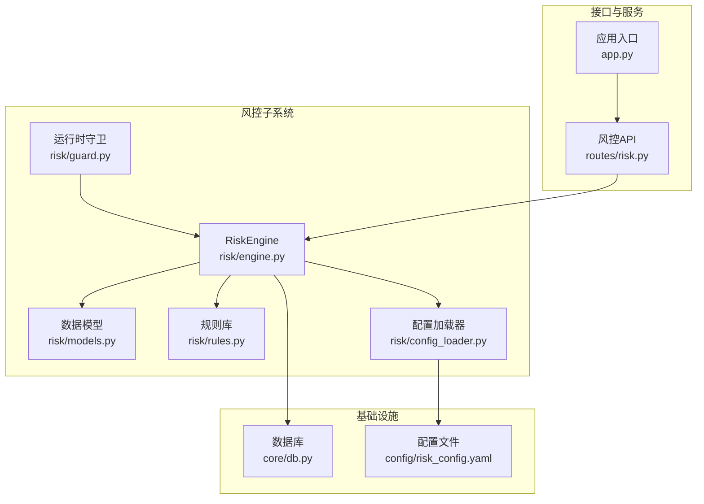
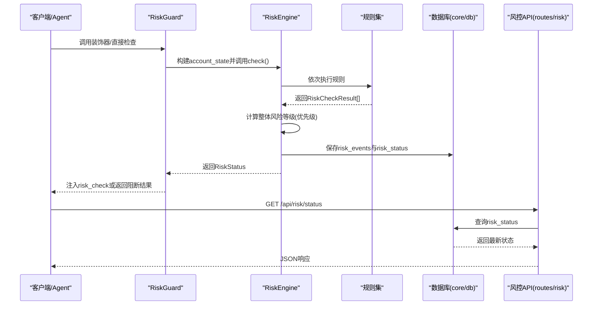
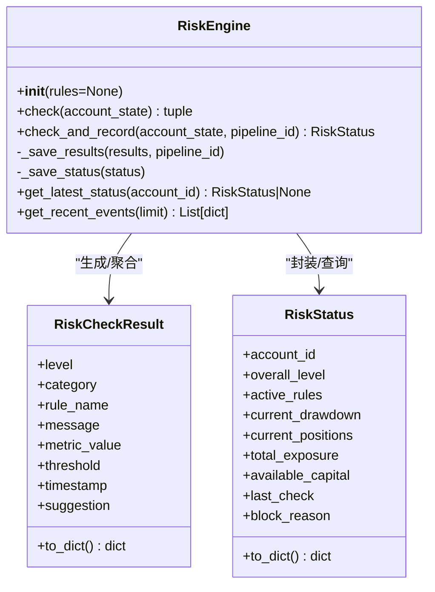
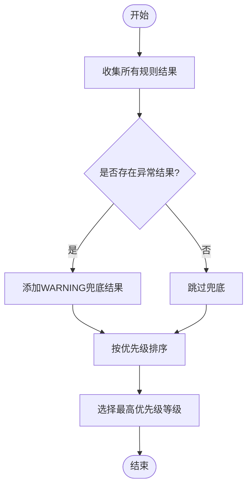
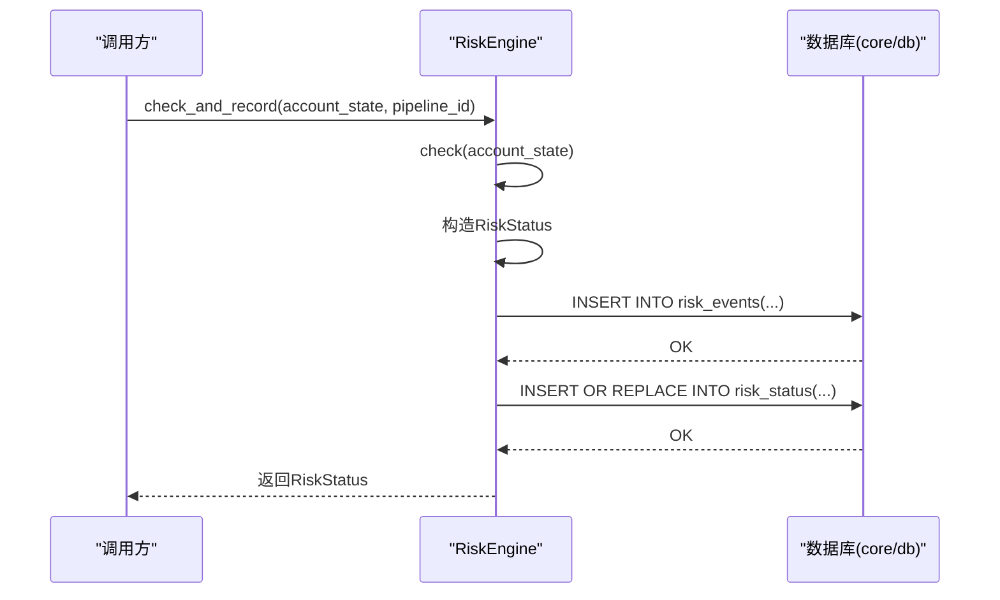
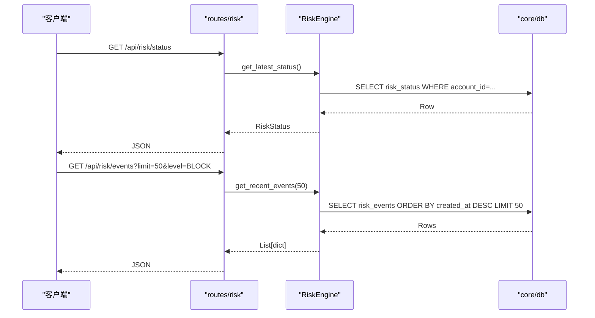
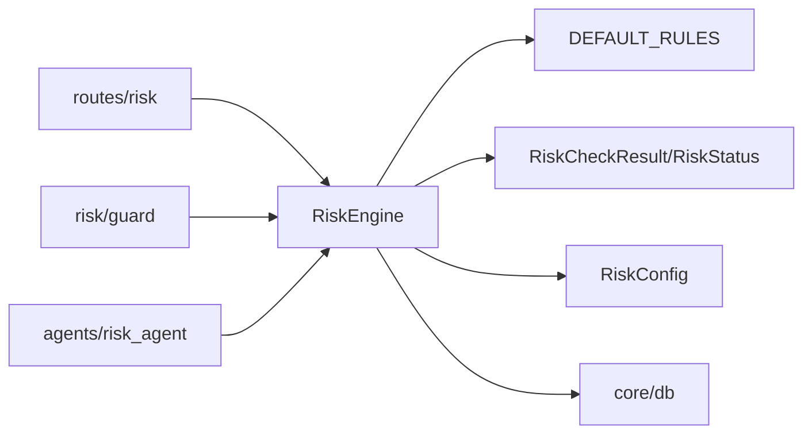

# 风控引擎核心

<cite>
**本文引用的文件**
- [risk/engine.py](file://risk/engine.py)
- [risk/models.py](file://risk/models.py)
- [risk/rules.py](file://risk/rules.py)
- [risk/guard.py](file://risk/guard.py)
- [risk/config_loader.py](file://risk/config_loader.py)
- [routes/risk.py](file://routes/risk.py)
- [core/db.py](file://core/db.py)
- [config/risk_config.yaml](file://config/risk_config.yaml)
- [agents/risk_agent.py](file://agents/risk_agent.py)
- [app.py](file://app.py)
</cite>

## 目录
1. [简介](#简介)
2. [项目结构](#项目结构)
3. [核心组件](#核心组件)
4. [架构总览](#架构总览)
5. [详细组件分析](#详细组件分析)
6. [依赖分析](#依赖分析)
7. [性能考量](#性能考量)
8. [故障排查指南](#故障排查指南)
9. [结论](#结论)
10. [附录](#附录)

## 简介
本文件面向AIQuant风控引擎核心模块，聚焦RiskEngine类的设计与实现，系统阐述全量风控检查流程、风险等级评估算法、检查结果聚合机制；详解check()与check_and_record()方法的执行逻辑、异常处理与风险等级优先级计算；说明风控状态的生命周期管理与查询接口；并提供可操作的使用示例与最佳实践，帮助开发者快速集成与扩展风控能力。

## 项目结构
风控引擎位于risk子包，围绕“规则库+引擎+守卫+配置+路由+数据库”的分层设计组织，配合agents与routes模块形成完整的风控闭环。

图表来源
- [risk/engine.py:1-168](file://risk/engine.py#L1-L168)
- [risk/models.py:1-78](file://risk/models.py#L1-L78)
- [risk/rules.py:1-388](file://risk/rules.py#L1-L388)
- [risk/config_loader.py:1-131](file://risk/config_loader.py#L1-L131)
- [risk/guard.py:1-92](file://risk/guard.py#L1-L92)
- [routes/risk.py:1-298](file://routes/risk.py#L1-L298)
- [core/db.py:1-467](file://core/db.py#L1-L467)
- [config/risk_config.yaml:1-170](file://config/risk_config.yaml#L1-L170)
- [app.py:1-164](file://app.py#L1-L164)

章节来源
- [risk/engine.py:1-168](file://risk/engine.py#L1-L168)
- [routes/risk.py:1-298](file://routes/risk.py#L1-L298)
- [core/db.py:1-467](file://core/db.py#L1-L467)

## 核心组件
- RiskEngine：风控引擎核心，负责规则遍历、异常兜底、等级聚合、结果持久化与状态查询。
- RiskCheckResult/RiskStatus：风控检查结果与风控状态快照的数据模型。
- DEFAULT_RULES：内置规则集合，按顺序执行。
- RiskConfig：YAML配置加载器，支持热加载与模板消息生成。
- RiskGuard：运行时守卫，提供装饰器与直接检查两种使用方式。
- 路由接口：对外暴露风控状态、事件、配置、黑名单、豁免等API。
- 数据库：risk_events、risk_status、blacklist、risk_overrides等表支撑风控数据存储。

章节来源
- [risk/engine.py:13-168](file://risk/engine.py#L13-L168)
- [risk/models.py:11-78](file://risk/models.py#L11-L78)
- [risk/rules.py:376-388](file://risk/rules.py#L376-L388)
- [risk/config_loader.py:20-131](file://risk/config_loader.py#L20-L131)
- [risk/guard.py:15-92](file://risk/guard.py#L15-L92)
- [routes/risk.py:29-298](file://routes/risk.py#L29-L298)
- [core/db.py:358-414](file://core/db.py#L358-L414)

## 架构总览
风控引擎采用“规则驱动 + 配置驱动 + 数据持久化”的架构，通过RiskEngine统一调度规则，RiskConfig提供动态阈值与消息模板，数据库承载事件与状态快照，路由层提供REST接口，守卫层在业务流程中透明接入风控。

图表来源
- [risk/guard.py:36-92](file://risk/guard.py#L36-L92)
- [risk/engine.py:19-168](file://risk/engine.py#L19-L168)
- [routes/risk.py:31-82](file://routes/risk.py#L31-L82)
- [core/db.py:358-414](file://core/db.py#L358-L414)

## 详细组件分析

### RiskEngine 类
RiskEngine是风控引擎的核心，承担以下职责：
- 规则遍历与异常兜底：对每个规则执行，异常时生成WARNING级别的兜底结果。
- 风险等级聚合：依据优先级映射，取最严格的风险等级作为整体结果。
- 结果持久化：将每条规则结果写入risk_events，将风控状态写入risk_status。
- 状态查询：提供最新状态与最近事件查询接口。

关键方法与行为
- check(account_state): 返回(整体风险等级, 所有规则结果)。规则异常会被捕获并记录为WARNING。
- check_and_record(account_state, pipeline_id): 在check基础上，封装RiskStatus并持久化。
- _save_results(results, pipeline_id): 批量写入risk_events。
- _save_status(status): 写入risk_status，支持INSERT OR REPLACE。
- get_latest_status(account_id): 查询最新风控状态。
- get_recent_events(limit): 查询最近风险事件。

图表来源
- [risk/engine.py:13-168](file://risk/engine.py#L13-L168)
- [risk/models.py:28-78](file://risk/models.py#L28-L78)

章节来源
- [risk/engine.py:19-168](file://risk/engine.py#L19-L168)
- [risk/models.py:28-78](file://risk/models.py#L28-L78)

### 风险等级优先级与聚合算法
- 优先级映射：BLOCK > RESTRICT > WARNING > PASS。
- 聚合策略：取所有规则结果中优先级最高的等级作为整体等级。
- 异常兜底：规则执行异常时，生成WARNING级别兜底结果，包含异常信息与默认阈值。

图表来源
- [risk/engine.py:24-49](file://risk/engine.py#L24-L49)

章节来源
- [risk/engine.py:24-49](file://risk/engine.py#L24-L49)

### check() 方法执行逻辑
- 输入：account_state（字典，包含账户与市场指标）。
- 流程：
  - 遍历DEFAULT_RULES中的规则函数。
  - 对每个规则传入account_state执行，收集RiskCheckResult。
  - 捕获异常并生成WARNING兜底结果。
  - 使用优先级映射取最大等级作为整体等级。
- 输出：(overall_level, results)。

章节来源
- [risk/engine.py:19-49](file://risk/engine.py#L19-L49)
- [risk/rules.py:376-388](file://risk/rules.py#L376-L388)

### check_and_record() 方法执行逻辑
- 输入：account_state、pipeline_id。
- 流程：
  - 调用check()获取overall与results。
  - 构造RiskStatus对象，包含账户关键指标与阻断原因。
  - 调用_save_results与_save_status分别写入risk_events与risk_status。
- 输出：RiskStatus。

图表来源
- [risk/engine.py:51-128](file://risk/engine.py#L51-L128)
- [core/db.py:358-414](file://core/db.py#L358-L414)

章节来源
- [risk/engine.py:51-128](file://risk/engine.py#L51-L128)

### 风控规则库与配置驱动
- 规则函数签名：rule_name(account_state: dict) -> RiskCheckResult。
- DEFAULT_RULES：内置规则集合，按顺序执行。
- 配置来源：risk_config.yaml，RiskConfig提供is_rule_enabled、get_rule_config、get_threshold、get_message、get_suggestion等接口。
- 规则异常：规则内部异常会被上层兜底为WARNING级别结果。

章节来源
- [risk/rules.py:14-388](file://risk/rules.py#L14-L388)
- [risk/config_loader.py:73-126](file://risk/config_loader.py#L73-L126)
- [config/risk_config.yaml:1-170](file://config/risk_config.yaml#L1-L170)

### 运行时风控守卫
- build_account_state：从各模块收集账户状态，构建account_state字典。
- @risk_guard：装饰器形式，若整体等级为BLOCK则直接拦截，否则执行原函数并注入risk_check。
- check_risk：直接执行风控检查并返回结果字典。

章节来源
- [risk/guard.py:15-92](file://risk/guard.py#L15-L92)

### 风控状态生命周期与查询接口
- 状态写入：check_and_record在每次检查后写入risk_status。
- 状态查询：get_latest_status按account_id查询最新状态；get_recent_events查询最近事件。
- API接口：/api/risk/status、/api/risk/events、/api/risk/check、/api/risk/config、/api/risk/config/reload等。

图表来源
- [routes/risk.py:31-82](file://routes/risk.py#L31-L82)
- [risk/engine.py:129-168](file://risk/engine.py#L129-L168)
- [core/db.py:358-414](file://core/db.py#L358-L414)

章节来源
- [routes/risk.py:31-82](file://routes/risk.py#L31-L82)
- [risk/engine.py:129-168](file://risk/engine.py#L129-L168)

## 依赖分析
- RiskEngine依赖：
  - 规则集：DEFAULT_RULES（来自risk/rules.py）。
  - 数据模型：RiskCheckResult、RiskStatus（来自risk/models.py）。
  - 配置：risk_config（来自risk/config_loader.py）。
  - 数据库：core/db.py（连接管理与建表）。
- 路由依赖：routes/risk.py依赖RiskEngine与RiskConfig。
- 守卫依赖：risk/guard.py依赖RiskEngine与models。
- Agent集成：agents/risk_agent.py在执行流程中调用RiskEngine并写入上下文。

图表来源
- [risk/engine.py:16-168](file://risk/engine.py#L16-L168)
- [routes/risk.py:21-25](file://routes/risk.py#L21-L25)
- [risk/guard.py:11-12](file://risk/guard.py#L11-L12)
- [agents/risk_agent.py:21-61](file://agents/risk_agent.py#L21-L61)

章节来源
- [risk/engine.py:16-168](file://risk/engine.py#L16-L168)
- [routes/risk.py:21-25](file://routes/risk.py#L21-L25)
- [risk/guard.py:11-12](file://risk/guard.py#L11-L12)
- [agents/risk_agent.py:21-61](file://agents/risk_agent.py#L21-L61)

## 性能考量
- 规则执行顺序：DEFAULT_RULES按固定顺序执行，建议将高成本规则置于末尾或按需启用。
- 异常兜底：规则异常被捕获并生成WARNING结果，避免中断整体流程，但需关注异常日志。
- 数据库写入：批量插入risk_events与INSERT OR REPLACE risk_status，建议在高频检查场景下关注数据库负载。
- 配置热加载：RiskConfig支持自动检测文件变更并热加载，无需重启服务，适合动态调整阈值与消息模板。

[本节为通用性能建议，不直接分析具体文件]

## 故障排查指南
常见问题与定位思路
- 风控检查未生效：确认DEFAULT_RULES是否包含目标规则，以及规则是否启用。
- 阈值不生效：检查risk_config.yaml对应规则的enabled与thresholds配置，确认RiskConfig已热加载。
- 数据库写入失败：检查core/db.py初始化与表结构，确认risk_events与risk_status表存在且字段匹配。
- API查询为空：确认get_latest_status的account_id是否正确，或使用默认值。
- 黑名单未命中：确认blacklist表中是否存在有效期内的记录，且trade_target或positions中的代码匹配。

章节来源
- [risk/engine.py:73-128](file://risk/engine.py#L73-L128)
- [risk/config_loader.py:58-72](file://risk/config_loader.py#L58-L72)
- [core/db.py:358-414](file://core/db.py#L358-L414)
- [routes/risk.py:112-168](file://routes/risk.py#L112-L168)

## 结论
AIQuant风控引擎以RiskEngine为核心，结合规则库、配置驱动与数据库持久化，实现了可配置、可观测、可扩展的风控体系。通过check()与check_and_record()方法，既能满足实时风控拦截，也能提供完整的风控状态与事件记录。配合路由与守卫，可在Agent与业务流程中无缝集成，并通过API实现可视化监控与管理。

[本节为总结性内容，不直接分析具体文件]

## 附录

### 使用示例与最佳实践

- 使用装饰器进行风控拦截
  - 步骤：在业务函数上使用@risk_guard(action="...")装饰，RiskEngine会在执行前后自动检查并注入risk_check。
  - 参考：[risk/guard.py:36-74](file://risk/guard.py#L36-L74)

- 直接调用风控检查
  - 步骤：调用check_risk(account_state, pipeline_id)，返回包含overall_level、blocked、active_rules等字段的结果。
  - 参考：[risk/guard.py:77-92](file://risk/guard.py#L77-L92)

- 在Agent中集成风控
  - 步骤：RiskAgent在执行流程中调用RiskEngine.check_and_record并将RiskStatus写入上下文，便于后续流程使用。
  - 参考：[agents/risk_agent.py:52-67](file://agents/risk_agent.py#L52-L67)

- 参数配置与返回值处理
  - 配置：在config/risk_config.yaml中设置规则阈值、消息模板与建议文本。
  - 返回值：check()返回(overall_level, results)，check_and_record()返回RiskStatus，可转换为字典用于API响应。
  - 参考：[config/risk_config.yaml:1-170](file://config/risk_config.yaml#L1-L170)，[risk/models.py:40-77](file://risk/models.py#L40-L77)

- 风控状态生命周期管理
  - 写入：check_and_record在每次检查后写入risk_status。
  - 查询：get_latest_status按account_id查询最新状态；get_recent_events查询最近事件。
  - API：/api/risk/status、/api/risk/events、/api/risk/check、/api/risk/config、/api/risk/config/reload。
  - 参考：[risk/engine.py:129-168](file://risk/engine.py#L129-L168)，[routes/risk.py:31-108](file://routes/risk.py#L31-L108)

- 风控规则扩展
  - 新增规则：定义rule_xxx(account_state) -> RiskCheckResult，使用_make_result辅助构造结果。
  - 注册规则：将新规则加入DEFAULT_RULES列表。
  - 参考：[risk/rules.py:14-388](file://risk/rules.py#L14-L388)

- 数据库表结构
  - 风控事件：risk_events
  - 风控状态：risk_status
  - 黑名单：blacklist
  - 豁免：risk_overrides
  - 参考：[core/db.py:358-414](file://core/db.py#L358-L414)