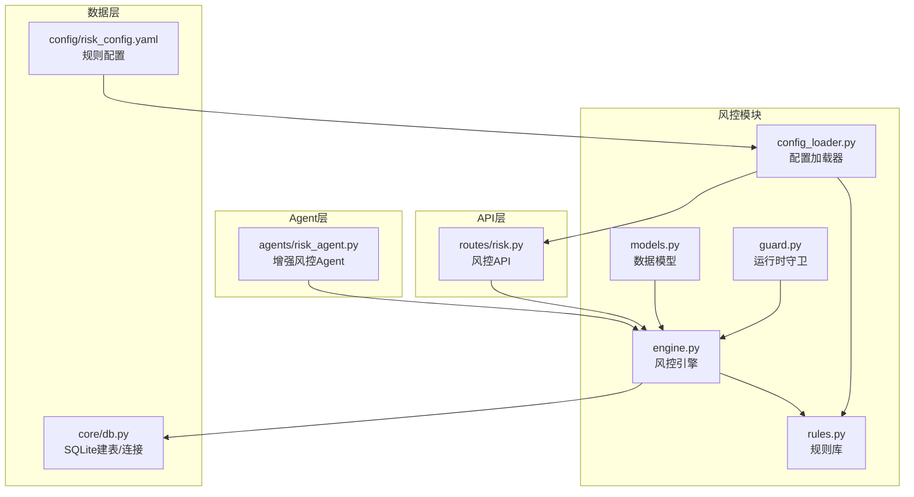
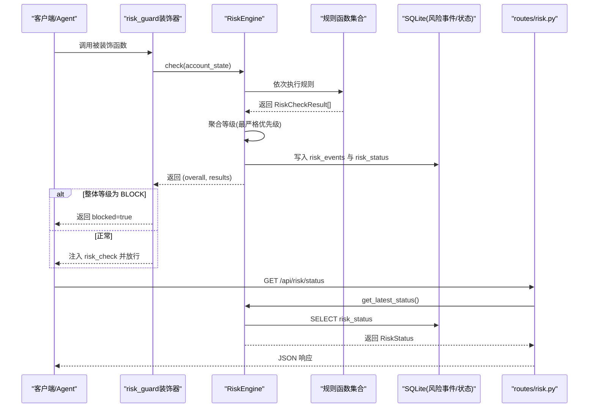
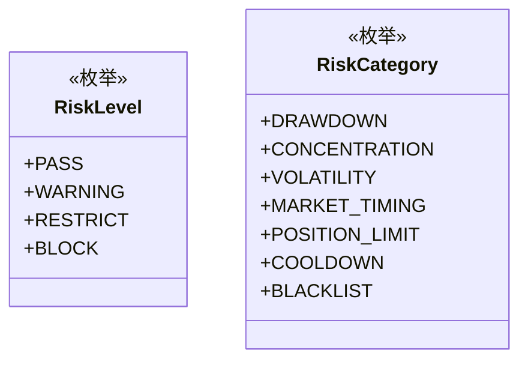
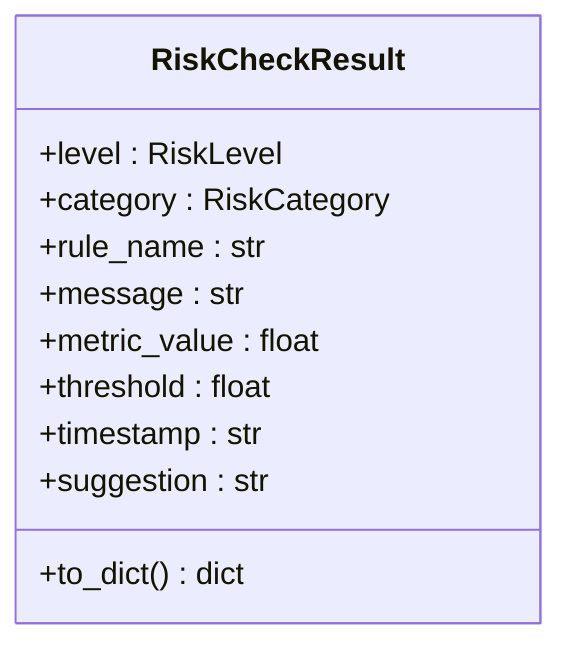
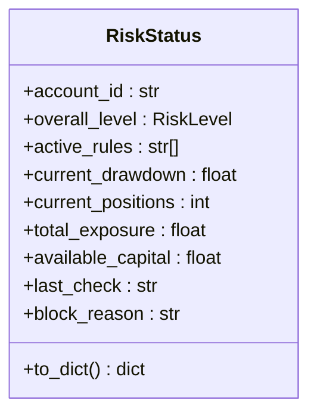
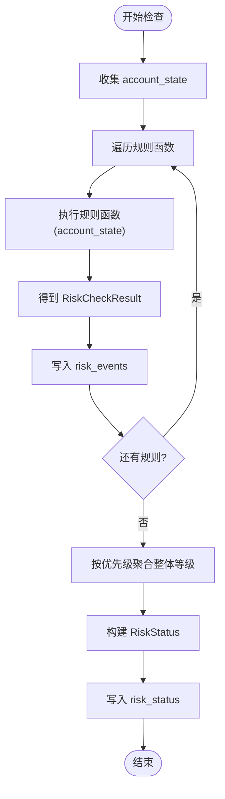
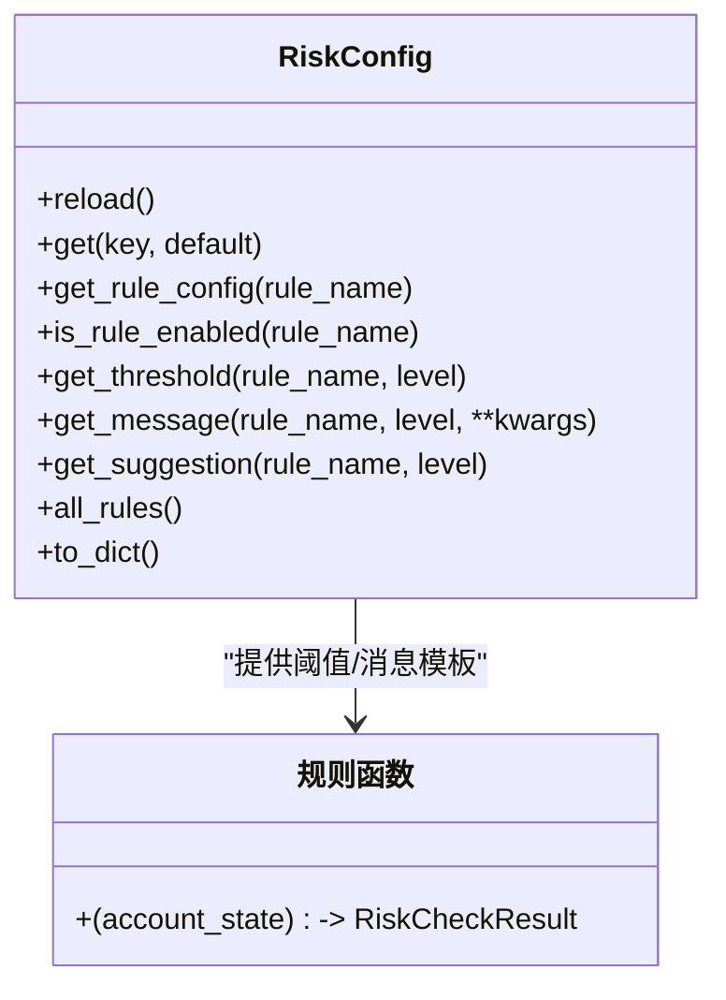
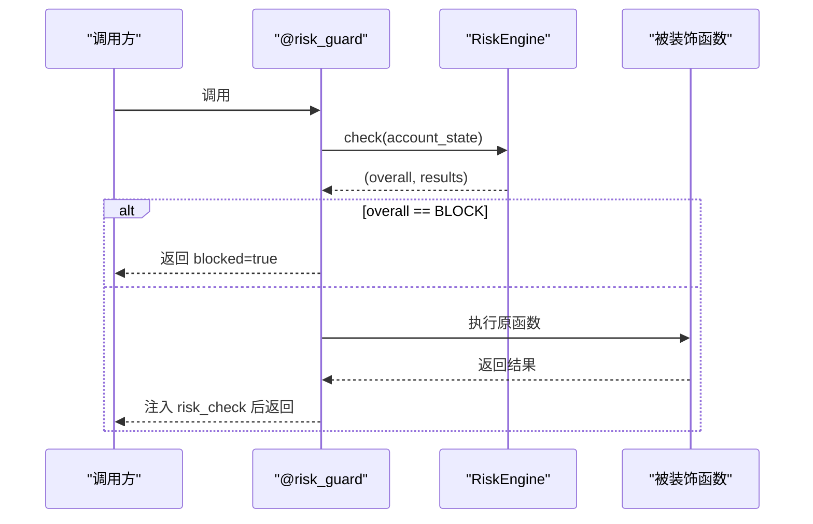
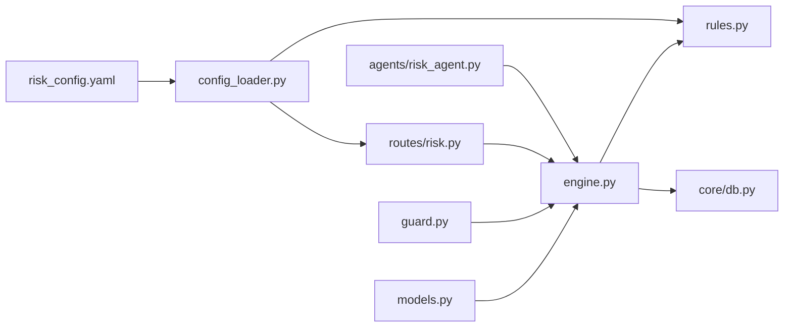

# 风控模型与数据结构

<cite>
**本文引用的文件**
- [risk/models.py](file://risk/models.py)
- [risk/engine.py](file://risk/engine.py)
- [risk/rules.py](file://risk/rules.py)
- [risk/guard.py](file://risk/guard.py)
- [risk/config_loader.py](file://risk/config_loader.py)
- [routes/risk.py](file://routes/risk.py)
- [agents/risk_agent.py](file://agents/risk_agent.py)
- [core/db.py](file://core/db.py)
- [config/risk_config.yaml](file://config/risk_config.yaml)
</cite>

## 目录
1. [简介](#简介)
2. [项目结构](#项目结构)
3. [核心组件](#核心组件)
4. [架构总览](#架构总览)
5. [详细组件分析](#详细组件分析)
6. [依赖分析](#依赖分析)
7. [性能考量](#性能考量)
8. [故障排查指南](#故障排查指南)
9. [结论](#结论)
10. [附录](#附录)

## 简介
本文件面向AIQuant风控模块，系统性梳理并解释核心数据模型与规则体系，重点覆盖：
- RiskCheckResult：单条风控规则检查结果的数据结构与用途
- RiskLevel：风险等级枚举（BLOCK、RESTRICT、WARNING、PASS）的定义与应用
- RiskStatus：账户实时风控状态快照的数据结构与状态管理
- 风险规则库与配置驱动机制
- 序列化/反序列化与数据库持久化
- 使用最佳实践与扩展建议

## 项目结构
风控模块位于risk目录，围绕数据模型、规则引擎、守卫装饰器、配置加载器与API路由协同工作，并通过core/db.py提供的SQLite表进行持久化。

图表来源
- [risk/models.py:1-78](file://risk/models.py#L1-L78)
- [risk/engine.py:1-168](file://risk/engine.py#L1-L168)
- [risk/rules.py:1-388](file://risk/rules.py#L1-L388)
- [risk/guard.py:1-92](file://risk/guard.py#L1-L92)
- [risk/config_loader.py:1-131](file://risk/config_loader.py#L1-L131)
- [routes/risk.py:1-298](file://routes/risk.py#L1-L298)
- [agents/risk_agent.py:1-262](file://agents/risk_agent.py#L1-L262)
- [core/db.py:358-414](file://core/db.py#L358-L414)
- [config/risk_config.yaml:1-170](file://config/risk_config.yaml#L1-L170)

章节来源
- [risk/models.py:1-78](file://risk/models.py#L1-L78)
- [risk/engine.py:1-168](file://risk/engine.py#L1-L168)
- [risk/rules.py:1-388](file://risk/rules.py#L1-L388)
- [risk/guard.py:1-92](file://risk/guard.py#L1-L92)
- [risk/config_loader.py:1-131](file://risk/config_loader.py#L1-L131)
- [routes/risk.py:1-298](file://routes/risk.py#L1-L298)
- [agents/risk_agent.py:1-262](file://agents/risk_agent.py#L1-L262)
- [core/db.py:358-414](file://core/db.py#L358-L414)
- [config/risk_config.yaml:1-170](file://config/risk_config.yaml#L1-L170)

## 核心组件
- RiskLevel：风险等级枚举，用于表示规则检查结果的严重程度，优先级顺序为 BLOCK > RESTRICT > WARNING > PASS。
- RiskCategory：风险类别枚举，涵盖回撤、集中度、波动率、择时、仓位限制、冷却、黑名单等维度。
- RiskCheckResult：单条规则检查结果，包含等级、类别、规则名、消息、指标值、阈值、时间戳与建议。
- RiskStatus：账户实时风控状态快照，包含账户ID、整体等级、活跃规则列表、当前回撤、持仓数量、总敞口、可用资金、最后检查时间与阻断原因。

章节来源
- [risk/models.py:11-78](file://risk/models.py#L11-L78)

## 架构总览
风控引擎负责执行规则集合、聚合结果并生成RiskStatus；规则函数从配置加载阈值与消息模板；守卫装饰器在业务入口处进行拦截；API路由提供查询与手动检查能力；Agent在策略流程中集成风控检查并将结果写入上下文。

图表来源
- [risk/guard.py:36-74](file://risk/guard.py#L36-L74)
- [risk/engine.py:19-71](file://risk/engine.py#L19-L71)
- [risk/rules.py:376-387](file://risk/rules.py#L376-L387)
- [core/db.py:358-414](file://core/db.py#L358-L414)
- [routes/risk.py:31-49](file://routes/risk.py#L31-L49)

## 详细组件分析

### RiskLevel与RiskCategory
- RiskLevel：用于表达规则检查结果的严重程度，优先级用于聚合整体等级。
- RiskCategory：对规则检查的归类，便于统计与可视化。

图表来源
- [risk/models.py:11-26](file://risk/models.py#L11-L26)

章节来源
- [risk/models.py:11-26](file://risk/models.py#L11-L26)

### RiskCheckResult 数据模型
- 字段含义
  - level：风险等级（RiskLevel）
  - category：规则类别（RiskCategory）
  - rule_name：规则函数名
  - message：格式化后的提示消息
  - metric_value：指标值（如回撤比例、集中度比率、波动率等）
  - threshold：阈值（来自配置）
  - timestamp：检查时间（ISO字符串）
  - suggestion：建议文本（可选）
- 序列化：to_dict() 输出包含上述字段的字典，便于API响应与日志记录。
- 反序列化：未提供from_dict()方法，但可通过字典重建对象（需自行处理枚举转换）。

图表来源
- [risk/models.py:28-50](file://risk/models.py#L28-L50)

章节来源
- [risk/models.py:28-50](file://risk/models.py#L28-L50)

### RiskStatus 数据模型
- 字段含义
  - account_id：账户标识
  - overall_level：整体风险等级（RiskLevel）
  - active_rules：当前被触发的规则名列表
  - current_drawdown：当前回撤（百分比或比率）
  - current_positions：当前持仓数量
  - total_exposure：总敞口
  - available_capital：可用资金
  - last_check：最后检查时间（ISO字符串）
  - block_reason：阻断原因（由所有BLOCK级别的消息拼接）
- 序列化：to_dict() 输出包含上述字段的字典，便于API响应与日志记录。
- 反序列化：未提供from_dict()方法，但可通过字典重建对象（需自行处理枚举转换）。

图表来源
- [risk/models.py:53-77](file://risk/models.py#L53-L77)

章节来源
- [risk/models.py:53-77](file://risk/models.py#L53-L77)

### 风控引擎 RiskEngine
- 职责
  - 执行规则集合，返回整体等级与全部检查结果
  - 聚合策略：按等级优先级取最严格者
  - 持久化：将每条规则结果写入risk_events，将RiskStatus写入risk_status
  - 查询：获取最新风控状态与最近风险事件
- 关键流程
  - check(account_state): 遍历规则，捕获异常并以WARNING兜底
  - check_and_record(account_state, pipeline_id): 生成RiskStatus并持久化
  - get_latest_status()/get_recent_events(): 从数据库读取

图表来源
- [risk/engine.py:19-71](file://risk/engine.py#L19-L71)
- [risk/engine.py:73-127](file://risk/engine.py#L73-L127)
- [risk/engine.py:129-167](file://risk/engine.py#L129-L167)

章节来源
- [risk/engine.py:13-168](file://risk/engine.py#L13-L168)

### 风控规则库与配置驱动
- 规则函数：每个规则函数接收account_state，返回RiskCheckResult；规则阈值与消息模板来自配置。
- 配置加载：RiskConfig单例，支持热加载与路径解析；提供is_rule_enabled、get_threshold、get_message、get_suggestion等便捷方法。
- 规则注册：DEFAULT_RULES列出所有规则函数，引擎按此集合执行。

图表来源
- [risk/config_loader.py:20-131](file://risk/config_loader.py#L20-L131)
- [risk/rules.py:14-27](file://risk/rules.py#L14-L27)
- [risk/rules.py:376-387](file://risk/rules.py#L376-L387)

章节来源
- [risk/rules.py:1-388](file://risk/rules.py#L1-L388)
- [risk/config_loader.py:1-131](file://risk/config_loader.py#L1-L131)
- [config/risk_config.yaml:1-170](file://config/risk_config.yaml#L1-L170)

### 运行时风控守卫 risk_guard
- 作用：装饰器在业务函数前后执行风控检查；若整体等级为BLOCK，则直接拦截并返回阻断信息；否则将风险检查结果注入返回字典。
- 账户状态构建：build_account_state()从上下文或默认值组装account_state。

图表来源
- [risk/guard.py:36-74](file://risk/guard.py#L36-L74)

章节来源
- [risk/guard.py:1-92](file://risk/guard.py#L1-L92)

### API 路由与Agent集成
- 路由
  - GET /api/risk/status：获取最新风控状态
  - GET /api/risk/events：获取最近风险事件
  - POST /api/risk/check：手动触发风控检查
  - GET/POST /api/risk/config：获取/热加载配置
  - 黑名单与豁免管理接口
- Agent集成
  - RiskAgent在策略流程中调用RiskEngine，将RiskStatus写入上下文，并在BLOCK时标记拦截。

章节来源
- [routes/risk.py:1-298](file://routes/risk.py#L1-L298)
- [agents/risk_agent.py:1-262](file://agents/risk_agent.py#L1-L262)

## 依赖分析
- 模型依赖：RiskCheckResult/RiskStatus依赖RiskLevel/RiskCategory
- 引擎依赖：RiskEngine依赖模型、规则集合与配置加载器
- 守卫依赖：risk_guard依赖RiskEngine与模型
- API依赖：routes/risk.py依赖RiskEngine、模型与配置加载器
- Agent依赖：agents/risk_agent.py依赖RiskEngine与模型
- 数据层：core/db.py提供SQLite连接与建表脚本，包含risk_events、risk_status、blacklist、risk_overrides等表

图表来源
- [risk/models.py:1-78](file://risk/models.py#L1-L78)
- [risk/engine.py:1-168](file://risk/engine.py#L1-L168)
- [risk/rules.py:1-388](file://risk/rules.py#L1-L388)
- [risk/guard.py:1-92](file://risk/guard.py#L1-L92)
- [routes/risk.py:1-298](file://routes/risk.py#L1-L298)
- [agents/risk_agent.py:1-262](file://agents/risk_agent.py#L1-L262)
- [risk/config_loader.py:1-131](file://risk/config_loader.py#L1-L131)
- [core/db.py:358-414](file://core/db.py#L358-L414)
- [config/risk_config.yaml:1-170](file://config/risk_config.yaml#L1-L170)

章节来源
- [core/db.py:358-414](file://core/db.py#L358-L414)

## 性能考量
- 规则执行：规则函数数量与复杂度直接影响检查耗时；建议将计算量大的规则异步化或缓存中间结果。
- 数据库写入：批量插入与索引优化有助于提升写入性能；当前采用逐条插入，可考虑批处理。
- 配置热加载：RiskConfig通过文件mtime检测热加载，避免频繁I/O；建议在高并发场景下增加锁保护。
- API查询：get_recent_events按时间倒序查询，建议结合索引与分页参数控制返回量。

[本节为通用性能讨论，不直接分析具体文件]

## 故障排查指南
- 风控事件写入失败
  - 现象：打印“保存风险事件失败”
  - 排查：检查数据库连接、表结构是否存在、权限是否足够
- 风控状态写入失败
  - 现象：打印“保存风控状态失败”
  - 排查：检查risk_status表结构、主键冲突（account_id唯一）、字段类型
- 配置热加载异常
  - 现象：配置未生效或报错
  - 排查：确认risk_config.yaml路径、文件编码、YAML语法；检查RiskConfig.reload()调用
- 黑名单/豁免查询异常
  - 现象：接口返回错误
  - 排查：确认blacklist、risk_overrides表存在且索引有效

章节来源
- [risk/engine.py:73-127](file://risk/engine.py#L73-L127)
- [risk/engine.py:129-167](file://risk/engine.py#L129-L167)
- [risk/config_loader.py:58-72](file://risk/config_loader.py#L58-L72)
- [routes/risk.py:112-167](file://routes/risk.py#L112-L167)
- [routes/risk.py:172-225](file://routes/risk.py#L172-L225)

## 结论
AIQuant风控模块以数据模型为核心，通过规则函数与配置驱动实现灵活可调的风险控制体系。RiskCheckResult与RiskStatus提供了清晰的结果与状态抽象，RiskEngine承担了规则执行、聚合与持久化的职责，配合risk_guard与API路由形成端到端的风控闭环。建议在生产环境中关注规则性能、数据库写入效率与配置热加载的稳定性，并持续完善规则覆盖与阈值校准。

[本节为总结性内容，不直接分析具体文件]

## 附录

### 数据模型字段与用途对照
- RiskCheckResult
  - level：决定整体等级聚合与拦截策略
  - category：用于分类统计与告警分级
  - rule_name：定位规则来源，便于审计与调试
  - message/suggestion：用户可见的提示与建议
  - metric_value/threshold：量化指标与阈值，便于监控与可视化
  - timestamp：记录检查时间，便于追踪
- RiskStatus
  - account_id/last_check：账户维度与时间维度的快照
  - overall_level：整体风险状态，决定是否拦截
  - active_rules：快速定位当前触发的规则
  - current_drawdown/current_positions/total_exposure/available_capital：账户健康度指标

章节来源
- [risk/models.py:28-77](file://risk/models.py#L28-L77)

### 序列化与反序列化示例
- 序列化
  - RiskCheckResult.to_dict()：输出包含level、category、rule_name、message、metric_value、threshold、timestamp、suggestion的字典
  - RiskStatus.to_dict()：输出包含account_id、overall_level、active_rules、current_drawdown、current_positions、total_exposure、available_capital、last_check、block_reason的字典
- 反序列化
  - 未提供from_dict()方法；如需反序列化，可使用字典构造对应对象，注意将字符串映射为RiskLevel/RiskCategory枚举值

章节来源
- [risk/models.py:40-77](file://risk/models.py#L40-L77)

### 数据库存储格式
- 风控事件表 risk_events
  - 字段：id、pipeline_id、rule_name、category、level、message、metric_value、threshold、suggestion、created_at
  - 索引：按created_at降序、按level索引
- 风控状态表 risk_status
  - 字段：account_id（主键）、overall_level、active_rules（逗号分隔字符串）、current_drawdown、current_positions、total_exposure、available_capital、last_check、block_reason、updated_at
- 黑名单表 blacklist
  - 字段：id、stock_code（唯一）、reason、created_by、created_at、expiry_date、removed_at
- 豁免表 risk_overrides
  - 字段：id、rule_name、reason、operator、approver、status、created_at、expires_at、approved_at

章节来源
- [core/db.py:358-414](file://core/db.py#L358-L414)

### 风险等级与应用场景
- PASS：规则未触发或满足条件，允许继续执行
- WARNING：规则触发预警，建议关注与调整
- RESTRICT：规则触发限制，建议降低仓位或暂停开仓
- BLOCK：规则触发阻断，禁止继续执行，需人工干预或等待豁免

章节来源
- [risk/models.py:11-16](file://risk/models.py#L11-L16)
- [risk/engine.py:41-47](file://risk/engine.py#L41-L47)

### 最佳实践与扩展建议
- 最佳实践
  - 使用RiskConfig集中管理阈值与消息模板，支持热加载
  - 在业务入口使用risk_guard进行统一拦截
  - 对高成本规则进行缓存与异步化
  - 通过active_rules与block_reason快速定位问题
- 扩展建议
  - 新增规则：在rules.py中新增规则函数，并加入DEFAULT_RULES
  - 自定义等级优先级：在engine.py中调整level_priority映射
  - 增强反序列化：为模型添加from_dict()方法，支持从数据库/缓存恢复对象
  - 增加规则覆盖率：针对新场景补充规则类别与阈值

章节来源
- [risk/rules.py:376-387](file://risk/rules.py#L376-L387)
- [risk/engine.py:41-47](file://risk/engine.py#L41-L47)
- [risk/config_loader.py:95-116](file://risk/config_loader.py#L95-L116)