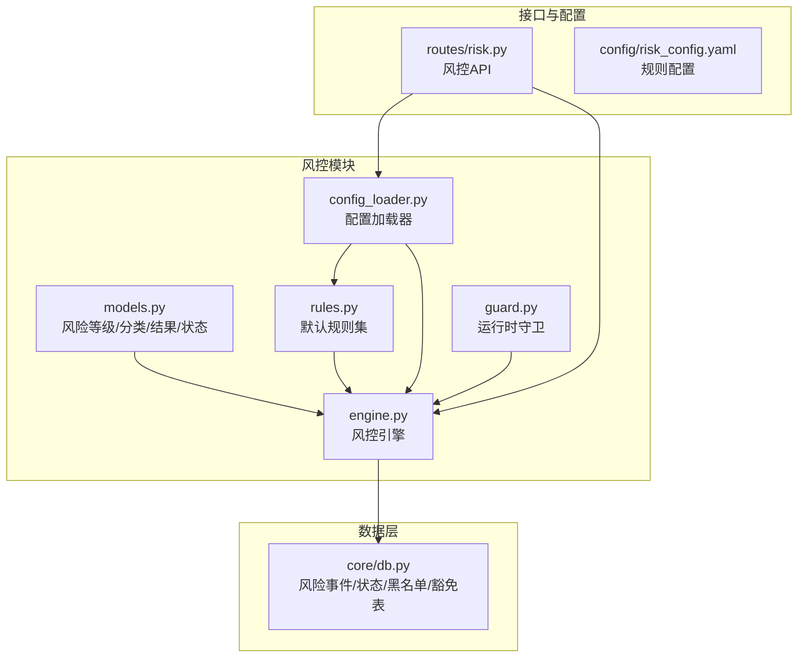
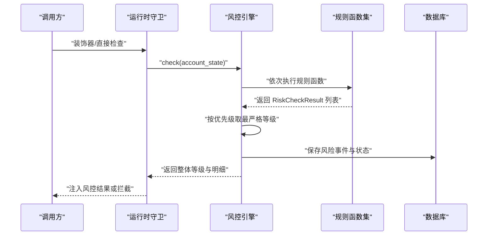
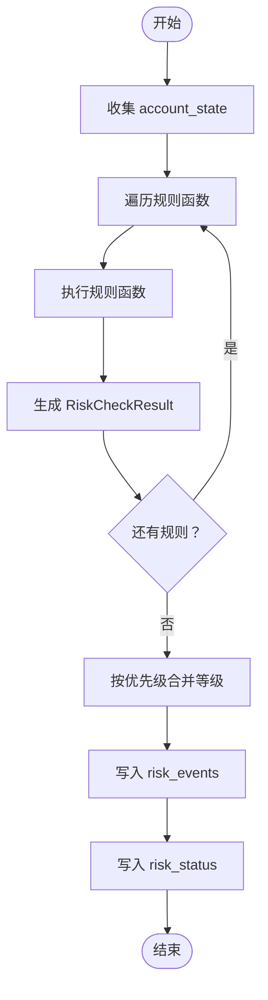
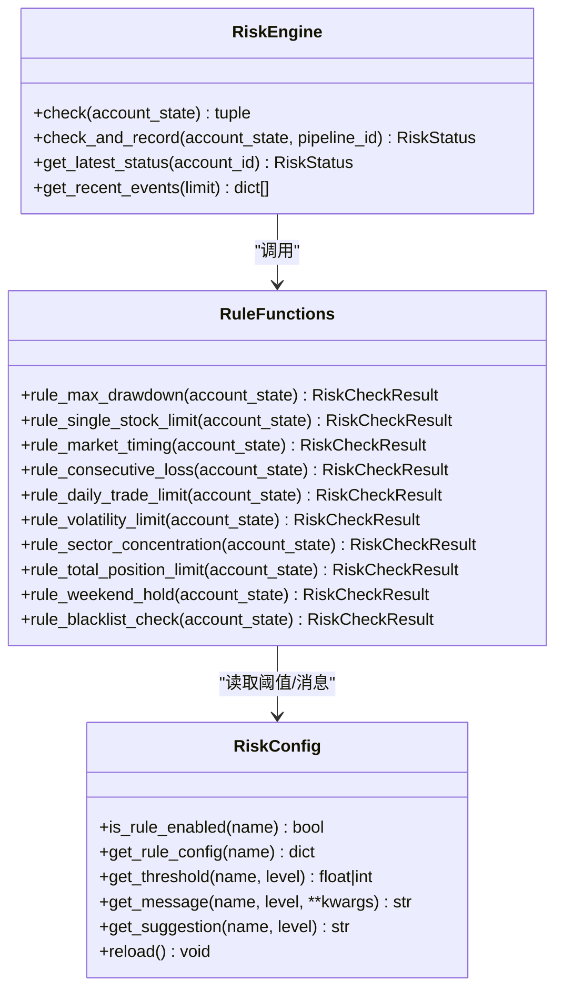
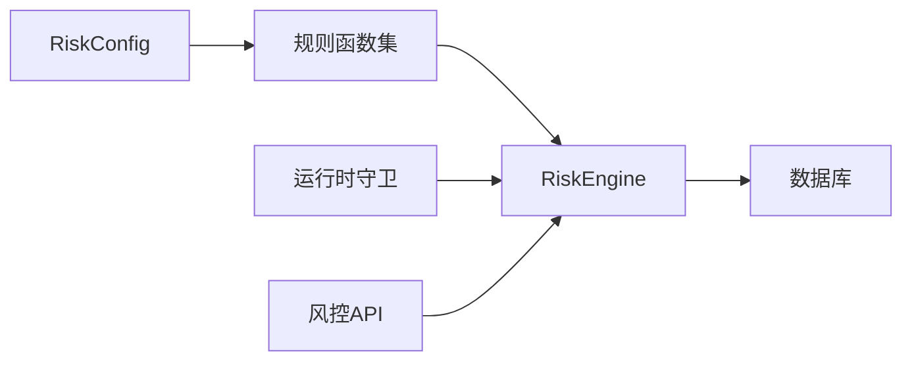

# 风控规则系统

<cite>
**本文引用的文件**
- [risk/__init__.py](file://risk/__init__.py)
- [risk/models.py](file://risk/models.py)
- [risk/engine.py](file://risk/engine.py)
- [risk/rules.py](file://risk/rules.py)
- [risk/config_loader.py](file://risk/config_loader.py)
- [risk/guard.py](file://risk/guard.py)
- [routes/risk.py](file://routes/risk.py)
- [config/risk_config.yaml](file://config/risk_config.yaml)
- [core/db.py](file://core/db.py)
- [agents/risk_agent.py](file://agents/risk_agent.py)
</cite>

## 目录
1. [简介](#简介)
2. [项目结构](#项目结构)
3. [核心组件](#核心组件)
4. [架构总览](#架构总览)
5. [详细组件分析](#详细组件分析)
6. [依赖分析](#依赖分析)
7. [性能考量](#性能考量)
8. [故障排查指南](#故障排查指南)
9. [结论](#结论)
10. [附录](#附录)

## 简介
本文件面向AIQuant风控规则系统，系统采用三层风控等级（通过 → 警告 → 限制 → 禁止），默认规则集覆盖最大回撤、单/行业集中度、择时、连续亏损、日交易频率、波动率、总仓位、节假日持仓提醒及黑名单检查等关键风控维度。系统以可配置化规则为核心，支持YAML配置热加载、规则函数签名规范化、统一结果模型与数据库持久化，并提供运行时装饰器与API接口，便于在策略执行链路中无缝集成。

## 项目结构
风控模块位于risk目录，核心文件包括：
- 模型与枚举：risk/models.py
- 引擎：risk/engine.py
- 规则库：risk/rules.py
- 配置加载器：risk/config_loader.py
- 运行时守卫：risk/guard.py
- API路由：routes/risk.py
- 配置文件：config/risk_config.yaml
- 数据库表结构：core/db.py（含risk_events、risk_status、blacklist、risk_overrides）

图表来源
- [risk/models.py:11-78](file://risk/models.py#L11-L78)
- [risk/engine.py:13-168](file://risk/engine.py#L13-L168)
- [risk/rules.py:1-388](file://risk/rules.py#L1-L388)
- [risk/config_loader.py:20-131](file://risk/config_loader.py#L20-L131)
- [risk/guard.py:15-92](file://risk/guard.py#L15-L92)
- [routes/risk.py:19-298](file://routes/risk.py#L19-L298)
- [config/risk_config.yaml:1-170](file://config/risk_config.yaml#L1-L170)
- [core/db.py:358-414](file://core/db.py#L358-L414)

章节来源
- [risk/__init__.py:1-20](file://risk/__init__.py#L1-L20)
- [risk/models.py:11-78](file://risk/models.py#L11-L78)
- [risk/engine.py:13-168](file://risk/engine.py#L13-L168)
- [risk/rules.py:1-388](file://risk/rules.py#L1-L388)
- [risk/config_loader.py:20-131](file://risk/config_loader.py#L20-L131)
- [risk/guard.py:15-92](file://risk/guard.py#L15-L92)
- [routes/risk.py:19-298](file://routes/risk.py#L19-L298)
- [config/risk_config.yaml:1-170](file://config/risk_config.yaml#L1-L170)
- [core/db.py:358-414](file://core/db.py#L358-L414)

## 核心组件
- 风险等级与分类：定义PASS/WARNING/RESTRICT/BLOCK与DRAWDOWN/CONCENTRATION/VOLATILITY/MARKET_TIMING/POSITION_LIMIT/COOLDOWN/BLACKLIST等类别。
- 风控检查结果与状态：统一输出字段（等级、类别、规则名、消息、指标值、阈值、时间戳、建议），并提供to_dict序列化。
- 风控引擎：遍历规则列表，收集结果，按优先级取最严格等级；支持检查并落库、查询最新状态、查询最近事件。
- 规则库：默认规则集包含最大回撤、单/行业集中度、择时、连续亏损、日交易频率、波动率、总仓位、节假日提醒、黑名单检查等。
- 配置加载器：单例模式，支持热加载，提供规则开关、阈值、消息模板、建议等读取接口。
- 运行时守卫：装饰器与直接检查接口，自动注入风控结果或在BLOCK时拦截。
- API路由：提供状态查询、事件查询、手动检查、配置查询与热加载、黑名单管理、风控豁免等接口。
- 数据库：risk_events、risk_status、blacklist、risk_overrides四张表支撑风控事件记录、状态快照、黑名单与豁免管理。

章节来源
- [risk/models.py:11-78](file://risk/models.py#L11-L78)
- [risk/engine.py:19-168](file://risk/engine.py#L19-L168)
- [risk/rules.py:376-388](file://risk/rules.py#L376-L388)
- [risk/config_loader.py:20-131](file://risk/config_loader.py#L20-L131)
- [risk/guard.py:36-92](file://risk/guard.py#L36-L92)
- [routes/risk.py:31-298](file://routes/risk.py#L31-L298)
- [core/db.py:358-414](file://core/db.py#L358-L414)

## 架构总览
风控系统遵循“配置驱动 + 规则函数 + 引擎聚合 + 守卫/接口接入”的分层设计。规则函数统一签名，返回标准化结果；引擎负责聚合与等级合并；守卫与API提供运行时接入点；配置热加载保障动态调整；数据库持久化记录事件与状态。

图表来源
- [risk/guard.py:36-92](file://risk/guard.py#L36-L92)
- [risk/engine.py:19-71](file://risk/engine.py#L19-L71)
- [risk/rules.py:34-61](file://risk/rules.py#L34-L61)
- [core/db.py:358-414](file://core/db.py#L358-L414)

## 详细组件分析

### 风控引擎（RiskEngine）
- 职责：执行规则集、聚合结果、计算整体等级、持久化事件与状态、查询最新状态与事件。
- 规则执行：遍历DEFAULT_RULES，捕获异常并生成WARNING级别兜底结果。
- 等级合并：PASS < WARNING < RESTRICT < BLOCK，取最严格者。
- 持久化：将每条规则结果写入risk_events，将当前状态写入risk_status。
- 查询：支持按账户查询最新状态、查询最近事件。

图表来源
- [risk/engine.py:19-71](file://risk/engine.py#L19-L71)
- [risk/models.py:28-50](file://risk/models.py#L28-L50)
- [core/db.py:358-414](file://core/db.py#L358-L414)

章节来源
- [risk/engine.py:19-168](file://risk/engine.py#L19-L168)

### 规则函数签名与参数传递机制
- 函数签名：rule_name(account_state: dict) -> RiskCheckResult
- 输入格式：account_state包含账户标识、当前回撤、持仓列表、总资产、总敞口、可用资金、连续亏损次数、日开仓次数、大盘MA5/MA20、交易标的、未来假期天数等键。
- 输出格式：RiskCheckResult包含等级、类别、规则名、消息、指标值、阈值、时间戳、建议。
- 阈值来源：从risk_config.yaml读取，支持热加载；规则可通过risk_config.get_rule_config(rule_name)获取完整配置。

章节来源
- [risk/rules.py:5-7](file://risk/rules.py#L5-L7)
- [risk/rules.py:14-27](file://risk/rules.py#L14-L27)
- [risk/guard.py:15-33](file://risk/guard.py#L15-L33)
- [risk/config_loader.py:88-116](file://risk/config_loader.py#L88-L116)

### 默认风控规则集
- 最大回撤限制：根据当前回撤与阈值比较，分别给出WARNING/RESTRICT/BLOCK等级。
- 单股集中度限制：计算最大持仓占比，超过阈值触发。
- 大盘择时（MA5/MA20）：当MA5 < MA20时限制开仓。
- 连续亏损冷却期：累计连续亏损次数达到阈值触发限制或禁止。
- 日交易频率限制：每日开仓次数超过阈值触发。
- 个股波动率限制：按日涨跌幅绝对值比较，超过阈值禁止买入。
- 行业集中度限制：按行业汇总持仓占比，超过阈值触发。
- 总仓位限制：总仓位比例超过阈值触发。
- 节假日/周末持仓提醒：临近长假期触发提醒。
- 黑名单检查：检查持仓与交易目标是否在有效黑名单内，命中即禁止。

图表来源
- [risk/engine.py:19-168](file://risk/engine.py#L19-L168)
- [risk/rules.py:34-387](file://risk/rules.py#L34-L387)
- [risk/config_loader.py:95-116](file://risk/config_loader.py#L95-L116)

章节来源
- [risk/rules.py:34-387](file://risk/rules.py#L34-L387)

### 配置加载器（RiskConfig）
- 单例模式，线程安全；支持热加载，自动检测文件修改并更新配置。
- 提供规则开关、阈值、消息模板、建议等读取接口；支持点号路径访问。
- 配置文件路径固定于config/risk_config.yaml。

章节来源
- [risk/config_loader.py:20-131](file://risk/config_loader.py#L20-L131)
- [config/risk_config.yaml:1-170](file://config/risk_config.yaml#L1-L170)

### 运行时守卫（risk_guard）
- 装饰器：对被装饰函数进行风控前置检查；若整体等级为BLOCK则直接拦截并返回阻断信息；否则执行原函数并将风控结果注入返回字典。
- 直接检查：check_risk(account_state, pipeline_id)返回结构化结果，包含整体等级、是否阻断、活跃规则、当前回撤、阻断原因等。

章节来源
- [risk/guard.py:36-92](file://risk/guard.py#L36-L92)

### API接口（routes/risk.py）
- 基础接口：获取当前风控状态、最近风控事件、手动触发风控检查、获取/热加载配置。
- 黑名单管理：查询、添加、删除黑名单。
- 风控豁免：申请、查询、审批豁免。
- 回撤曲线：基于账户快照表计算并返回日期序列与回撤值。

章节来源
- [routes/risk.py:31-298](file://routes/risk.py#L31-L298)

### 数据模型与数据库
- 数据模型：RiskLevel、RiskCategory、RiskCheckResult、RiskStatus。
- 数据库表：
  - risk_events：记录每次规则检查事件（规则名、类别、等级、消息、指标值、阈值、建议、时间）。
  - risk_status：账户风控状态快照（账户ID、整体等级、活跃规则、当前回撤、持仓数量、总敞口、可用资金、最后检查时间、阻断原因）。
  - blacklist：黑名单（股票代码、原因、有效期等）。
  - risk_overrides：风控豁免（规则名、原因、操作员、审批人、状态、创建/到期时间）。

章节来源
- [risk/models.py:11-78](file://risk/models.py#L11-L78)
- [core/db.py:358-414](file://core/db.py#L358-L414)

## 依赖分析
- 模块内聚：规则函数与配置加载器解耦，通过统一的配置接口读取阈值与消息模板。
- 引擎聚合：RiskEngine作为规则执行与结果聚合中心，耦合规则函数列表但不关心具体规则实现。
- 接口与守卫：routes/risk.py与risk/guard.py均依赖RiskEngine，形成“API/装饰器”两条接入路径。
- 数据持久化：引擎与API共同写入数据库，确保事件与状态可追溯。

图表来源
- [risk/rules.py:376-387](file://risk/rules.py#L376-L387)
- [risk/engine.py:19-71](file://risk/engine.py#L19-L71)
- [risk/config_loader.py:95-116](file://risk/config_loader.py#L95-L116)
- [core/db.py:358-414](file://core/db.py#L358-L414)

章节来源
- [risk/engine.py:19-168](file://risk/engine.py#L19-L168)
- [risk/rules.py:376-387](file://risk/rules.py#L376-L387)
- [risk/config_loader.py:95-116](file://risk/config_loader.py#L95-L116)
- [routes/risk.py:31-298](file://routes/risk.py#L31-L298)
- [risk/guard.py:36-92](file://risk/guard.py#L36-L92)

## 性能考量
- 规则执行：规则函数均为O(n)或常数复杂度，整体复杂度由规则数量决定；建议将高成本规则置于末尾或按业务场景动态调整顺序。
- 配置热加载：RiskConfig采用文件修改时间检测，避免频繁I/O；建议在生产环境合理设置阈值与刷新频率。
- 数据库写入：批量插入与索引优化（按时间、等级、状态）有助于查询性能；建议定期清理历史事件与黑名单。
- 并发与事务：数据库连接使用上下文管理器，自动提交/回滚；建议在高并发场景下评估锁竞争与超时设置。

## 故障排查指南
- 规则执行异常：引擎在规则执行异常时会生成WARNING级别的兜底结果并记录异常信息，便于定位问题。
- 配置未生效：确认risk_config.yaml路径正确且具备读权限；通过“热加载配置”接口验证配置是否成功加载。
- 数据库写入失败：检查数据库连接与表结构是否存在；关注异常打印信息。
- 黑名单/豁免异常：核对黑名单有效期与豁免状态字段；通过API查询当前有效黑名单与豁免记录。

章节来源
- [risk/engine.py:29-38](file://risk/engine.py#L29-L38)
- [routes/risk.py:96-107](file://routes/risk.py#L96-L107)
- [core/db.py:358-414](file://core/db.py#L358-L414)

## 结论
AIQuant风控规则系统以配置驱动为核心，通过标准化规则函数签名与统一结果模型，实现了可扩展、可热配置、可观测的风控能力。引擎聚合与守卫/接口双通道接入，满足不同业务场景的风控需求；数据库持久化确保了风控事件与状态的可追溯性。建议在实际部署中结合业务特征持续优化阈值与规则组合，并通过API与守卫实现端到端的风控闭环。

## 附录

### 风控规则优先级与冲突处理
- 优先级：BLOCK > RESTRICT > WARNING > PASS
- 冲突处理：引擎按优先级取最严格等级，避免低等级覆盖高等级；建议在规则设计上避免同一业务场景同时触发多个高等级规则，必要时通过配置开关与阈值微调进行协调。

章节来源
- [risk/engine.py:41-47](file://risk/engine.py#L41-L47)

### 规则配置最佳实践
- 使用risk_config.yaml集中管理阈值与消息模板，避免硬编码。
- 启用/禁用规则通过enabled字段控制，便于快速回滚。
- 为每个规则提供清晰的消息模板与建议，便于运营与审计。
- 对高成本规则建议在非高峰时段或特定条件下启用。

章节来源
- [config/risk_config.yaml:10-170](file://config/risk_config.yaml#L10-L170)
- [risk/config_loader.py:95-116](file://risk/config_loader.py#L95-L116)

### 自定义扩展方法
- 新增规则步骤：
  1) 在risk/rules.py中新增规则函数，遵循统一签名与返回类型。
  2) 在DEFAULT_RULES中注册新规则。
  3) 在config/risk_config.yaml中为新规则添加配置项（enabled、thresholds、messages、suggestions）。
  4) 通过API或守卫接入新规则。
- 调整现有规则参数：直接修改risk_config.yaml对应规则的thresholds与消息模板，无需重启服务。

章节来源
- [risk/rules.py:376-387](file://risk/rules.py#L376-L387)
- [config/risk_config.yaml:10-170](file://config/risk_config.yaml#L10-L170)
- [routes/risk.py:86-107](file://routes/risk.py#L86-L107)

### 业务逻辑与阈值设定说明
- 最大回撤：按账户回撤百分比分级，建议结合策略收益波动与回撤容忍度设定。
- 集中度：单股/行业集中度阈值需结合流动性与市场风格调整。
- 择时：MA5/MA20用于判断多空趋势，建议配合其他信号过滤。
- 连续亏损：冷却期有助于避免情绪化交易，建议与策略复盘周期结合。
- 日交易频率：防止过度交易，建议与策略频率目标一致。
- 波动率：单日涨跌幅阈值需考虑个股特性与市场阶段。
- 总仓位：满仓策略需更严格阈值，建议与流动性管理结合。
- 节假日提醒：提前降低仓位以规避黑天鹅风险。
- 黑名单：黑名单有效期与自动清理策略需明确。

章节来源
- [risk/rules.py:34-387](file://risk/rules.py#L34-L387)
- [config/risk_config.yaml:10-170](file://config/risk_config.yaml#L10-L170)

### 代码示例路径（不含具体代码内容）
- 新增规则函数示例路径：[新增规则函数定义:194-226](file://risk/rules.py#L194-L226)
- 注册新规则示例路径：[规则注册表:376-387](file://risk/rules.py#L376-L387)
- 配置热加载接口示例路径：[热加载配置:96-107](file://routes/risk.py#L96-L107)
- 运行时守卫装饰器示例路径：[风险装饰器:36-74](file://risk/guard.py#L36-L74)
- 直接风控检查示例路径：[直接检查:77-92](file://risk/guard.py#L77-L92)
- 黑名单管理接口示例路径：[黑名单查询/添加/删除:112-167](file://routes/risk.py#L112-L167)
- 风控豁免接口示例路径：[申请/查询/审批:172-243](file://routes/risk.py#L172-L243)