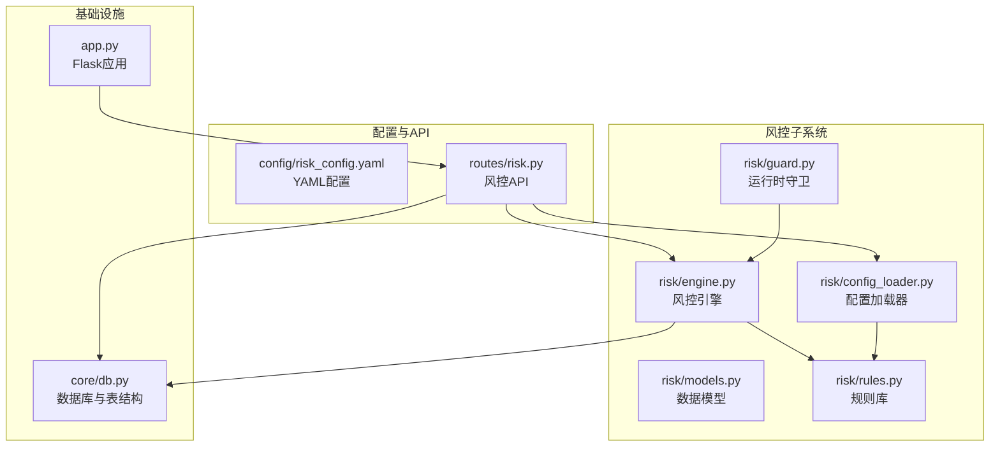
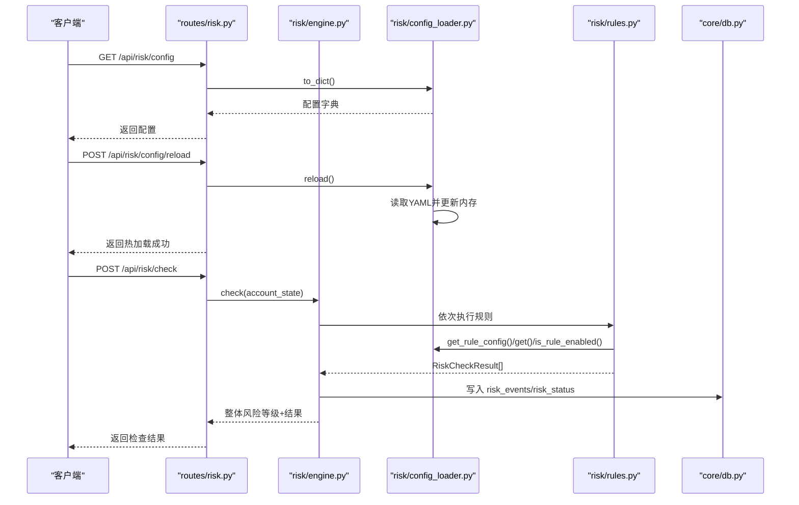
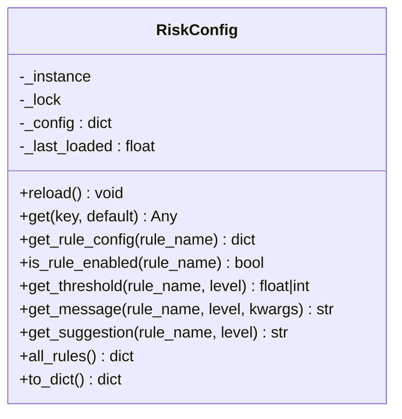
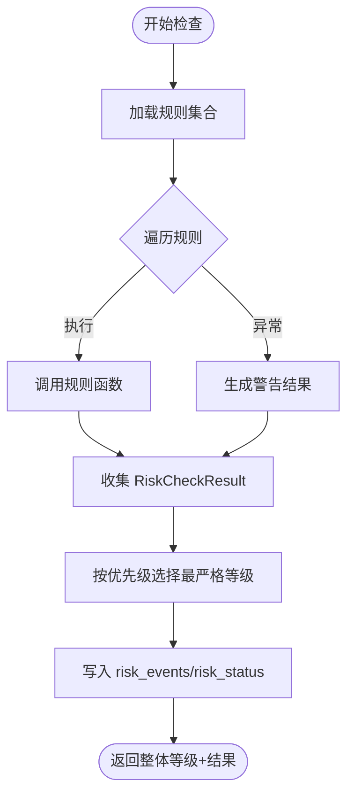
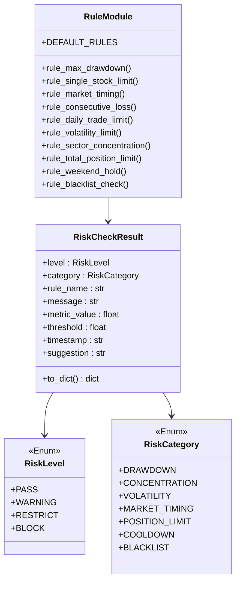
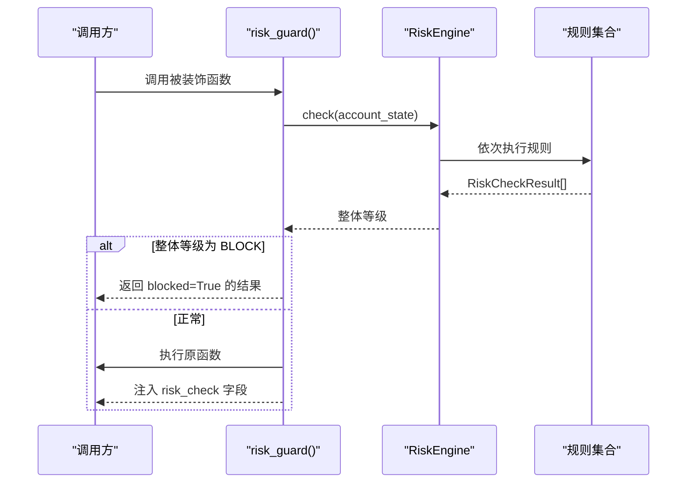
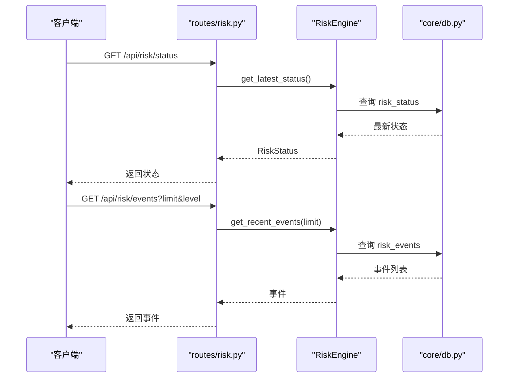
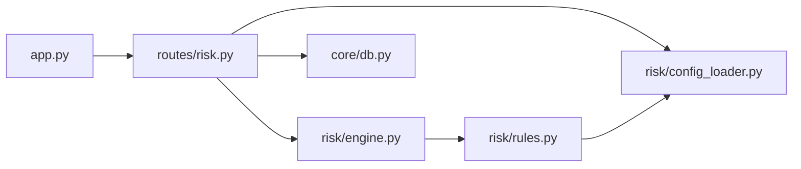

# 风控配置加载器

<cite>
**本文引用的文件**
- [risk/config_loader.py](file://risk/config_loader.py)
- [risk/engine.py](file://risk/engine.py)
- [risk/guard.py](file://risk/guard.py)
- [risk/models.py](file://risk/models.py)
- [risk/rules.py](file://risk/rules.py)
- [routes/risk.py](file://routes/risk.py)
- [config/risk_config.yaml](file://config/risk_config.yaml)
- [core/db.py](file://core/db.py)
- [app.py](file://app.py)
</cite>

## 目录
1. [简介](#简介)
2. [项目结构](#项目结构)
3. [核心组件](#核心组件)
4. [架构总览](#架构总览)
5. [详细组件分析](#详细组件分析)
6. [依赖关系分析](#依赖关系分析)
7. [性能考量](#性能考量)
8. [故障排除指南](#故障排除指南)
9. [结论](#结论)
10. [附录](#附录)

## 简介
本技术文档围绕 AIQuant 风控配置加载器展开，系统性阐述风险配置文件的结构、加载机制、层次化配置（全局/账户/策略）、格式规范与验证、热更新与实时生效、以及编写指南与最佳实践。文档同时提供 API 流程图、类图与依赖关系图，帮助读者快速理解并正确使用风控配置体系。

## 项目结构
风控相关模块集中在 risk 子目录，并通过 routes/risk.py 对外暴露 API；配置文件位于 config/risk_config.yaml；数据库表结构由 core/db.py 统一初始化。

图表来源
- [risk/config_loader.py:1-131](file://risk/config_loader.py#L1-L131)
- [risk/engine.py:1-168](file://risk/engine.py#L1-L168)
- [risk/guard.py:1-92](file://risk/guard.py#L1-L92)
- [risk/models.py:1-78](file://risk/models.py#L1-L78)
- [risk/rules.py:1-388](file://risk/rules.py#L1-L388)
- [routes/risk.py:1-298](file://routes/risk.py#L1-L298)
- [config/risk_config.yaml:1-170](file://config/risk_config.yaml#L1-L170)
- [core/db.py:358-414](file://core/db.py#L358-L414)
- [app.py:1-164](file://app.py#L1-L164)

章节来源
- [risk/config_loader.py:1-131](file://risk/config_loader.py#L1-L131)
- [routes/risk.py:1-298](file://routes/risk.py#L1-L298)
- [config/risk_config.yaml:1-170](file://config/risk_config.yaml#L1-L170)
- [core/db.py:358-414](file://core/db.py#L358-L414)
- [app.py:1-164](file://app.py#L1-L164)

## 核心组件
- 配置加载器（RiskConfig）：负责 YAML 配置文件的读取、热加载、键路径解析、规则开关与阈值获取、消息模板格式化、建议文本提取等。
- 风控引擎（RiskEngine）：聚合规则执行，计算整体风险等级，持久化检查结果与状态，提供查询接口。
- 规则库（rules.py）：内置多条风控规则，均从配置加载器读取阈值与提示信息，支持按 enabled 控制开关。
- 运行时守卫（guard.py）：装饰器与直接调用入口，封装风控检查与结果注入。
- 数据模型（models.py）：定义风险等级、类别、检查结果与状态快照的数据结构。
- API 路由（routes/risk.py）：对外提供风控状态、事件查询、手动检查、配置读取与热加载、黑名单与豁免管理等接口。
- 数据库（core/db.py）：初始化风控相关表（risk_events、risk_status、blacklist、risk_overrides），并提供查询与写入能力。

章节来源
- [risk/config_loader.py:20-131](file://risk/config_loader.py#L20-L131)
- [risk/engine.py:13-168](file://risk/engine.py#L13-L168)
- [risk/rules.py:1-388](file://risk/rules.py#L1-L388)
- [risk/guard.py:1-92](file://risk/guard.py#L1-L92)
- [risk/models.py:1-78](file://risk/models.py#L1-L78)
- [routes/risk.py:1-298](file://routes/risk.py#L1-L298)
- [core/db.py:358-414](file://core/db.py#L358-L414)

## 架构总览
风控配置加载器采用“配置即代码”的设计：规则函数签名固定，阈值与提示信息全部来自 YAML 配置；配置文件支持热加载，无需重启服务即可生效。API 层提供对配置、状态、事件、黑名单与豁免的统一管理。

图表来源
- [routes/risk.py:86-108](file://routes/risk.py#L86-L108)
- [risk/engine.py:19-72](file://risk/engine.py#L19-L72)
- [risk/config_loader.py:73-126](file://risk/config_loader.py#L73-L126)
- [risk/rules.py:34-61](file://risk/rules.py#L34-L61)
- [core/db.py:358-414](file://core/db.py#L358-L414)

## 详细组件分析

### 配置加载器（RiskConfig）
- 单例模式：保证全局唯一配置实例，避免重复加载。
- 热加载机制：通过文件修改时间戳检测变更，自动重载；提供显式 reload()。
- 键路径访问：支持“a.b.c”形式的嵌套键访问，默认值返回。
- 规则配置接口：获取规则完整配置、启用状态、阈值、消息模板（支持格式化）、建议文本。
- 导出与遍历：支持导出完整配置字典、列出所有规则配置（排除元数据）。

图表来源
- [risk/config_loader.py:20-131](file://risk/config_loader.py#L20-L131)

章节来源
- [risk/config_loader.py:20-131](file://risk/config_loader.py#L20-L131)

### 风控引擎（RiskEngine）
- 规则聚合：遍历规则集合，执行并收集结果；异常时生成警告级别结果。
- 整体等级：按优先级映射（BLOCK > RESTRICT > WARNING > PASS）取最严格等级。
- 结果持久化：将每条规则结果写入 risk_events，将当前状态写入 risk_status。
- 查询接口：获取最新状态、最近事件列表。

图表来源
- [risk/engine.py:19-72](file://risk/engine.py#L19-L72)
- [core/db.py:358-414](file://core/db.py#L358-L414)

章节来源
- [risk/engine.py:13-168](file://risk/engine.py#L13-L168)

### 规则库（rules.py）
- 规则签名：每个规则函数接收 account_state 并返回 RiskCheckResult。
- 配置驱动：规则阈值、消息模板、建议文本均来自 RiskConfig。
- 规则集合：DEFAULT_RULES 汇总所有规则，便于引擎统一调度。
- 特殊规则：黑名单检查从数据库读取有效黑名单；节假日提醒基于 upcoming_holiday_days。

图表来源
- [risk/models.py:11-78](file://risk/models.py#L11-L78)
- [risk/rules.py:14-388](file://risk/rules.py#L14-L388)

章节来源
- [risk/rules.py:1-388](file://risk/rules.py#L1-L388)
- [risk/models.py:1-78](file://risk/models.py#L1-L78)

### 运行时守卫（guard.py）
- 装饰器：@risk_guard(action) 包裹业务函数，在执行前后进行风控检查；若整体等级为 BLOCK，则直接拦截并返回阻断信息；否则将风险检查结果注入返回字典。
- 直接调用：check_risk(account_state, pipeline_id) 直接返回风控检查结果字典，便于在任意流程中插入风控校验。

图表来源
- [risk/guard.py:36-92](file://risk/guard.py#L36-L92)
- [risk/engine.py:19-72](file://risk/engine.py#L19-L72)

章节来源
- [risk/guard.py:1-92](file://risk/guard.py#L1-L92)

### API 接口（routes/risk.py）
- 基础接口：获取风控状态、最近事件、手动触发检查。
- 配置接口：获取当前配置、热加载配置。
- 黑名单接口：查询、添加、删除黑名单。
- 豁免接口：申请豁免、查询记录、审批通过。
- 数据接口：获取账户回撤曲线（基于 account_snapshots 表）。

图表来源
- [routes/risk.py:31-82](file://routes/risk.py#L31-L82)
- [risk/engine.py:129-168](file://risk/engine.py#L129-L168)
- [core/db.py:358-414](file://core/db.py#L358-L414)

章节来源
- [routes/risk.py:1-298](file://routes/risk.py#L1-L298)

### 配置文件结构与层次化设计
- 全局配置：顶层包含版本号与最后修改时间，以及各规则的 enabled、description、thresholds、messages、suggestions 等字段。
- 规则维度：每个规则拥有独立命名空间（如 max_drawdown、single_stock_limit 等），包含 enabled、阈值、消息模板与建议。
- 黑名单与豁免：blacklist.default_expiry_days、override.max_duration_hours、require_reason、require_approval 等参数用于黑名单有效期与豁免策略控制。
- 层次化含义：enabled 控制规则是否参与检查；thresholds 定义不同等级的阈值；messages/suggestions 提供用户可读的提示与建议；version/last_modified 用于审计与追踪。

章节来源
- [config/risk_config.yaml:1-170](file://config/risk_config.yaml#L1-L170)

### 配置热更新与实时生效
- 自动检测：RiskConfig._auto_reload() 通过 os.path.getmtime() 比较文件修改时间，若变更则 reload()。
- 线程安全：单例与锁保护，避免并发读写问题。
- 实时生效：规则函数在执行前调用 get()/get_rule_config()，内部触发自动检测，确保每次检查使用最新配置。
- 强制刷新：API 提供 POST /api/risk/config/reload，主动触发热加载。

章节来源
- [risk/config_loader.py:63-126](file://risk/config_loader.py#L63-L126)
- [routes/risk.py:96-108](file://routes/risk.py#L96-L108)

### 配置格式规范与验证机制
- 格式规范：YAML，键名遵循“规则名.字段”，如 thresholds.warning、messages.warning、suggestions.warning。
- 类型与范围：规则阈值通常为数值（float/int），消息模板支持占位符格式化；建议文本为字符串。
- 验证策略：配置加载器对缺失键返回默认值；规则函数对缺失阈值采用默认阈值；API 对必填字段（如黑名单的 stock_code、reason）进行校验。
- 建议：建议在开发环境开启严格模式，对异常键名与非法阈值进行告警或拒绝加载。

章节来源
- [risk/config_loader.py:73-126](file://risk/config_loader.py#L73-L126)
- [routes/risk.py:129-152](file://routes/risk.py#L129-L152)
- [routes/risk.py:172-204](file://routes/risk.py#L172-L204)

### 缓存管理与一致性
- 内存缓存：RiskConfig 将 YAML 解析后的字典缓存在内存中，减少 IO。
- 一致性保障：每次访问配置前触发自动检测，确保与磁盘一致；API 的 reload 接口提供强一致刷新。
- 数据库一致性：引擎写入 risk_events/risk_status 时使用事务上下文，异常回滚，保证数据一致性。

章节来源
- [risk/config_loader.py:45-62](file://risk/config_loader.py#L45-L62)
- [risk/engine.py:73-128](file://risk/engine.py#L73-L128)
- [core/db.py:26-40](file://core/db.py#L26-L40)

### 编写指南与最佳实践
- 参数调优建议
  - 回撤阈值：建议从保守值起步（如 max_drawdown.block=0.15），结合历史回撤曲线评估。
  - 集中度阈值：单股与行业集中度应与策略风格匹配，避免过度集中。
  - 波动率阈值：根据个股特性与市场阶段设定，避免在极端波动时追涨杀跌。
  - 交易频率：日开仓次数限制应与策略频率相匹配，防止过度交易。
- 性能优化技巧
  - 使用 enabled 控制规则开关，按需启用，减少规则执行次数。
  - 将高频规则的阈值与消息模板尽量简单，避免复杂格式化。
  - 利用 API 的热加载接口在夜间低峰时段批量更新配置。
- 配置示例参考
  - 参考 config/risk_config.yaml 中各规则的 thresholds、messages、suggestions 字段，按需调整百分比、数值与文案。
  - 黑名单与豁免：通过 routes/risk.py 的黑名单与豁免接口进行管理，配合配置中的 default_expiry_days、require_approval 等参数。

章节来源
- [config/risk_config.yaml:1-170](file://config/risk_config.yaml#L1-L170)
- [routes/risk.py:129-204](file://routes/risk.py#L129-L204)

## 依赖关系分析
- 风控引擎依赖规则集合与配置加载器；规则函数依赖配置加载器读取阈值与消息模板。
- API 路由依赖风控引擎与数据库；数据库提供风控事件与状态的持久化能力。
- 应用层（app.py）注册所有蓝图，包括风控蓝图。

图表来源
- [routes/risk.py:1-298](file://routes/risk.py#L1-L298)
- [risk/engine.py:1-168](file://risk/engine.py#L1-L168)
- [risk/config_loader.py:1-131](file://risk/config_loader.py#L1-L131)
- [risk/rules.py:1-388](file://risk/rules.py#L1-L388)
- [core/db.py:358-414](file://core/db.py#L358-L414)
- [app.py:1-164](file://app.py#L1-L164)

章节来源
- [routes/risk.py:1-298](file://routes/risk.py#L1-L298)
- [risk/engine.py:1-168](file://risk/engine.py#L1-L168)
- [risk/config_loader.py:1-131](file://risk/config_loader.py#L1-L131)
- [risk/rules.py:1-388](file://risk/rules.py#L1-L388)
- [core/db.py:358-414](file://core/db.py#L358-L414)
- [app.py:1-164](file://app.py#L1-L164)

## 性能考量
- 配置读取：YAML 解析与文件系统访问为 IO 密集，建议在高并发场景下减少频繁热加载；可通过 API 批量更新配置。
- 规则执行：规则函数为 CPU 密集，建议将复杂计算拆分为预处理步骤，减少规则函数内的计算量。
- 数据库写入：使用上下文管理器与事务，避免长事务；对高频写入场景可考虑批量写入或异步队列。
- 线程安全：单例与锁保护配置加载，避免并发读写冲突；规则执行与数据库写入应避免共享可变状态。

## 故障排除指南
- 配置文件未找到
  - 现象：打印“配置文件不存在”，使用默认配置。
  - 处理：确认 CONFIG_PATH 指向正确位置，检查文件权限与编码。
- 配置加载失败
  - 现象：打印“加载配置失败”异常信息。
  - 处理：检查 YAML 语法与缩进；使用在线 YAML 校验工具；必要时回退至上一个稳定版本。
- 规则执行异常
  - 现象：规则函数抛出异常，引擎生成 WARNING 级别结果。
  - 处理：检查规则函数依赖的数据源（如 MA 指标、黑名单数据库）是否可用；修复异常逻辑。
- 黑名单/豁免接口报错
  - 现象：添加/删除黑名单或申请豁免时报错。
  - 处理：检查必填字段（stock_code、reason）；确认数据库连接与表结构存在；查看 core/db.py 初始化日志。
- 状态查询为空
  - 现象：GET /api/risk/status 返回 null。
  - 处理：确认引擎已执行过检查并成功写入 risk_status；检查数据库连接与表结构。

章节来源
- [risk/config_loader.py:52-57](file://risk/config_loader.py#L52-L57)
- [risk/engine.py:29-38](file://risk/engine.py#L29-L38)
- [routes/risk.py:129-152](file://routes/risk.py#L129-L152)
- [routes/risk.py:172-204](file://routes/risk.py#L172-L204)
- [core/db.py:358-414](file://core/db.py#L358-L414)

## 结论
风控配置加载器通过“配置即代码”的理念，实现了规则的可配置化、可热更新与可审计。RiskConfig 提供了简洁而强大的配置访问接口，RiskEngine 将规则执行与持久化整合，routes/risk.py 则提供了完整的运维与管理接口。建议在生产环境中结合 API 的热加载能力与数据库的审计能力，建立完善的配置变更流程与回滚预案。

## 附录
- 配置文件示例路径：config/risk_config.yaml
- API 路由清单（节选）
  - GET /api/risk/status：获取当前风控状态
  - GET /api/risk/events：获取最近风控事件
  - POST /api/risk/check：手动触发风控检查
  - GET /api/risk/config：获取当前风控配置
  - POST /api/risk/config/reload：热加载风控配置
  - GET/POST/DELETE /api/risk/blacklist：黑名单管理
  - POST/GET /api/risk/override：风控豁免管理
  - GET /api/risk/drawdown：获取账户回撤曲线

章节来源
- [routes/risk.py:1-298](file://routes/risk.py#L1-L298)
- [config/risk_config.yaml:1-170](file://config/risk_config.yaml#L1-L170)