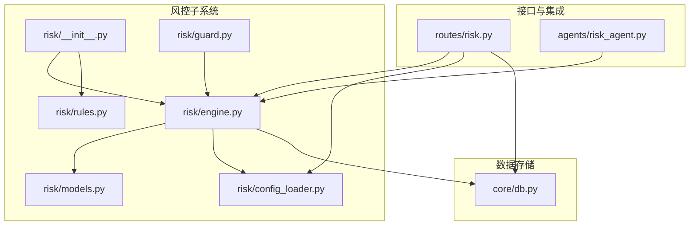
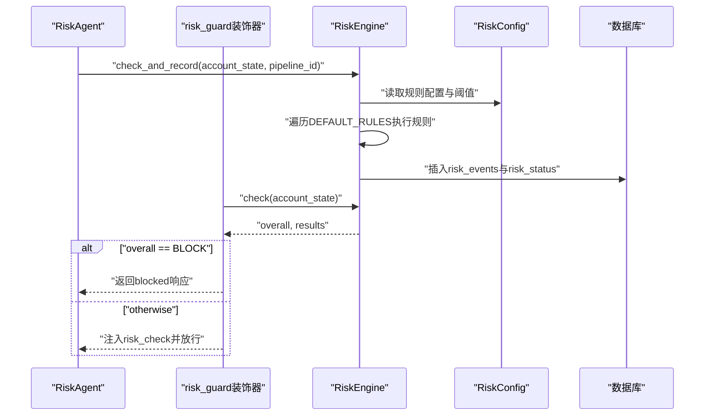
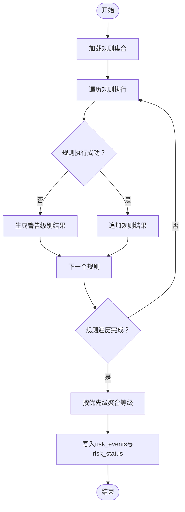
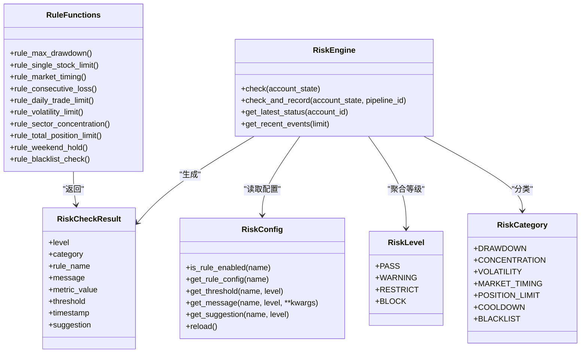
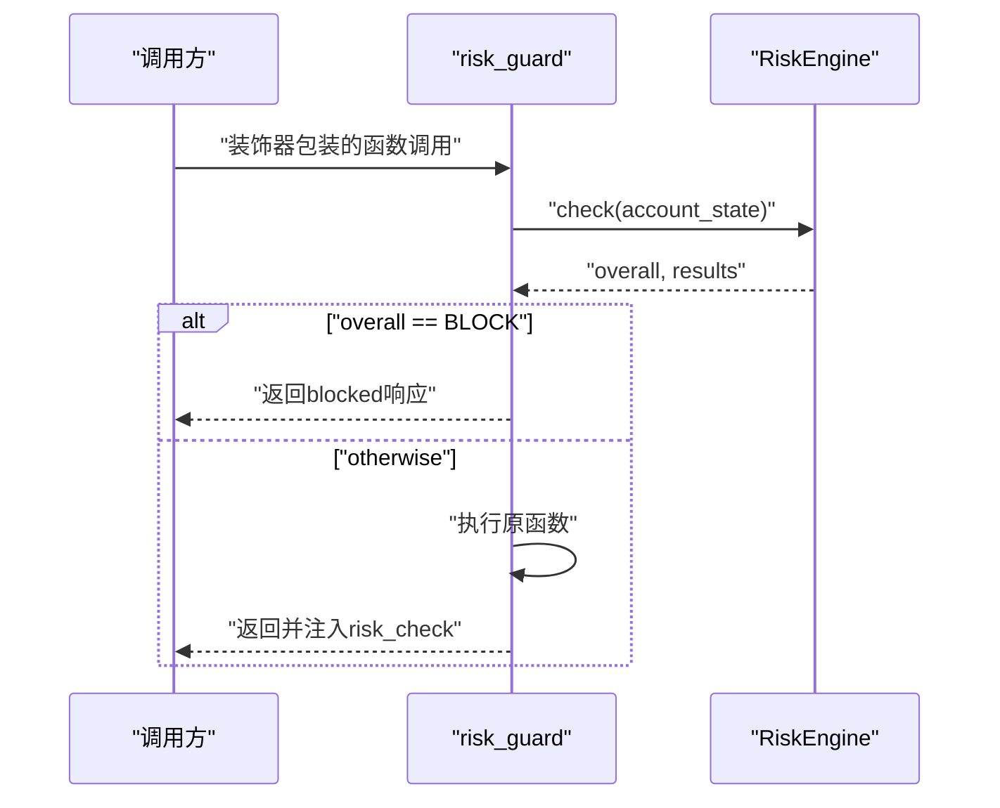
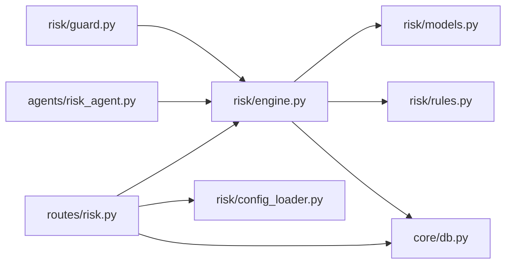

# 风险控制系统

<cite>
**本文引用的文件**
- [risk/__init__.py](file://risk/__init__.py)
- [risk/engine.py](file://risk/engine.py)
- [risk/guard.py](file://risk/guard.py)
- [risk/models.py](file://risk/models.py)
- [risk/rules.py](file://risk/rules.py)
- [risk/config_loader.py](file://risk/config_loader.py)
- [routes/risk.py](file://routes/risk.py)
- [agents/risk_agent.py](file://agents/risk_agent.py)
- [config/risk_config.yaml](file://config/risk_config.yaml)
- [core/db.py](file://core/db.py)
</cite>

## 目录
1. [引言](#引言)
2. [项目结构](#项目结构)
3. [核心组件](#核心组件)
4. [架构总览](#架构总览)
5. [详细组件分析](#详细组件分析)
6. [依赖分析](#依赖分析)
7. [性能考量](#性能考量)
8. [故障排查指南](#故障排查指南)
9. [结论](#结论)
10. [附录](#附录)

## 引言
本技术文档面向AIQuant风险控制系统，系统性阐述风控架构设计、规则定义与执行机制，覆盖多层次风控检查流程（交易限额、止损止盈、仓位管理等），并解释风控状态管理、事件记录与报警机制。文档同时提供规则配置指南、自定义扩展方法、最佳实践与常见问题解决方案，并通过具体代码示例路径展示如何实现有效的风险控制策略。

## 项目结构
风险控制子系统位于risk目录，围绕“规则库 + 引擎 + 守卫 + 配置加载器”的分层设计组织；配合Flask路由提供API能力，结合Agent在业务流程中嵌入风控检查，最终将状态与事件持久化至数据库。

**图表来源**
- [risk/__init__.py:1-20](file://risk/__init__.py#L1-L20)
- [risk/engine.py:1-168](file://risk/engine.py#L1-L168)
- [risk/guard.py:1-92](file://risk/guard.py#L1-L92)
- [risk/models.py:1-78](file://risk/models.py#L1-L78)
- [risk/rules.py:1-388](file://risk/rules.py#L1-L388)
- [risk/config_loader.py:1-131](file://risk/config_loader.py#L1-L131)
- [routes/risk.py:1-298](file://routes/risk.py#L1-L298)
- [agents/risk_agent.py:1-262](file://agents/risk_agent.py#L1-L262)
- [core/db.py:358-414](file://core/db.py#L358-L414)

**章节来源**
- [risk/__init__.py:1-20](file://risk/__init__.py#L1-L20)
- [risk/engine.py:1-168](file://risk/engine.py#L1-L168)
- [risk/guard.py:1-92](file://risk/guard.py#L1-L92)
- [risk/models.py:1-78](file://risk/models.py#L1-L78)
- [risk/rules.py:1-388](file://risk/rules.py#L1-L388)
- [risk/config_loader.py:1-131](file://risk/config_loader.py#L1-L131)
- [routes/risk.py:1-298](file://routes/risk.py#L1-L298)
- [agents/risk_agent.py:1-262](file://agents/risk_agent.py#L1-L262)
- [core/db.py:358-414](file://core/db.py#L358-L414)

## 核心组件
- 风控引擎（RiskEngine）：负责执行规则集合、聚合结果、持久化状态与事件、查询最新状态与事件。
- 规则库（DEFAULT_RULES）：内置多条风控规则，均从配置中心按需读取阈值与消息模板。
- 风控守卫（risk_guard装饰器与check_risk函数）：在业务流程中快速注入风控检查与拦截逻辑。
- 数据模型（RiskLevel/RiskCategory/RiskCheckResult/RiskStatus）：统一描述风险等级、分类、检查结果与状态快照。
- 配置加载器（RiskConfig）：支持YAML热加载，提供规则开关、阈值、消息与建议读取。
- 路由接口（routes/risk.py）：对外暴露风控状态、事件、配置、黑名单与豁免管理等API。
- Agent集成（agents/risk_agent.py）：在策略编排中调用风控引擎，将风控状态写入上下文并影响后续流程。

**章节来源**
- [risk/engine.py:13-168](file://risk/engine.py#L13-L168)
- [risk/rules.py:376-387](file://risk/rules.py#L376-L387)
- [risk/guard.py:36-92](file://risk/guard.py#L36-L92)
- [risk/models.py:11-78](file://risk/models.py#L11-L78)
- [risk/config_loader.py:20-131](file://risk/config_loader.py#L20-L131)
- [routes/risk.py:29-298](file://routes/risk.py#L29-L298)
- [agents/risk_agent.py:25-96](file://agents/risk_agent.py#L25-L96)

## 架构总览
系统采用“规则配置驱动 + 引擎执行 + 守卫拦截 + API对外 + Agent集成 + 数据持久化”的闭环架构。规则通过配置中心动态加载，引擎对账户状态进行全量检查，守卫在运行时自动拦截高风险场景，API提供运维与审计能力，Agent在策略流程中嵌入风控检查，最终将状态与事件写入数据库。

**图表来源**
- [agents/risk_agent.py:52-66](file://agents/risk_agent.py#L52-L66)
- [risk/guard.py:36-74](file://risk/guard.py#L36-L74)
- [risk/engine.py:19-71](file://risk/engine.py#L19-L71)
- [risk/config_loader.py:88-115](file://risk/config_loader.py#L88-L115)
- [core/db.py:358-414](file://core/db.py#L358-L414)

## 详细组件分析

### 风控引擎（RiskEngine）
- 职责
  - 执行规则集合，聚合结果并取最严格等级作为整体风险等级。
  - 将检查结果与状态写入数据库，提供查询最新状态与事件的能力。
- 关键流程
  - 全量检查：遍历规则，捕获异常并生成警告级别结果，保证鲁棒性。
  - 状态聚合：根据等级优先级映射，取最大等级作为overall。
  - 持久化：分别写入risk_events与risk_status表，字段覆盖指标、建议与时间戳。
  - 查询：按账户ID查询最新状态，按时间倒序查询最近事件。
- 错误处理
  - 规则执行异常转为警告级别结果，避免中断整体流程。
  - 数据库写入失败打印错误日志，不影响主流程返回。

**图表来源**
- [risk/engine.py:19-71](file://risk/engine.py#L19-L71)

**章节来源**
- [risk/engine.py:13-168](file://risk/engine.py#L13-L168)

### 风控规则库（DEFAULT_RULES）
- 设计原则
  - 规则函数签名统一：rule_name(account_state: dict) -> RiskCheckResult。
  - 阈值与消息模板来自配置中心，支持热加载。
  - 规则启用开关、阈值、消息与建议均可独立配置。
- 规则类别与要点
  - 最大回撤限制：按百分比阈值分级，支持阻断与限制。
  - 单股集中度限制：计算最大持仓占比，超限阻断。
  - 大盘择时（MA5/MA20）：空头市场限制开仓。
  - 连续亏损冷却期：累计次数达到阈值阻断交易。
  - 日交易频率限制：限制每日开仓次数。
  - 个股波动率限制：按涨跌幅限制买卖。
  - 行业集中度限制：按行业汇总并限制占比。
  - 总仓位限制：总仓位比例限制。
  - 节假日/周末持仓提醒：临近长假提示风险。
  - 黑名单检查：命中黑名单即阻断。
- 规则注册
  - 通过DEFAULT_RULES集中注册，便于扩展与维护。

**图表来源**
- [risk/models.py:11-78](file://risk/models.py#L11-L78)
- [risk/engine.py:19-71](file://risk/engine.py#L19-L71)
- [risk/config_loader.py:88-115](file://risk/config_loader.py#L88-L115)
- [risk/rules.py:34-387](file://risk/rules.py#L34-L387)

**章节来源**
- [risk/rules.py:34-387](file://risk/rules.py#L34-L387)
- [risk/models.py:11-78](file://risk/models.py#L11-L78)
- [risk/config_loader.py:88-115](file://risk/config_loader.py#L88-L115)

### 风控守卫（risk_guard装饰器与check_risk）
- 使用方式
  - 装饰器：在业务函数上使用risk_guard，自动注入风控拦截与结果。
  - 直接调用：通过check_risk(account_state, pipeline_id)执行检查并记录。
- 行为特征
  - 若整体等级为BLOCK，直接返回拦截响应。
  - 否则执行原函数，并在返回字典中注入risk_check字段，包含等级、是否受限与明细。
- 账户状态构建
  - 提供build_account_state工具，从上下文或参数组装账户状态字典，包含回撤、持仓、总值、可用资金、连续亏损、日开仓次数、大盘MA5/MA20、交易标的、假期天数等。

**图表来源**
- [risk/guard.py:36-74](file://risk/guard.py#L36-L74)
- [risk/engine.py:19-49](file://risk/engine.py#L19-L49)

**章节来源**
- [risk/guard.py:15-92](file://risk/guard.py#L15-L92)

### 配置加载器（RiskConfig）
- 功能特性
  - 单例模式，支持线程安全。
  - 自动热加载：检测配置文件修改后自动重载。
  - 提供规则开关、阈值、消息模板与建议的统一读取接口。
- 接口要点
  - is_rule_enabled：判断规则是否启用。
  - get_rule_config：获取规则完整配置。
  - get_threshold：按等级获取阈值。
  - get_message/get_suggestion：按等级获取消息与建议。
  - reload：强制热加载。
- 配置文件
  - 默认路径：config/risk_config.yaml。
  - 示例配置涵盖最大回撤、单股集中度、大盘择时、连续亏损、日交易频率、波动率、行业集中度、总仓位、节假日提醒、黑名单与豁免等。

**章节来源**
- [risk/config_loader.py:20-131](file://risk/config_loader.py#L20-L131)
- [config/risk_config.yaml:1-170](file://config/risk_config.yaml#L1-L170)

### 路由接口（routes/risk.py）
- 基础接口
  - GET /api/risk/status：获取当前风控状态（整体等级、活跃规则、回撤、持仓、最后检查时间等）。
  - GET /api/risk/events：获取最近风控事件，支持limit与level过滤。
  - POST /api/risk/check：手动触发风控检查，传入account_state。
- 配置管理
  - GET /api/risk/config：获取当前风控配置与配置文件路径。
  - POST /api/risk/config/reload：热加载配置。
- 黑名单管理
  - GET /api/risk/blacklist：获取有效黑名单列表。
  - POST /api/risk/blacklist：添加黑名单（含有效期）。
  - DELETE /api/risk/blacklist/<code>：移除黑名单。
- 豁免管理
  - POST /api/risk/override：申请风控豁免（可选审批流程）。
  - GET /api/risk/overrides：查询豁免记录（支持状态过滤）。
  - POST /api/risk/override/<id>/approve：审批通过豁免。
- 回撤曲线
  - GET /api/risk/drawdown：获取账户资产回撤曲线与最大回撤。

**章节来源**
- [routes/risk.py:29-298](file://routes/risk.py#L29-L298)

### Agent集成（agents/risk_agent.py）
- 职责
  - 大盘风险评估、波动率评估、个股风险筛查、仓位建议与综合风险等级。
  - 系统化风控检查：构建账户状态，调用RiskEngine执行检查并记录，将结果写入上下文。
  - 若整体等级为BLOCK，则在上下文中标记拦截与原因，供编排器使用。
- 账户状态构建
  - 从市场风险评估结果中提取MA5/MA20等指标，结合默认账户信息组装account_state。
- 上下文兼容
  - 同时输出传统格式与system_risk格式，确保与既有流程兼容。

**章节来源**
- [agents/risk_agent.py:25-96](file://agents/risk_agent.py#L25-L96)

## 依赖分析
- 组件耦合
  - RiskEngine依赖RiskCheckResult、RiskLevel、RiskStatus与DEFAULT_RULES，以及RiskConfig读取阈值与消息。
  - RiskGuard依赖RiskEngine与RiskLevel，用于拦截与注入风控结果。
  - routes/risk.py依赖RiskEngine与RiskConfig，提供API能力。
  - agents/risk_agent.py依赖RiskEngine与RiskLevel，用于在策略流程中嵌入风控。
  - 所有持久化依赖core/db.py中的表结构（risk_events、risk_status、blacklist、risk_overrides）。
- 外部依赖
  - Flask蓝图提供HTTP接口。
  - YAML配置文件提供规则与建议模板。
  - SQLite连接（通过core.db）提供事件与状态存储。

**图表来源**
- [risk/guard.py:11-12](file://risk/guard.py#L11-L12)
- [routes/risk.py:21-24](file://routes/risk.py#L21-L24)
- [agents/risk_agent.py:21-22](file://agents/risk_agent.py#L21-L22)
- [risk/engine.py:8-10](file://risk/engine.py#L8-L10)
- [core/db.py:358-414](file://core/db.py#L358-L414)

**章节来源**
- [risk/engine.py:8-10](file://risk/engine.py#L8-L10)
- [risk/guard.py:11-12](file://risk/guard.py#L11-L12)
- [routes/risk.py:21-24](file://routes/risk.py#L21-L24)
- [agents/risk_agent.py:21-22](file://agents/risk_agent.py#L21-L22)
- [core/db.py:358-414](file://core/db.py#L358-L414)

## 性能考量
- 规则执行
  - 规则数量固定且轻量，主要为阈值比较与少量统计计算，复杂度低。
  - 异常捕获与警告降级避免单规则异常影响整体性能。
- 配置热加载
  - 通过文件时间戳检测实现自动热加载，避免重启服务带来的停机成本。
- 数据库写入
  - 使用批量插入与索引优化（按时间与等级索引），建议在高并发场景下增加连接池与事务批处理。
- 查询优化
  - 最新状态按账户ID与时间排序，事件按时间倒序分页查询，建议合理设置limit与筛选条件。

[本节为通用性能建议，不直接分析具体文件]

## 故障排查指南
- 规则未生效
  - 检查规则启用开关与阈值配置，确认配置文件路径与权限。
  - 使用“热加载配置”接口验证配置是否正确加载。
- 风控拦截导致业务中断
  - 通过“获取最近风控事件”查看触发规则与阈值，必要时临时调整阈值或申请豁免。
  - 使用“手动触发风控检查”接口复现问题，核对account_state字段是否完整。
- 数据库写入失败
  - 查看引擎与路由的日志输出，确认数据库连接与表结构是否存在。
  - 核对表结构（risk_events、risk_status、blacklist、risk_overrides）是否已创建。
- 黑名单/豁免异常
  - 检查黑名单有效期与豁免状态，确认审批流程与过期时间设置。

**章节来源**
- [routes/risk.py:96-107](file://routes/risk.py#L96-L107)
- [risk/engine.py:73-127](file://risk/engine.py#L73-L127)
- [core/db.py:358-414](file://core/db.py#L358-L414)

## 结论
AIQuant风险控制系统通过“配置驱动 + 规则执行 + 守卫拦截 + API对外 + Agent集成 + 数据持久化”的架构，实现了可扩展、可观测、可运维的风险控制能力。系统支持多维度风控检查与分级处置，具备完善的事件记录与状态管理，并提供灵活的配置与API接口，满足实盘交易中的风控需求。

[本节为总结性内容，不直接分析具体文件]

## 附录

### 风控规则配置指南
- 配置文件位置
  - config/risk_config.yaml
- 常用配置项
  - enabled：规则启用开关
  - thresholds.warning/restrict/block：不同等级阈值
  - messages.warning/restrict/block：对应消息模板
  - suggestions.warning/restrict/block：对应建议文本
  - blacklist.default_expiry_days：黑名单默认有效期（天）
  - override.*：豁免相关配置（最长有效期、是否需要原因/审批）
- 热加载
  - 通过POST /api/risk/config/reload触发热加载，无需重启服务。

**章节来源**
- [config/risk_config.yaml:1-170](file://config/risk_config.yaml#L1-L170)
- [routes/risk.py:96-107](file://routes/risk.py#L96-L107)
- [risk/config_loader.py:58-71](file://risk/config_loader.py#L58-L71)

### 自定义扩展方法
- 新增规则
  - 在risk/rules.py中新增rule_xxx函数，遵循统一签名与返回类型。
  - 在DEFAULT_RULES中注册新规则。
  - 在config/risk_config.yaml中新增规则配置项（enabled、thresholds、messages、suggestions）。
- 自定义拦截行为
  - 在业务函数上使用@risk_guard装饰器，或在关键流程调用check_risk。
  - 根据overall等级决定是否放行或拦截。
- 黑名单与豁免
  - 通过路由接口管理黑名单与豁免，支持有效期与审批流程。

**章节来源**
- [risk/rules.py:376-387](file://risk/rules.py#L376-L387)
- [risk/guard.py:36-92](file://risk/guard.py#L36-L92)
- [routes/risk.py:129-243](file://routes/risk.py#L129-L243)

### 最佳实践
- 分级处置：合理设置warning/restrict/block阈值，避免过度限制或宽松。
- 配置热更新：在非交易时段调整阈值，使用热加载接口验证生效。
- 事件审计：定期审查risk_events与risk_status，形成风控报告。
- 黑名单治理：明确黑名单原因与有效期，建立审批与复核流程。
- Agent集成：在策略编排中尽早执行风控检查，前置拦截高风险动作。

[本节为通用实践建议，不直接分析具体文件]