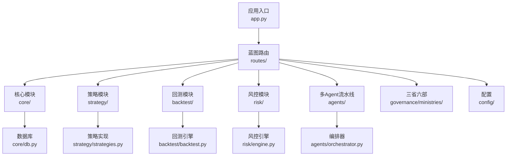
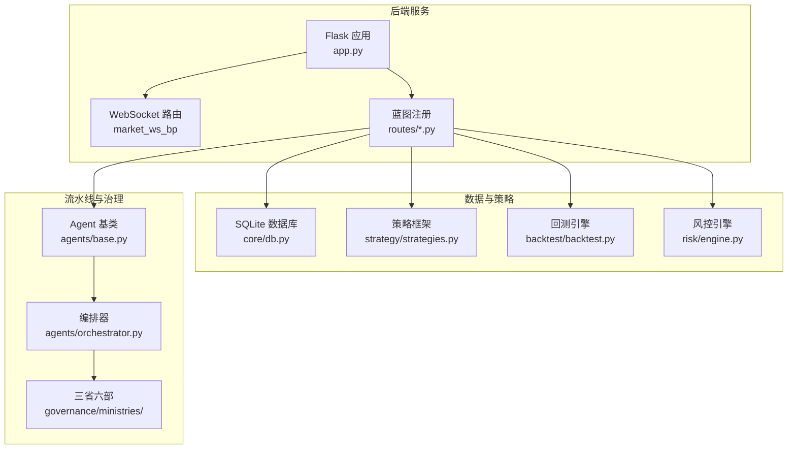
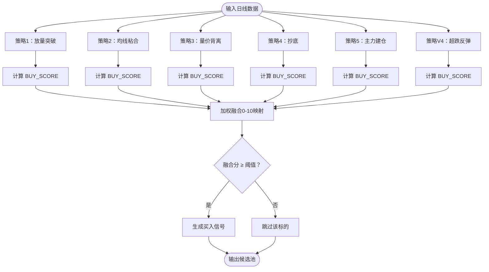
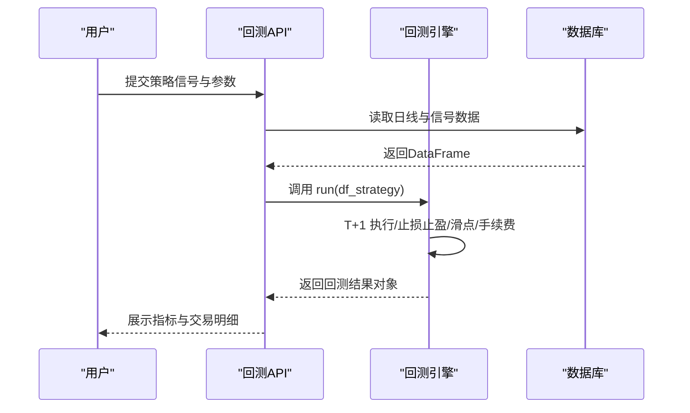
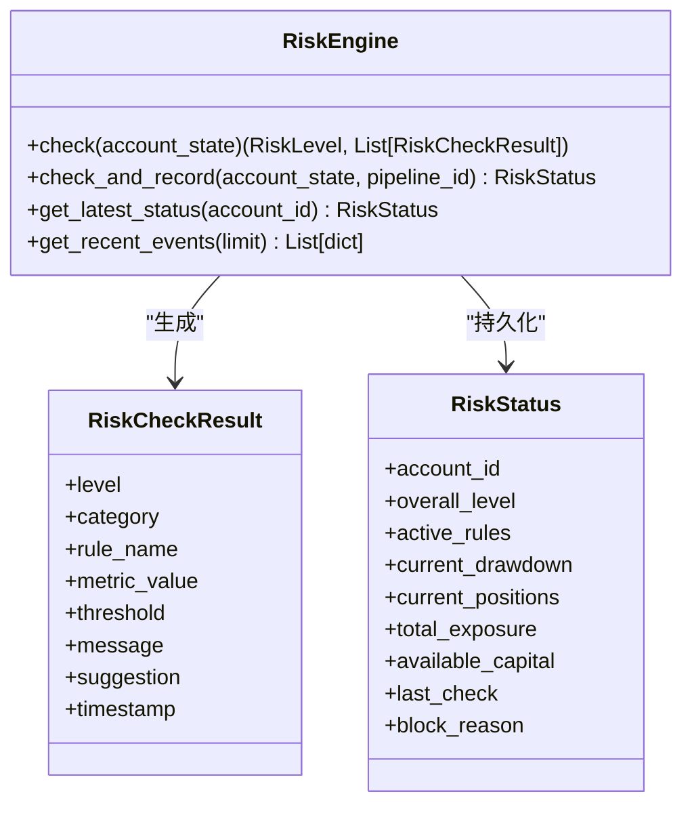
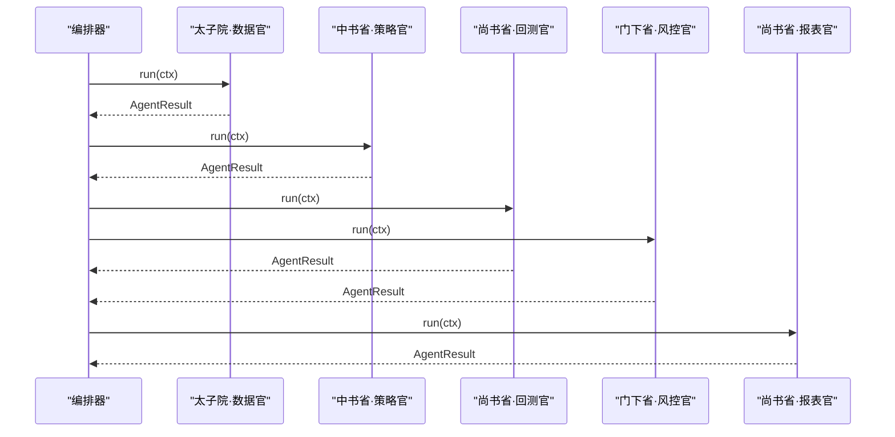
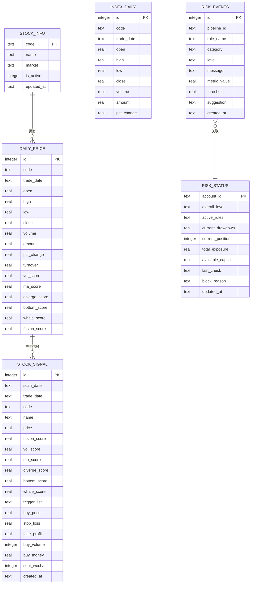
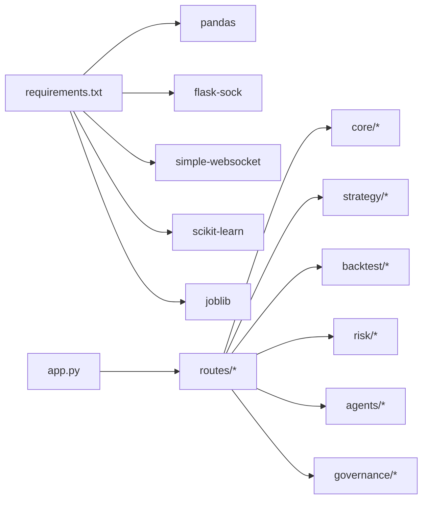

# 项目概述

<cite>
**本文档引用的文件**
- [README.md](file://README.md)
- [app.py](file://app.py)
- [quant.py](file://quant.py)
- [config/settings.py](file://config/settings.py)
- [config/llm_config.yaml](file://config/llm_config.yaml)
- [agents/base.py](file://agents/base.py)
- [agents/orchestrator.py](file://agents/orchestrator.py)
- [governance/__init__.py](file://governance/__init__.py)
- [ministries/rites/__init__.py](file://ministries/rites/__init__.py)
- [risk/engine.py](file://risk/engine.py)
- [strategy/strategies.py](file://strategy/strategies.py)
- [backtest/backtest.py](file://backtest/backtest.py)
- [core/db.py](file://core/db.py)
- [routes/__init__.py](file://routes/__init__.py)
- [requirements.txt](file://requirements.txt)
</cite>

## 目录
1. [简介](#简介)
2. [项目结构](#项目结构)
3. [核心组件](#核心组件)
4. [架构总览](#架构总览)
5. [详细组件分析](#详细组件分析)
6. [依赖分析](#依赖分析)
7. [性能考虑](#性能考虑)
8. [故障排查指南](#故障排查指南)
9. [结论](#结论)
10. [附录](#附录)

## 简介
AIQuant 是面向 A 股市场的量化交易助手，旨在通过“多策略分析 + 风险控制 + 回测验证”的闭环体系，帮助用户进行小波段的智能选股与交易决策。项目采用模块化设计，结合“三省六部制”组织化的流水线编排，以及“多 Agent”协作机制，形成从数据采集、策略生成、风控校验到报告产出的自动化工作流。

- 项目目标：提供稳定、可复现、可审计的 A 股量化交易工具链，兼顾初学者易用性与专业开发者扩展性。
- 核心能力：多策略融合评分、超跌反弹专项策略、回测引擎、实时行情监控、风险控制、三省六部流水线编排。
- 应用场景：日频策略扫描、回测验证、实盘监控、风险审计与报告生成。

**章节来源**
- [README.md:1-3](file://README.md#L1-L3)

## 项目结构
项目采用“蓝图 + 模块化 + 流水线”的组织方式，核心目录与职责如下：
- app.py：Flask 后端入口，注册所有蓝图与 WebSocket 路由，提供统一 API 与仪表板页面。
- routes/：按领域划分的蓝图集合，涵盖系统、股票、回测、账户、风控、治理等模块。
- core/：核心基础设施，包括数据库、数据抓取、同步、任务队列等。
- strategy/：多策略框架与具体策略实现，支持融合评分与超跌反弹策略。
- backtest/：回测引擎与参数优化模块，支持 T+1 执行、止损止盈、动态仓位等特性。
- risk/：风控引擎与规则集，提供风险事件记录与状态快照。
- agents/：多 Agent 框架与三省六部流水线编排器。
- governance/ministries/：三省六部制组织架构，职责清晰、耦合可控。
- config/：基础配置与 LLM 配置。
- live/：实盘监控模块。
- docs/：架构与风控方案文档。

**图表来源**
- [app.py:9-72](file://app.py#L9-L72)
- [routes/__init__.py:6-16](file://routes/__init__.py#L6-L16)
- [core/db.py:57-427](file://core/db.py#L57-L427)
- [strategy/strategies.py:1-431](file://strategy/strategies.py#L1-L431)
- [backtest/backtest.py:56-494](file://backtest/backtest.py#L56-L494)
- [risk/engine.py:13-168](file://risk/engine.py#L13-L168)
- [agents/orchestrator.py:36-263](file://agents/orchestrator.py#L36-L263)

**章节来源**
- [app.py:9-72](file://app.py#L9-L72)
- [routes/__init__.py:6-16](file://routes/__init__.py#L6-L16)
- [core/db.py:57-427](file://core/db.py#L57-L427)

## 核心组件
- 策略层
  - 多策略框架：放量突破、均线粘合、量价背离、抄底、主力建仓，支持独立运行与融合评分。
  - 超跌反弹策略：基于 20 日跌幅、MA5 站上、温和放量、RSI 区间与底部平台等条件的专项策略。
- 回测层
  - 回测引擎：支持 T+1 执行、止损止盈、滑点成本、手续费/印花税、动态仓位、大盘择时、回撤熔断等。
  - 参数优化：支持参数寻优与批量验证。
- 风控层
  - 风控引擎：规则集驱动的风险检查，输出风险等级与事件记录，并持久化至数据库。
- 数据层
  - SQLite 本地数据库：统一存储股票基础信息、日线行情、策略评分、信号记录、风控状态等。
- 流水线与治理
  - 多 Agent 框架：统一上下文与结果封装，支持串行与并行执行。
  - 三省六部制：太子院（数据）、中书省（信号）、门下省（风控）、尚书省（报告）的职责分离与依赖编排。

**章节来源**
- [strategy/strategies.py:1-431](file://strategy/strategies.py#L1-L431)
- [backtest/backtest.py:56-494](file://backtest/backtest.py#L56-L494)
- [risk/engine.py:13-168](file://risk/engine.py#L13-L168)
- [core/db.py:57-427](file://core/db.py#L57-L427)
- [agents/base.py:20-120](file://agents/base.py#L20-L120)
- [agents/orchestrator.py:36-263](file://agents/orchestrator.py#L36-L263)
- [governance/__init__.py:1-10](file://governance/__init__.py#L1-L10)

## 架构总览
AIQuant 采用“后端 API + 多模块协同 + 三省六部流水线”的整体架构。后端通过 Flask 提供 REST API 与 WebSocket，前端通过仪表板页面与多 Agent 控制台进行交互。核心数据与策略在本地 SQLite 中持久化，策略扫描与数据同步通过定时任务驱动，回测与风控在流水线中并行执行，最终生成报告。

**图表来源**
- [app.py:9-72](file://app.py#L9-L72)
- [core/db.py:57-427](file://core/db.py#L57-L427)
- [strategy/strategies.py:1-431](file://strategy/strategies.py#L1-L431)
- [backtest/backtest.py:56-494](file://backtest/backtest.py#L56-L494)
- [risk/engine.py:13-168](file://risk/engine.py#L13-L168)
- [agents/base.py:20-120](file://agents/base.py#L20-L120)
- [agents/orchestrator.py:36-263](file://agents/orchestrator.py#L36-L263)

## 详细组件分析

### 多策略分析与融合
- 策略实现：每个策略独立计算 BUY_SCORE 与 BUY_SIGNAL，并返回包含 close/open/volume 等列的 DataFrame，便于回测引擎使用。
- 融合评分：将各策略的 0-3 分映射到 0-10 分后按权重加权，得到 0-50 的融合分，作为最终筛选依据。
- 超跌反弹：独立的 v4 策略，强调 20 日跌幅、MA5 站上、温和放量、RSI 区间与底部平台，适合阶段性反弹捕捉。

**图表来源**
- [strategy/strategies.py:36-431](file://strategy/strategies.py#L36-L431)

**章节来源**
- [strategy/strategies.py:36-431](file://strategy/strategies.py#L36-L431)

### 回测引擎与参数优化
- 执行规则：T+1 模式，信号日判断，次日开盘价执行；支持止损止盈、滑点、手续费/印花税、动态仓位、大盘择时与回撤熔断。
- 指标计算：总收益、年化收益、最大回撤、夏普比率、胜率、盈亏比、平均持仓天数、基准收益与 Alpha 等。
- 参数优化：支持参数寻优与批量验证，结合回测结果评估策略鲁棒性。

**图表来源**
- [backtest/backtest.py:121-494](file://backtest/backtest.py#L121-L494)

**章节来源**
- [backtest/backtest.py:56-494](file://backtest/backtest.py#L56-L494)

### 风控引擎与规则集
- 规则驱动：规则集按优先级合并，取最严格等级作为整体风险等级；记录风险事件与状态快照。
- 数据持久化：将风险事件与状态写入数据库，支持查询最新状态与近期事件。
- 风控拦截：在三省六部流水线中，门下省风控一旦判定为“拦截”，将阻止进入尚书省报告阶段。

**图表来源**
- [risk/engine.py:13-168](file://risk/engine.py#L13-L168)

**章节来源**
- [risk/engine.py:13-168](file://risk/engine.py#L13-L168)

### 多 Agent 流水线与三省六部制
- Agent 基类：统一上下文 AgentContext 与结果 AgentResult，自动记录耗时与异常。
- 编排器：三省六部制流水线，太子院串行、中书省串行、门下省与尚书省并行，门下省一票否决。
- 可观测性：流水线状态、历史记录与摘要，支持 API 查询与前端展示。

**图表来源**
- [agents/orchestrator.py:81-175](file://agents/orchestrator.py#L81-L175)
- [agents/base.py:20-120](file://agents/base.py#L20-L120)

**章节来源**
- [agents/base.py:20-120](file://agents/base.py#L20-L120)
- [agents/orchestrator.py:36-263](file://agents/orchestrator.py#L36-L263)
- [governance/__init__.py:1-10](file://governance/__init__.py#L1-L10)

### 数据层与数据库设计
- 表结构：stock_info、daily_price、index_daily、stock_signal、positions、trades、account_snapshots、risk_events、risk_status 等。
- 索引与约束：为高频查询建立索引，使用 UNIQUE 约束保证幂等写入。
- 迁移与兼容：支持列增量添加与索引重建，保障历史数据兼容。

**图表来源**
- [core/db.py:57-427](file://core/db.py#L57-L427)

**章节来源**
- [core/db.py:57-427](file://core/db.py#L57-L427)

### 系统边界与关键配置
- 系统边界：后端 API、本地数据库、策略与回测、风控与流水线、实时行情监控。
- 关键配置：
  - 基础配置：数据库路径、API 主机端口、定时任务时间、同步批次与日志级别。
  - LLM 配置：模型选择、API Key、Base URL、默认参数与功能开关。
- 启动与监控：后端启动时自动注册路由与 WebSocket，同时启动行情监控与实盘监控线程。

**章节来源**
- [config/settings.py:1-25](file://config/settings.py#L1-L25)
- [config/llm_config.yaml:1-23](file://config/llm_config.yaml#L1-L23)
- [app.py:148-164](file://app.py#L148-L164)

## 依赖分析
- 外部依赖：requests、pandas、plotly、flask-sock、simple-websocket、scikit-learn、joblib。
- 模块耦合：routes 仅负责路由与蓝图，核心业务集中在 core、strategy、backtest、risk、agents；耦合度低，内聚性强。
- 循环依赖：未见明显循环依赖，模块间通过接口与数据传递解耦。

**图表来源**
- [requirements.txt:1-9](file://requirements.txt#L1-L9)
- [app.py:9-72](file://app.py#L9-L72)

**章节来源**
- [requirements.txt:1-9](file://requirements.txt#L1-L9)
- [app.py:9-72](file://app.py#L9-L72)

## 性能考虑
- 数据库：采用 WAL 模式与 NORMAL 同步策略，在并发与可靠性之间取得平衡；为高频查询建立索引。
- 策略与回测：批量写入策略评分，避免逐条更新；回测引擎使用向量化计算与 T+1 执行，减少未来数据泄露风险。
- 流水线：并行执行回测与风控，缩短整体耗时；门下省拦截可快速终止无效流程。
- 实时监控：行情监控与实盘监控线程化，避免阻塞主服务。

[本节为通用性能讨论，无需特定文件引用]

## 故障排查指南
- 健康检查：通过 /api/health 接口确认服务可用。
- 路由调试：/api/debug/routes 返回所有注册路由，便于定位接口问题。
- 数据库：检查表结构与索引是否存在，必要时查看迁移日志。
- 风控：查询 risk_events 与 risk_status，确认风险事件与状态快照。
- 定时任务：核对配置中的定时时间与日志输出，确认任务是否按时执行。

**章节来源**
- [app.py:124-145](file://app.py#L124-L145)
- [core/db.py:57-427](file://core/db.py#L57-L427)
- [risk/engine.py:129-168](file://risk/engine.py#L129-L168)

## 结论
AIQuant 以“多策略 + 回测 + 风控 + 流水线”的闭环为核心，结合三省六部制的组织化治理，构建了从数据到决策再到执行的完整链条。其模块化设计与本地数据库方案降低了部署与运维复杂度，适合个人与小型团队在 A 股市场开展量化实践。对于初学者，系统提供了直观的仪表板与报告；对于专业开发者，系统具备良好的扩展性与可观测性，便于二次开发与定制。

[本节为总结性内容，无需特定文件引用]

## 附录
- 项目背景：面向 A 股市场的量化交易助手，强调可复现、可审计与可扩展。
- 应用场景：日频策略扫描、回测验证、实盘监控、风险审计与报告生成。
- 价值定位：在 A 股波动环境中，通过系统化方法降低主观判断偏差，提升策略稳定性与可解释性。

[本节为概览性内容，无需特定文件引用]