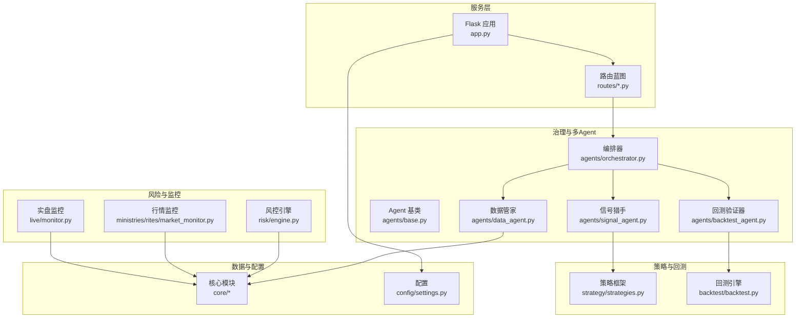
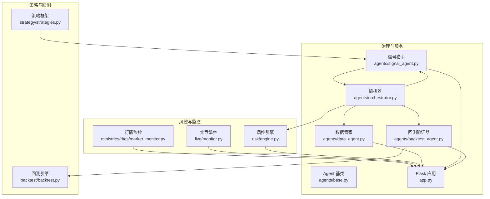
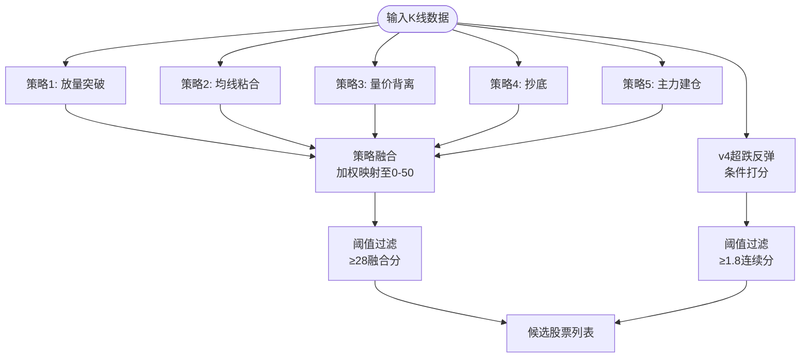
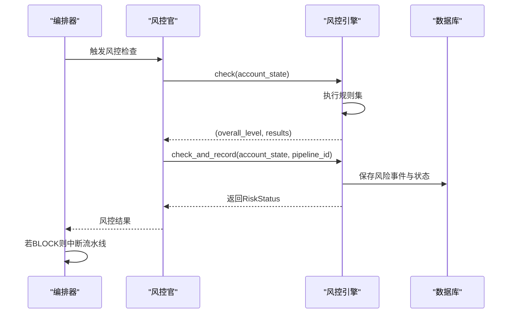
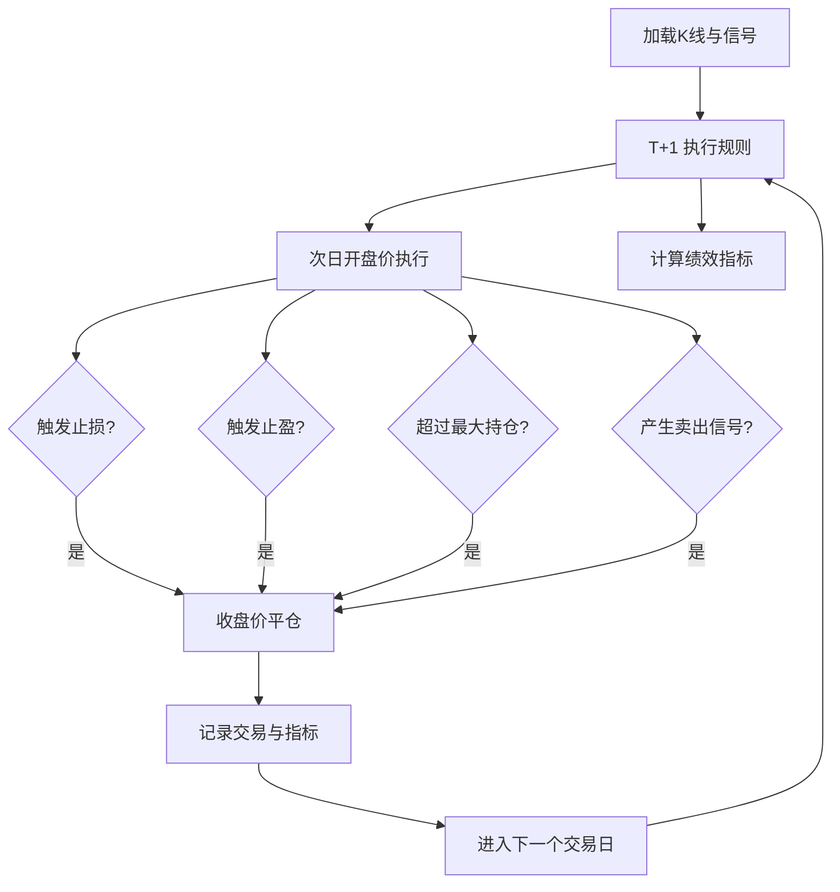
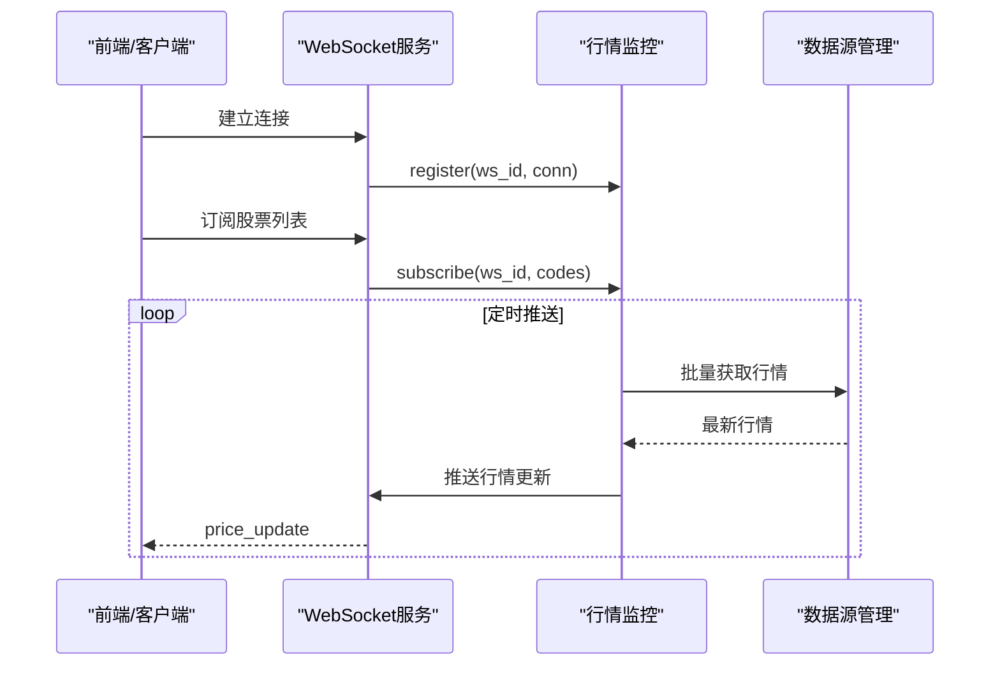
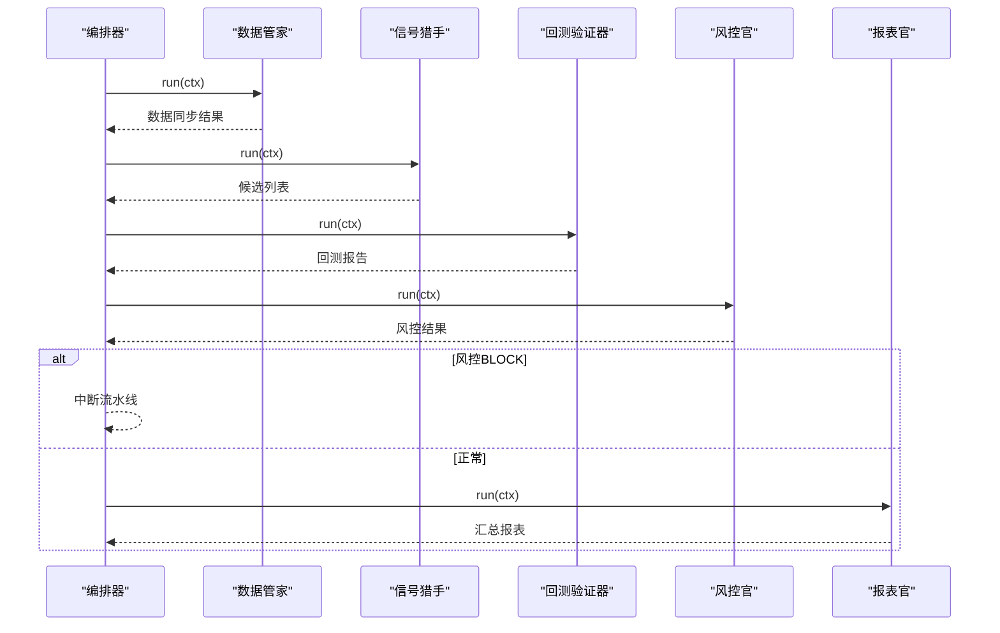
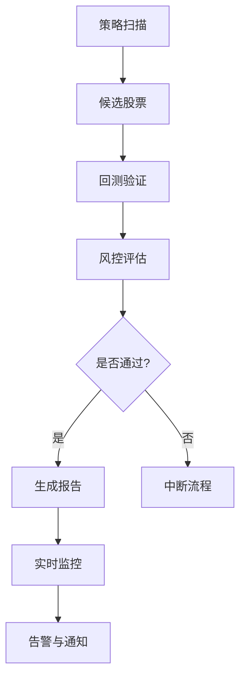
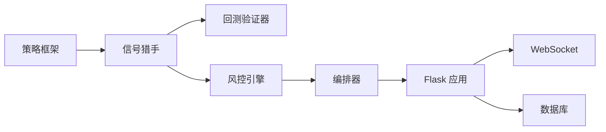

# 项目简介

<cite>
**本文档引用的文件**
- [README.md](file://README.md)
- [app.py](file://app.py)
- [quant.py](file://quant.py)
- [agents/orchestrator.py](file://agents/orchestrator.py)
- [agents/base.py](file://agents/base.py)
- [agents/data_agent.py](file://agents/data_agent.py)
- [agents/signal_agent.py](file://agents/signal_agent.py)
- [agents/backtest_agent.py](file://agents/backtest_agent.py)
- [backtest/backtest.py](file://backtest/backtest.py)
- [risk/engine.py](file://risk/engine.py)
- [ministries/rites/market_monitor.py](file://ministries/rites/market_monitor.py)
- [live/monitor.py](file://live/monitor.py)
- [config/settings.py](file://config/settings.py)
- [strategy/strategies.py](file://strategy/strategies.py)
</cite>

## 目录
1. [引言](#引言)
2. [项目结构](#项目结构)
3. [核心组件](#核心组件)
4. [架构总览](#架构总览)
5. [详细组件分析](#详细组件分析)
6. [依赖关系分析](#依赖关系分析)
7. [性能考量](#性能考量)
8. [故障排查指南](#故障排查指南)
9. [结论](#结论)
10. [附录](#附录)

## 引言
AIQuant 是面向 A 股市场的量化交易助手，旨在通过“多策略量化分析 + 风险控制系统 + 回测验证平台 + 实时监控”的一体化能力，帮助用户做出更稳健的投资决策，并在合规前提下降低交易成本与风险。项目以“三省六部制”组织治理理念构建多 Agent 流水线，结合回测引擎与风控引擎，形成从数据采集、信号生成、风险评估到回测验证与实时监控的闭环。

## 项目结构
项目采用模块化分层组织，围绕“策略层、回测层、风险层、数据层、治理层、监控层、服务层”展开，配合 Flask 提供统一 API 与可视化界面，支撑日常扫描、回测验证与实盘监控。

图表来源
- [app.py:1-164](file://app.py#L1-L164)
- [agents/orchestrator.py:1-263](file://agents/orchestrator.py#L1-L263)
- [agents/base.py:1-120](file://agents/base.py#L1-L120)
- [agents/data_agent.py:1-167](file://agents/data_agent.py#L1-L167)
- [agents/signal_agent.py:1-213](file://agents/signal_agent.py#L1-L213)
- [agents/backtest_agent.py:1-181](file://agents/backtest_agent.py#L1-L181)
- [backtest/backtest.py:1-517](file://backtest/backtest.py#L1-L517)
- [risk/engine.py:1-168](file://risk/engine.py#L1-L168)
- [ministries/rites/market_monitor.py:1-244](file://ministries/rites/market_monitor.py#L1-L244)
- [live/monitor.py:1-286](file://live/monitor.py#L1-L286)
- [config/settings.py:1-25](file://config/settings.py#L1-L25)

章节来源
- [README.md:1-3](file://README.md#L1-L3)
- [app.py:1-164](file://app.py#L1-L164)
- [config/settings.py:1-25](file://config/settings.py#L1-L25)

## 核心组件
- 多策略量化分析：提供放量突破、均线粘合、量价背离、抄底、主力建仓等策略，支持策略融合与 v4 超跌反弹策略，输出信号与评分，用于候选池筛选与交易建议。
- 风险控制系统：基于规则集的风控引擎，支持回撤熔断、连续亏损限制、大盘择时过滤、动态仓位等风控措施，提供风险状态与事件记录。
- 回测验证平台：提供 T+1 回测、滑点成本、手续费/印花税、止盈止损、最大回撤、夏普比率、胜率、盈亏比等指标，支持快速回测与参数敏感度分析。
- 实时监控：行情监控（WebSocket）与实盘监控（止损/止盈/异动告警），支持 Webhook 推送与告警处理。
- 多 Agent 流水线：以“三省六部制”组织策略扫描、回测验证与报表生成，支持串行与并行执行、状态持久化与错误处理。
- 数据与配置：统一数据库、定时任务、API 端口与日志级别配置，保障系统稳定运行。

章节来源
- [strategy/strategies.py:1-431](file://strategy/strategies.py#L1-L431)
- [risk/engine.py:1-168](file://risk/engine.py#L1-L168)
- [backtest/backtest.py:1-517](file://backtest/backtest.py#L1-L517)
- [ministries/rites/market_monitor.py:1-244](file://ministries/rites/market_monitor.py#L1-L244)
- [live/monitor.py:1-286](file://live/monitor.py#L1-L286)
- [agents/orchestrator.py:1-263](file://agents/orchestrator.py#L1-L263)
- [agents/base.py:1-120](file://agents/base.py#L1-L120)
- [config/settings.py:1-25](file://config/settings.py#L1-L25)

## 架构总览
AIQuant 采用“策略-回测-风控-监控-治理-服务”的分层架构，核心流程包括：
- 数据层：负责全市场数据同步、指数同步、策略评分缓存与质量检查。
- 策略层：多策略信号生成与融合，支持 v4 超跌反弹策略。
- 回测层：历史回测与关键指标计算，支持快速回测与参数敏感度分析。
- 风控层：规则驱动的风险评估与状态记录，支持熔断与熔断解除。
- 监控层：行情推送与实盘监控，支持告警与 Webhook。
- 治理层：多 Agent 编排与状态管理，支持三省六部制流水线。
- 服务层：Flask 提供 API 与前端页面，统一健康检查与路由。

图表来源
- [strategy/strategies.py:1-431](file://strategy/strategies.py#L1-L431)
- [backtest/backtest.py:1-517](file://backtest/backtest.py#L1-L517)
- [risk/engine.py:1-168](file://risk/engine.py#L1-L168)
- [ministries/rites/market_monitor.py:1-244](file://ministries/rites/market_monitor.py#L1-L244)
- [live/monitor.py:1-286](file://live/monitor.py#L1-L286)
- [agents/orchestrator.py:1-263](file://agents/orchestrator.py#L1-L263)
- [agents/base.py:1-120](file://agents/base.py#L1-L120)
- [agents/data_agent.py:1-167](file://agents/data_agent.py#L1-L167)
- [agents/signal_agent.py:1-213](file://agents/signal_agent.py#L1-L213)
- [agents/backtest_agent.py:1-181](file://agents/backtest_agent.py#L1-L181)
- [app.py:1-164](file://app.py#L1-L164)

## 详细组件分析

### 多策略量化分析
- 策略集合：放量突破、均线粘合、量价背离、抄底、主力建仓，均输出 BUY_SIGNAL、SELL_SIGNAL 与连续打分列，便于回测与融合。
- 策略融合：将各策略原始分映射至 0-10 分后按权重加权，得到融合分 0-50，用于候选池筛选。
- v4 超跌反弹：基于 20 日跌幅、站上 MA5、温和放量、RSI 区间、底部平台等条件，输出连续分 0-4 并映射至 0-50，支持择时过滤与熔断机制。

图表来源
- [strategy/strategies.py:1-431](file://strategy/strategies.py#L1-L431)

章节来源
- [strategy/strategies.py:1-431](file://strategy/strategies.py#L1-L431)

### 风险控制系统
- 风控规则：回撤熔断、连续亏损限制、大盘择时过滤、动态仓位等，规则可配置并记录到数据库。
- 风控状态：整体风险等级（PASS/WARNING/RESTRICT/BLOCK），支持查询最新状态与近期事件。
- 风控拦截：在三省六部流水线中，门下省风控官一票否决，阻止进入报表官阶段。

图表来源
- [agents/orchestrator.py:1-263](file://agents/orchestrator.py#L1-L263)
- [risk/engine.py:1-168](file://risk/engine.py#L1-L168)

章节来源
- [risk/engine.py:1-168](file://risk/engine.py#L1-L168)
- [agents/orchestrator.py:1-263](file://agents/orchestrator.py#L1-L263)

### 回测验证平台
- 回测引擎：支持 T+1 执行、滑点成本、手续费/印花税、止损止盈、最大持仓天数、回撤熔断、大盘择时、动态仓位等。
- 指标输出：总收益、年化收益、最大回撤、夏普比率、胜率、盈亏比、平均持仓天数、基准收益与超额收益等。
- 快速回测：对候选股票进行近 90 天快速回测，统计信号触发次数与后续收益表现。

图表来源
- [backtest/backtest.py:1-517](file://backtest/backtest.py#L1-L517)

章节来源
- [backtest/backtest.py:1-517](file://backtest/backtest.py#L1-L517)

### 实时监控
- 行情监控：WebSocket 管理客户端连接、订阅列表与推送，定时批量获取行情并广播。
- 实盘监控：扫描持仓，检查止损/止盈/异动，支持 Webhook 推送与告警处理。

图表来源
- [ministries/rites/market_monitor.py:1-244](file://ministries/rites/market_monitor.py#L1-L244)
- [app.py:1-164](file://app.py#L1-L164)

章节来源
- [ministries/rites/market_monitor.py:1-244](file://ministries/rites/market_monitor.py#L1-L244)
- [live/monitor.py:1-286](file://live/monitor.py#L1-L286)

### 多 Agent 流水线（三省六部制）
- 太子院·数据官：交易日判断、全量/增量同步、数据质量检查、缓存清理。
- 中书省·策略官：5 策略融合与 v4 超跌反弹扫描，生成候选列表并保存至面板。
- 尚书省·回测官：对候选股票进行快速历史回测，输出回测报告。
- 门下省·风控官：执行风控检查，若为 BLOCK 则中断流水线。
- 报表官：汇总流水线结果，生成报表（由编排器统一调度）。

图表来源
- [agents/orchestrator.py:1-263](file://agents/orchestrator.py#L1-L263)
- [agents/data_agent.py:1-167](file://agents/data_agent.py#L1-L167)
- [agents/signal_agent.py:1-213](file://agents/signal_agent.py#L1-L213)
- [agents/backtest_agent.py:1-181](file://agents/backtest_agent.py#L1-L181)

章节来源
- [agents/orchestrator.py:1-263](file://agents/orchestrator.py#L1-L263)
- [agents/base.py:1-120](file://agents/base.py#L1-L120)
- [agents/data_agent.py:1-167](file://agents/data_agent.py#L1-L167)
- [agents/signal_agent.py:1-213](file://agents/signal_agent.py#L1-L213)
- [agents/backtest_agent.py:1-181](file://agents/backtest_agent.py#L1-L181)

### 概念性概览
以下为概念性工作流图，展示从策略扫描到回测验证与实时监控的整体流程，帮助用户建立系统性认知。

## 依赖关系分析
- 组件耦合：策略层与回测层松耦合，通过信号列与回测引擎对接；风控层独立于策略与回测，通过编排器在流水线中串联。
- 外部依赖：数据源管理、Broker 适配、WebSocket 服务、数据库等，均通过模块化封装降低耦合。
- 关键依赖链：策略框架 → 信号猎手 → 回测验证器 → 风控引擎 → 编排器 → API 服务。

图表来源
- [strategy/strategies.py:1-431](file://strategy/strategies.py#L1-L431)
- [agents/signal_agent.py:1-213](file://agents/signal_agent.py#L1-L213)
- [agents/backtest_agent.py:1-181](file://agents/backtest_agent.py#L1-L181)
- [risk/engine.py:1-168](file://risk/engine.py#L1-L168)
- [agents/orchestrator.py:1-263](file://agents/orchestrator.py#L1-L263)
- [app.py:1-164](file://app.py#L1-L164)

章节来源
- [strategy/strategies.py:1-431](file://strategy/strategies.py#L1-L431)
- [agents/orchestrator.py:1-263](file://agents/orchestrator.py#L1-L263)
- [app.py:1-164](file://app.py#L1-L164)

## 性能考量
- 数据同步：全量同步按批次进行，支持增量同步与缓存清理，减少重复 IO。
- 策略扫描：分批处理候选股票，支持进度打印与阈值过滤，避免无效计算。
- 回测引擎：T+1 执行、滑点与手续费成本内置，支持动态仓位与熔断，提升回测真实性。
- 实时监控：批量获取行情、限制单股告警频率、支持 Webhook 异步推送，降低阻塞风险。
- 编排器：线程池并行执行多个 Agent，串行与并行结合，支持状态持久化与异常恢复。

## 故障排查指南
- 健康检查：访问健康接口确认服务可用。
- 日志与错误：全局错误处理器统一返回 JSON，便于前端与自动化脚本处理。
- 数据库：检查数据库路径与表结构初始化，确认数据同步与策略评分是否正常。
- 定时任务：核对定时任务配置与执行时间，确保扫描与同步按时执行。
- WebSocket：确认行情推送线程状态与客户端连接数，检查订阅列表与推送频率。

章节来源
- [app.py:124-145](file://app.py#L124-L145)
- [config/settings.py:1-25](file://config/settings.py#L1-L25)

## 结论
AIQuant 以“三省六部制”多 Agent 流水线为核心，结合多策略量化分析、回测验证与风控监控，形成从数据到决策再到执行的闭环体系。其创新点在于：
- 多 Agent 流水线架构：明确职责划分与执行顺序，支持并行与串行混合执行。
- 三省六部制设计：以治理理念指导系统组织，强调策略生成、风控审核与执行调度的协同。
- 风控与回测深度融合：在流水线中嵌入风控拦截与回测验证，提升策略稳健性与可验证性。
- 实时监控与告警：覆盖行情与实盘监控，保障交易安全与及时响应。

这些特性使 AIQuant 能够在复杂市场环境中辅助投资决策、降低交易成本与风险，并为用户提供清晰的使用预期与可观测的执行过程。

## 附录
- 项目定位：A 股量化交易助手，提供策略扫描、回测验证、风控评估与实时监控能力。
- 应用场景：辅助投资决策、自动化交易执行、风险控制与实时监控。
- 使用建议：结合回测报告与风控状态进行决策，关注实时行情与告警提示，定期复盘策略表现。